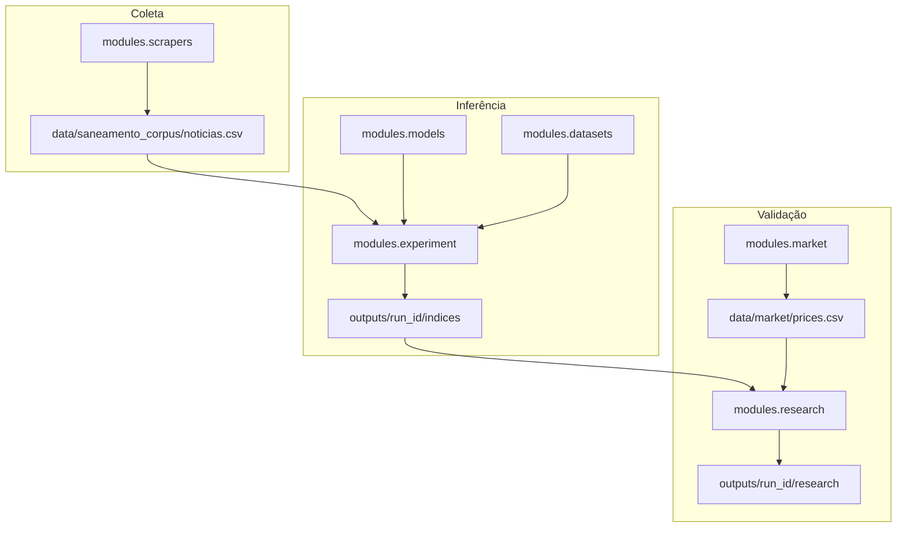
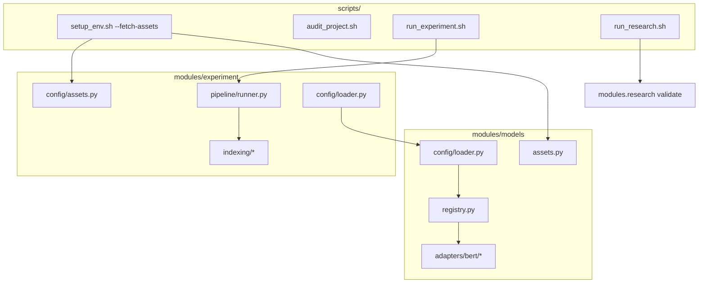
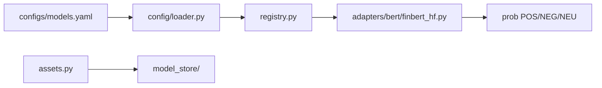
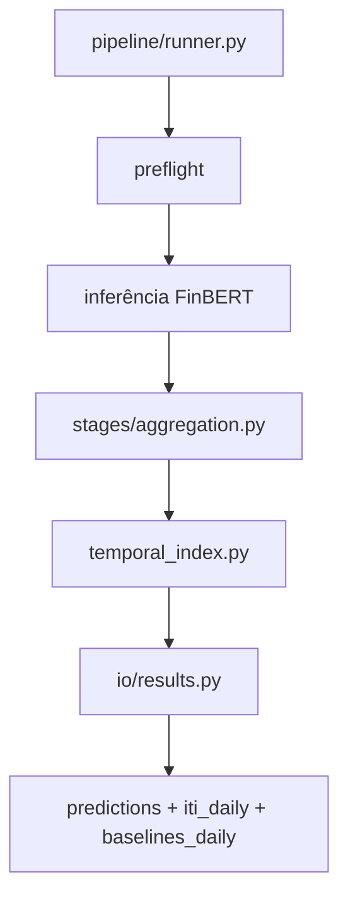
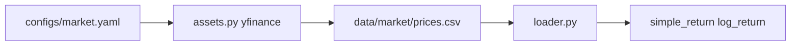
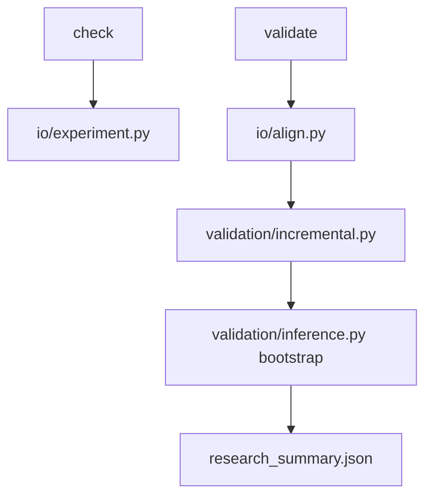
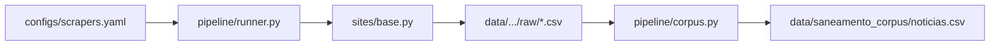

# Documentação técnica — Financial Sentiment Lab

Referência para entender **o que foi implementado**, **como os módulos se conectam** e **quais fórmulas são usadas**. Para comandos rápidos, veja [README.md](README.md).

---

## 1. Visão geral da pesquisa

A hipótese operacional é que o sentimento agregado em notícias financeiras, transformado em um índice temporal persistente (ITI), pode ser comparado a retornos futuros de ações. O pipeline separa três preocupações:

| Fase | Módulo | Pergunta |
| --- | --- | --- |
| Coleta | `modules/scrapers` | De onde vêm as notícias? |
| Inferência + ITI | `modules/experiment` | Qual o impacto informacional diário? |
| Validação | `modules/research` + `modules/market` | O ITI se associa a retornos melhor que baselines? |



---

## 2. Entrypoints e scripts



| Script | Função |
| --- | --- |
| `scripts/setup_env.sh` | Cria `venv/`, instala deps; `--fetch-assets` baixa modelos, datasets e mercado |
| `scripts/audit_project.sh` | Estrutura, YAML, pytest, dry-run |
| `scripts/run_experiment.sh` | Chama `python -m modules.experiment` |
| `scripts/run_research.sh` | Chama `python -m modules.research validate` |
| `modules/scrapers/scripts/scrape.sh` | Wrapper de coleta |
| `modules/scrapers/scripts/build_corpus.sh` | Mescla `raw/` → corpus |
| `modules/market/scripts/fetch.sh` | Wrapper de preços |
| `modules/models/scripts/fetch.sh` | Download isolado de modelos |
| `modules/datasets/scripts/fetch.sh` | Download isolado de datasets |

---

## 3. Módulos

### 3.1 `modules/models` — modelos de sentimento

**Responsabilidade:** carregar checkpoints FinBERT, normalizar rótulos e produzir probabilidades por notícia.



| Arquivo | Papel |
| --- | --- |
| `config/loader.py` | Lê e valida `configs/models.yaml` |
| `assets.py` | Download HuggingFace → `model_store/` |
| `registry.py` | Instancia adaptador por chave YAML |
| `sentiment.py` | Mapeamento de rótulos e `continuous_sentiment` |
| `base.py` | Contrato base dos adaptadores |
| `adapters/bert/finbert_hf.py` | Motor compartilhado BERT |
| `adapters/bert/finbert_ptbr.py` | Alias FinBERT-PT-BR |
| `adapters/bert/*.py` | Um adaptador por checkpoint |

**Sentimento contínuo** (por notícia):

\[
d = P(\text{POSITIVE}) - P(\text{NEGATIVE})
\]

Implementado conforme `labels.continuous_sentiment.formula` em cada modelo (`prob_positive - prob_negative`).

---

### 3.2 `modules/datasets` — datasets de notícias

**Responsabilidade:** ler CSVs locais ou HuggingFace, padronizar colunas e aplicar limites (`max_rows`).

| Arquivo | Papel |
| --- | --- |
| `config/loader.py` | Lê `configs/datasets.yaml` |
| `loader.py` | Leitura, validação e normalização de linhas |
| `assets.py` | Fetch de datasets declarados com `source` |
| `__main__.py` | CLI `fetch`, `check`, `validate` |

Colunas canônicas internas: `news_id`, `text`, `date`, `company`, `sector`, `ticker`, etc., mapeadas via `columns` no YAML.

---

### 3.3 `modules/experiment` — inferência e ITI

**Responsabilidade:** orquestrar combinações modelo×dataset, inferir sentimento, agregar e calcular ITI + baselines B0–B2.



| Arquivo | Papel |
| --- | --- |
| `pipeline/runner.py` | Loop combinações, preflight, inferência, ITI |
| `config/loader.py` | Resolve `experiment.yaml` + models + datasets |
| `config/assets.py` | Orquestra fetch de modelos, datasets e mercado |
| `stages/aggregation.py` | Agregações company/sector/market day |
| `stages/metrics.py` | Métricas supervisionadas e performance |
| `indexing/temporal_index.py` | **Cálculo do ITI** |
| `indexing/dimensions.py` | Dimensões m, r, e, h, q, u |
| `indexing/baselines.py` | Baselines B0–B2 |
| `io/results.py` | Grava CSVs e `summary.json` |

---

### 3.4 `modules/market` — preços e retornos

**Responsabilidade:** materializar preços diários (yfinance) e calcular retornos para o research.



| Arquivo | Papel |
| --- | --- |
| `assets.py` | Download ticker a ticker; normaliza MultiIndex yfinance |
| `loader.py` | Sanitiza CSV, calcula retornos |
| `config/loader.py` | Tickers, datas, colunas |

**Retornos** (por ticker, ordenado por data):

\[
r^{\log}_t = \ln\left(\frac{P_t}{P_{t-1}}\right), \quad r^{\simple}_t = \frac{P_t - P_{t-1}}{P_{t-1}}
\]

(`sklearn`/pandas: `pct_change` e log-ratio.)

---

### 3.5 `modules/research` — validação científica

**Responsabilidade:** alinhar ITI + baselines + preços B3, calcular métricas incrementais e gerar relatórios.



| Arquivo | Papel |
| --- | --- |
| `pipeline/runner.py` | `check_research_inputs`, `run_research` |
| `io/align.py` | Merge ITI × mercado × retornos futuros |
| `io/experiment.py` | Descobre combinações em `outputs/{run_id}/` |
| `validation/incremental.py` | ITI vs baselines por horizonte |
| `validation/market.py` | Correlações série × retorno |
| `validation/metrics.py` | Pearson, Spearman, R², MSE |
| `validation/inference.py` | Bootstrap em bloco, IC, p-value |
| `validation/baselines.py` | Deriva B3 = `impacto_dia` no painel |

**Saídas** em `outputs/{run_id}/research/{model}/{dataset}/`:

- `aligned_panel.csv` — painel date×empresa×ticker
- `incremental.csv` — métricas por predictor/horizonte
- `incremental_deltas.csv` — delta ITI − baseline
- `market_metrics.csv` — correlações brutas
- `research_summary.json` — conclusão e metadados

---

### 3.6 `modules/scrapers` — coleta multiportal

**Responsabilidade:** buscar artigos em portais configurados, enriquecer entidade B3 e mesclar corpus.



| Arquivo | Papel |
| --- | --- |
| `pipeline/runner.py` | Orquestra sites habilitados |
| `sites/base.py` | Scraper configurável (RSS, API WordPress, HTML) |
| `core/search.py` | Estratégias de busca |
| `schema/entities.py` | Match Sabesp, Copasa, Sanepar, etc. |
| `pipeline/corpus.py` | Dedupe e filtro de registros genéricos (`SETOR`) |

---

## 4. Fórmulas do ITI

Implementação: `modules/experiment/indexing/temporal_index.py`  
Dimensões: `modules/experiment/indexing/dimensions.py`  
Parâmetros: `configs/experiment.yaml` → `temporal_index`

### 4.1 Variáveis por notícia

| Símbolo | Nome | Descrição |
| --- | --- | --- |
| \(d\) | sentimento contínuo | \(P_{pos} - P_{neg}\) |
| \(c\) | confiança | max(probabilidades) ou coluna `confidence` |
| \(m\) | magnitude | dimensão de escala do evento |
| \(r\) | relevância | peso de relevância editorial |
| \(e\) | event_weight | peso por tipo de evento (heurística) |
| \(u\) | novelty | novidade vs títulos já vistos |
| \(h\) | horizon | horizonte temporal inferido do texto |
| \(q\) | risk | peso de risco (eventos negativos) |

Dimensões resolvem-se na ordem `dataset_columns` → `prediction_metadata` → `heuristics` → `defaults`.

### 4.2 Impacto por notícia

**Impacto líquido:**

\[
I_n = d \cdot m \cdot r \cdot c \cdot e \cdot u
\]

**Impacto de risco** (só lado negativo do sentimento):

\[
R_n = \max(0,\,-d) \cdot m \cdot r \cdot c \cdot q
\]

**Peso da notícia:**

\[
w_n = c \cdot r \cdot u
\]

### 4.3 Agregação diária (empresa)

Para cada `(empresa, setor, data)`:

\[
\text{impacto\_dia} = \frac{\sum I_n w_n}{\sum w_n}
\quad\text{(ou média de } I_n \text{ se } \sum w_n = 0\text{)}
\]

\[
\text{risco\_dia} = \frac{\sum R_n w_n}{\sum w_n}
\quad\text{(ou média de } R_n \text{ se } \sum w_n = 0\text{)}
\]

### 4.4 Memória EWMA — `iti_liquido` e `iti_risco`

Parâmetro base \(\alpha\) (default `0.85`). Com notícias no dia, usa \(\alpha_{\text{eff}}\):

\[
\alpha_{\text{eff}} = \text{clip}\left(\alpha^{1/h},\ 0.01,\ 0.999\right)
\]

**Dia com notícia:**

\[
\text{iti\_liquido}_t = \alpha_{\text{eff}} \cdot \text{iti\_liquido}_{t-1} + (1-\alpha_{\text{eff}}) \cdot \text{impacto\_dia}_t
\]

\[
\text{iti\_risco}_t = \alpha_{\text{eff}} \cdot \text{iti\_risco}_{t-1} + (1-\alpha_{\text{eff}}) \cdot \text{risco\_dia}_t
\]

**Dia sem notícia** (decay):

\[
\text{iti\_liquido}_t = \alpha \cdot \text{iti\_liquido}_{t-1}, \quad \text{iti\_risco}_t = \alpha \cdot \text{iti\_risco}_{t-1}
\]

A série é preenchida em calendário contínuo entre a primeira e a última data com notícia da empresa.

### 4.5 Agregação setor e mercado

Médias diárias de `impacto_dia`, `risco_dia`, `iti_liquido`, `iti_risco` entre empresas do nível.

### 4.6 Baselines (validação)

| Baseline | Coluna | Fórmula |
| --- | --- | --- |
| B0 | `b0_news_count` | contagem de notícias no dia |
| B1 | `b1_mean_sentiment` | média de \(d\) no dia |
| B2 | `b2_confidence_weighted_sentiment` | \(\sum(d \cdot c) / \sum c\) |
| B3 | `b3_daily_impact_no_memory` | `impacto_dia` (sem EWMA) |

B0–B2 são gerados no experimento; B3 é derivado no research. B0–B2 são avaliados **apenas em dias com notícia** (`baseline_news_only` em `configs/research.yaml`).

---

## 5. Validação research — métricas e retornos

Config: `configs/research.yaml`

### 5.1 Retorno alvo

Modo default `return_mode: cumulative`. Para horizonte \(h\), retorno futuro a partir do dia \(t\):

- **log_return:** soma dos log-retornos em \([t+1, t+h]\)
- **simple_return:** \(\prod_{i=1}^{h}(1+r_i) - 1\)

Colunas geradas: `future_log_return_1`, `future_log_return_5`, `future_log_return_21`.

### 5.2 Métricas predictor × retorno

| Métrica | Uso | Observação |
| --- | --- | --- |
| Pearson | correlação linear | p paramétrico + bootstrap |
| Spearman | correlação de ranks | idem |
| R² | `sklearn.r2_score(y, x)` | omitido se \(n < 30\) |
| MSE | erro quadrático médio | predictor vs retorno |

Para `iti_risco`, o alvo é \(|\text{retorno}|\) (`abs_return_predictors`).

### 5.3 Delta incremental ITI vs baseline

Para cada horizonte e baseline:

\[
\Delta = \text{metric}_{ITI} - \text{metric}_{baseline}
\]

(MSE usa \(\Delta = \text{MSE}_{baseline} - \text{MSE}_{ITI}\) — redução de erro favorece ITI.)

**Bootstrap em bloco** (`block_size=5`, `n_bootstrap=500`): reamostra índices contíguos, recalcula \(\Delta\), estima IC 95% e p-value. A conclusão CLI usa **apenas Pearson e Spearman** (`conclusion_metrics`).

---

## 6. Configurações principais

### ITI (`configs/experiment.yaml`)

```yaml
temporal_index:
  alpha: 0.85
  initial_value: 0.0
  horizon:
    mode: ewma_alpha
  baselines:
    enabled: true
  resample:
    frequencies: [weekly, monthly, quarterly]
  uncertainty:
    enabled: true
    min_models: 2
```

### Research (`configs/research.yaml`)

```yaml
validation:
  horizons: [1, 5, 21]
  baselines: [b0, b1, b2, b3]
  conclusion_metrics: [pearson, spearman]
  baseline_news_only: [b0, b1, b2]
  min_samples_for_r2: 30
  return_mode: cumulative
```

---

## 7. Apêndice — execução no Santos Dumont (desenvolvimento)

O cluster SDumont é um **ambiente de teste HPC** para rodar o experimento com GPU; não faz parte do desenho científico em si. O job Slurm executa apenas `./scripts/run_experiment.sh --skip-setup` (sem scraper nem research no nó).

### 7.1 Fluxo resumido

```text
[PC]  git push
[SDumont]  git pull / reset --hard origin/main
[SDumont]  module load cuda + anaconda
[SDumont]  ./scripts/setup_env.sh --fetch-assets
[SDumont]  pip install torch (index cu124)   # driver CUDA 12.6
[SDumont]  ./scripts/audit_project.sh --sdumont
[SDumont]  sbatch jobs/sdumont/run_experiment.srm
[PC]  scp outputs/ e logs/
```

### 7.2 Caminhos típicos

| Variável | Exemplo |
| --- | --- |
| `$HOME` | `/prj/ufsj/hpc4agents-br/<usuario>` |
| `$SCRATCH` | `/scratch/ufsj/hpc4agents-br/<usuario>` |
| Projeto | `$SCRATCH/financial-sentiment-lab` |

### 7.3 Setup no cluster

```bash
cd "$SCRATCH/financial-sentiment-lab"
module purge
module load cuda/12.6_sequana
module load anaconda3/2024.02_sequana

./scripts/setup_env.sh --fetch-assets

# PyTorch compatível com CUDA 12.6 (obrigatório após setup)
source venv/bin/activate
pip uninstall -y torch
pip install torch --index-url https://download.pytorch.org/whl/cu124
python -c "import torch; print(torch.__version__, torch.cuda.is_available())"
```

### 7.4 Validar e submeter

```bash
./scripts/audit_project.sh --sdumont
sbatch jobs/sdumont/run_experiment.srm

squeue -u $USER
tail -f job_financial_<JOBID>.out
```

Job: `jobs/sdumont/run_experiment.srm` — partição GPU dev, ~20 min, 1 GPU.

### 7.5 Sincronizar código

Fluxo recomendado: editar no PC → `git push` → no cluster `git fetch && git reset --hard origin/main`. Não fazer `git push` a partir do SDumont.

### 7.6 Baixar resultados (PC)

No PowerShell (VPN conectada), ajuste `RUN` e `JOB`:

```powershell
$SSH = "-o MACs=hmac-sha2-256 -o Ciphers=aes256-ctr -o IPQoS=none -o Compression=no"
$BASE = "<usuario>@login.sdumont.lncc.br:/scratch/ufsj/hpc4agents-br/<usuario>/financial-sentiment-lab"
$RUN = "financial_sentiment_AAAAMMDD_HHMMSS"
$JOB = "12345678"

scp -r $SSH "${BASE}/outputs/${RUN}" .
scp $SSH "${BASE}/logs/${RUN}.log" .
scp $SSH "${BASE}/job_financial_${JOB}.out" .
```

### 7.7 Problemas comuns

| Sintoma | Solução |
| --- | --- |
| `Failed building wheel for pyarrow` | `rm -rf venv && ./scripts/setup_env.sh --recreate --fetch-assets` (requer pyarrow ≥ 22 para Python 3.14) |
| `bad interpreter` no venv | `rm -rf venv` + setup + PyTorch cu124 |
| CUDA driver too old | Reinstalar torch com index `cu124` |
| Audit CUDA falha no login | Normal no login node; GPU vale no job |
| Quota SCRATCH | Limpar `outputs/` e `job_financial_*.out` antigos |

### 7.8 Research e scraper no HPC

Por padrão o job SDumont **não** roda scraper, fetch de mercado nem `modules.research`. Para validação científica completa, execute localmente (ou estenda o job):

```bash
python -m modules.market fetch
python -m modules.research validate --run-id <run_id>
```

---

## 8. Testes

```bash
pytest -m "not network"
./scripts/audit_project.sh
```

Fixtures em `tests/fixtures/` cobrem mercado, research e experimento dry-run.
