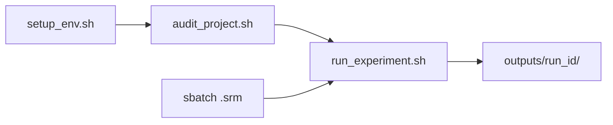

# Financial Sentiment Lab

Pipeline para **análise de sentimentos em notícias do mercado financeiro brasileiro**, com execução local e no Supercomputador Santos Dumont.

Modelos, datasets e parâmetros são definidos em arquivos YAML. A interface pública do projeto tem quatro pontos de entrada:

```text
./scripts/setup_env.sh          # uma vez (local ou login SDumont)
./scripts/audit_project.sh      # validar antes de rodar
./scripts/run_experiment.sh     # executar experimento
sbatch jobs/sdumont/run_experiment.srm   # HPC
```



Por padrão, a pipeline executa **modelos com `enabled: true` × datasets com `enabled: true`**. Cada combinação gera previsões, métricas, agregações, logs e metadados próprios.

---

## Objetivo

O projeto busca construir um indicador contínuo de sentimento informacional para empresas, setores e o mercado financeiro brasileiro.

Fluxo científico:

1. carregar notícias financeiras;
2. classificar cada notícia como positiva, negativa ou neutra;
3. registrar as probabilidades das classes;
4. calcular um sentimento contínuo;
5. agregar os resultados por data, empresa, setor e mercado;
6. comparar modelos e datasets;
7. relacionar o sentimento com retorno, volatilidade, volume e eventos financeiros.

Classes padronizadas: `POSITIVE`, `NEGATIVE`, `NEUTRAL`.

Sentimento contínuo:

```text
continuous_sentiment = prob_positive - prob_negative
```

Interpretação: próximo de **-1** → negativo; **0** → equilíbrio; **+1** → positivo.

Fluxo da pipeline:

```text
configurações → preflight → modelos × datasets → inferência → métricas → agregações → outputs/{run_id}/
```

---

## Comandos

Antes de usar os scripts:

```bash
chmod +x scripts/*.sh jobs/sdumont/*.srm
```

Requisitos: Linux ou WSL, Python 3.10+, pesos em `model_store/` (para inferência), datasets nos caminhos dos YAMLs.

| Comando | Faz |
|---|---|
| `setup_env.sh` | Cria `venv/` e instala `requirements.txt` + `requirements-dev.txt` |
| `audit_project.sh` | Estrutura + YAML + imports + **pytest** + dry-run (se `model_store/` existir) |
| `audit_project.sh --smoke` | Audit padrão + inferência curta (2 textos; exige pesos) |
| `audit_project.sh --sdumont` | Audit + exige CUDA e `model_store/`; dry-run obrigatório |
| `run_experiment.sh` | Executa modelos×datasets `enabled: true` |
| `run_experiment.sh --skip-setup` | Igual acima, sem recriar venv (job Slurm) |
| `run_experiment.sh --model X --dataset Y` | Restringe combinações desta execução |
| `run_experiment.sh --run-id ID` | Nomeia a pasta em `outputs/` |

**Validação sem inferência:** use `./scripts/audit_project.sh` — não há `--dry-run` em `run_experiment.sh`.

**Recriar o venv:** `./scripts/setup_env.sh --recreate` (nota avançada; evite no SDumont sem necessidade).

### Exemplos

Preparar ambiente e validar (clone sem pesos passa nas etapas estruturais e pytest):

```bash
./scripts/setup_env.sh
./scripts/audit_project.sh
```

Executar um modelo no dataset de exemplo:

```bash
./scripts/run_experiment.sh \
  --model finbert_ptbr \
  --dataset noticias_exemplo \
  --run-id local_finbert_01
```

Antes de submeter no cluster:

```bash
./scripts/audit_project.sh --sdumont
sbatch jobs/sdumont/run_experiment.srm
```

Relatório de auditoria: `logs/audit/audit_project_<timestamp>.log`.

---

## Configuração

Três YAMLs controlam o experimento. Os comentários dentro de cada arquivo são a referência detalhada.

| Arquivo | Controla |
|---|---|
| `configs/experiment.yaml` | `run_id`, ambiente (`local`/`sdumont`), logs, caminhos, saídas, agregação, métricas |
| `configs/models.yaml` | Modelos, adaptadores, pesos em `model_store/`, batch, device, mapeamento de labels |
| `configs/datasets.yaml` | Datasets, caminhos, colunas, validação, formatos CSV/JSONL |

Campos que você altera com frequência:

- **`enabled: true/false`** — inclui ou exclui modelo/dataset da matriz;
- **`execution.environment`** — registrado nos resultados (`local` ou `sdumont`);
- **`execution.log_level`** — nível de log (substitui flags removidas da CLI);
- **`parameters.device`** — em `models.yaml`; use `cpu` para forçar CPU de forma persistente;
- **`experiment.run_id`** — `null` gera ID automático; `--run-id` na CLI vale só para aquela execução.

Opções `--model`, `--dataset` e `--run-id` na linha de comando **não alteram** os YAMLs.

---

## Saídas

Cada execução grava artefatos em `outputs/{run_id}/` e log em `logs/{run_id}.log`.

```text
outputs/{run_id}/
├── summary.json
├── resolved_config.yaml
└── models/{model}/{dataset}/
    ├── predictions.csv
    ├── classification_metrics.csv
    ├── aggregates.csv
    ├── execution_metrics.csv
    └── metadata.json
```

| Artefato | Conteúdo |
|---|---|
| `predictions.csv` | Previsão por notícia (`predicted_label`, probabilidades, `continuous_sentiment`) |
| `classification_metrics.csv` | Accuracy, F1, matriz de confusão (se houver labels) |
| `aggregates.csv` | Agregações `company_day`, `sector_day`, `market_day` |
| `execution_metrics.csv` | Tempo, throughput, memória GPU, device |
| `summary.json` | Status de todas as combinações modelo×dataset |

Níveis de agregação configurados em `experiment.yaml` → `aggregation.levels`.

---

## Santos Dumont

Job Slurm: `jobs/sdumont/run_experiment.srm`.

### Diretório no Scratch

Ajuste `WORKING_DIR` no `.srm` para o caminho do projeto no Scratch:

```bash
WORKING_DIR="/scratch/.../financial-sentiment-lab"
```

Projeto, pesos (`model_store/`) e datasets devem estar nesse diretório antes da submissão.

### Preparação (uma vez no nó de login)

```bash
cd /scratch/.../financial-sentiment-lab

module purge
module load cuda/12.6_sequana
module load anaconda3/2024.02_sequana

./scripts/setup_env.sh
./scripts/audit_project.sh --sdumont
```

O `venv/` deve ser criado no SDumont com os **mesmos módulos** usados pelo job.

### Submissão e acompanhamento

```bash
sbatch jobs/sdumont/run_experiment.srm
squeue -u "$USER"
tail -f job_financial_JOB_ID.out
```

O job executa:

```bash
srun ./scripts/run_experiment.sh --environment sdumont --skip-setup
```

Para um teste restrito, edite a linha final do `.srm`:

```bash
srun ./scripts/run_experiment.sh \
  --environment sdumont \
  --skip-setup \
  --model finbert_ptbr \
  --dataset noticias_exemplo \
  --run-id "sdumont_finbert_${SLURM_JOB_ID}"
```

Progresso por combinação (exemplo):

```text
Progresso geral: 1/4 combinações (25%) — iniciando finbert_ptbr × noticias_exemplo
Experimento concluído: 4/4 combinações (100%), 4 sucesso, 0 falha(s).
```

Mensagens aparecem em `job_financial_JOB_ID.out` e em `logs/{run_id}.log`. Recursos (`partition`, `mem`, `time`, `gres`) são ajustados nas linhas `#SBATCH` do `.srm`.

---

## Estender o projeto

### Adicionar um dataset

1. Coloque o arquivo em `datasets/raw/novo_dataset/` (CSV ou JSONL).
2. Cadastre em `configs/datasets.yaml` com `enabled: true`, `path`, `columns` e `required_fields`.
3. Rode `./scripts/audit_project.sh` e depois `./scripts/run_experiment.sh --dataset novo_dataset`.

Exemplo mínimo (detalhes e validações nos comentários do YAML):

```yaml
datasets:
  novo_dataset:
    enabled: true
    path: datasets/raw/novo_dataset/noticias.csv
    format: csv
    columns:
      news_id: id
      text: texto
      date: data
    required_fields: [news_id, text]
```

### Adicionar um modelo

1. Crie o adaptador em `models/novo_modelo.py` implementando `models/base_model.py`.
2. Coloque pesos e tokenizer em `model_store/Novo-Modelo/`.
3. Cadastre em `configs/models.yaml` com `adapter`, `model_dir`, `files.required` e `labels`.
4. Valide com `./scripts/audit_project.sh --smoke`.

O adaptador deve retornar `ModelPrediction` na mesma ordem dos textos recebidos.

---

## Estrutura

```text
financial-sentiment-lab/
├── configs/           # experiment.yaml, models.yaml, datasets.yaml
├── datasets/raw/      # CSV e JSONL de entrada
├── jobs/sdumont/      # run_experiment.srm
├── model_store/       # pesos locais (FinBERT, ensemble, …)
├── models/            # adaptadores de inferência
├── pipeline/          # configuração, runner, métricas, agregação, resultados
├── scripts/           # setup_env, audit_project, run_experiment, run_service
├── tests/             # pytest (sentiment + configuration)
├── outputs/           # resultados por run_id
└── logs/              # execução e auditoria
```

| Caminho | Responsabilidade |
|---|---|
| `pipeline/configuration.py` | Carrega e valida YAMLs |
| `pipeline/runner.py` | Orquestra modelo×dataset |
| `pipeline/dataset_loader.py` | Lê e valida datasets |
| `pipeline/registry.py` | Instancia adaptadores |
| `scripts/run_service.sh` | Runtime Python (`python -m pipeline.runner`) |
| `scripts/audit_project.sh` | Única porta de validação pré-execução |
