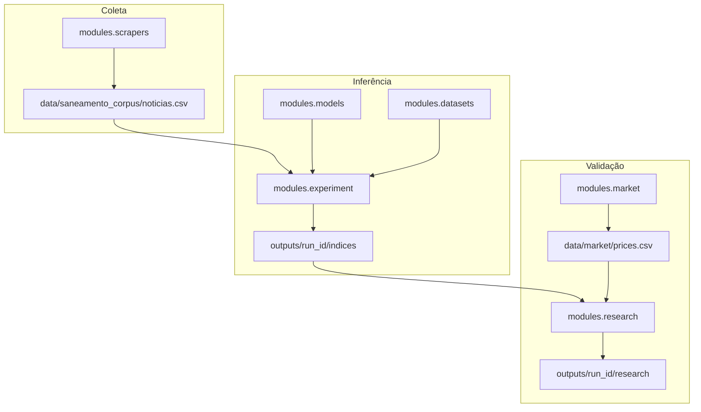
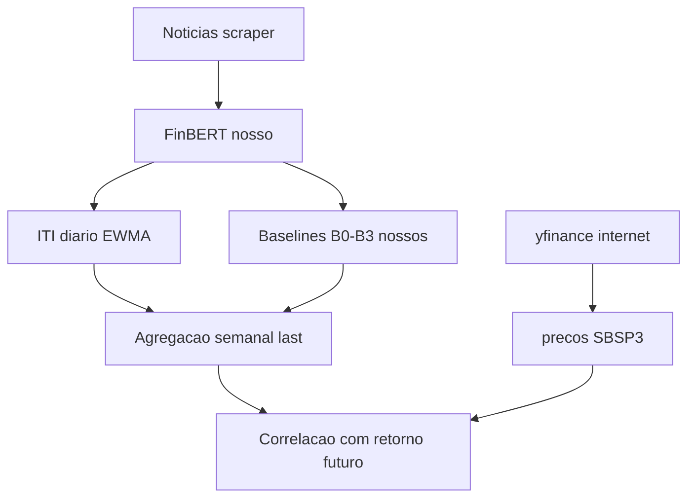
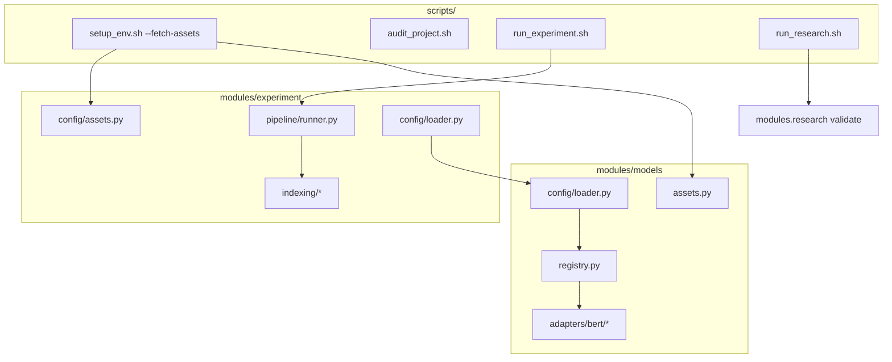
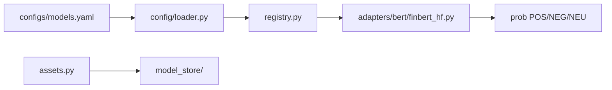
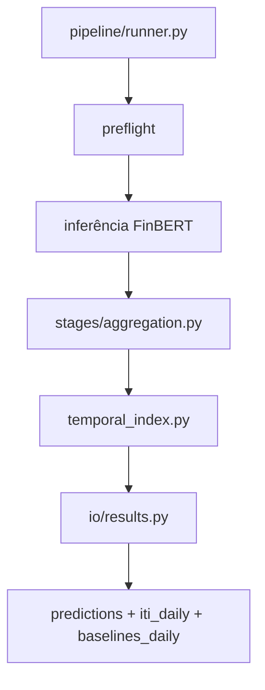
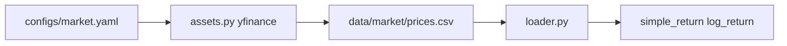
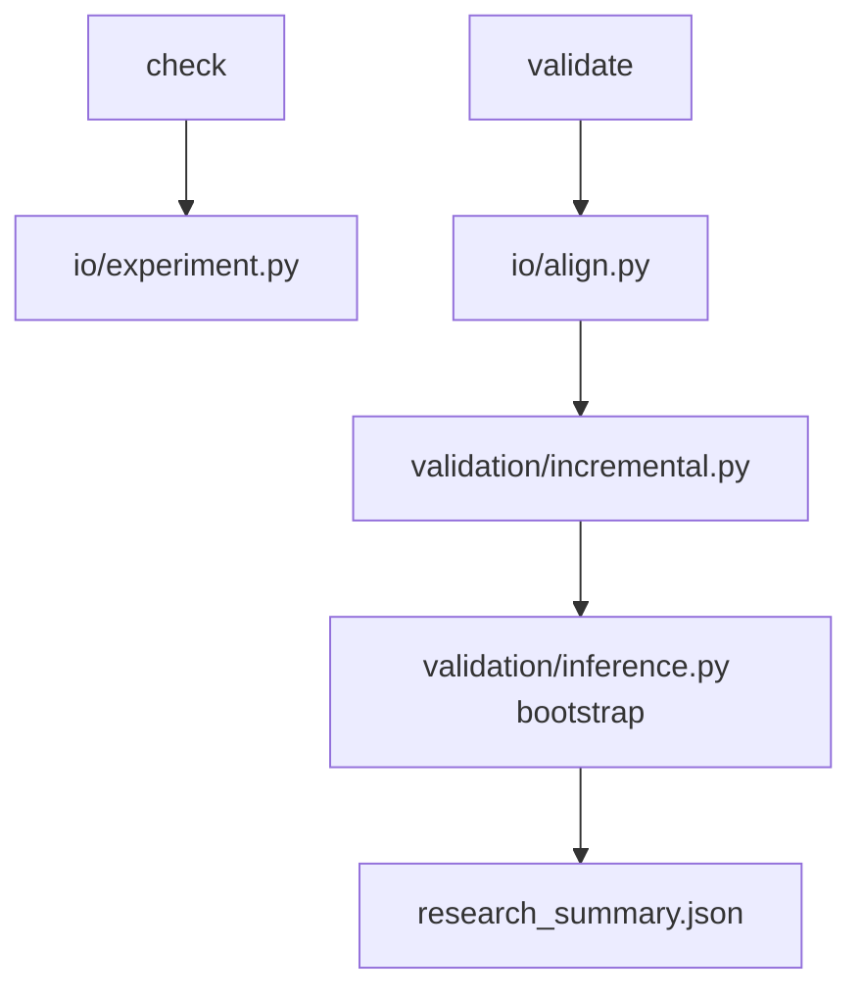
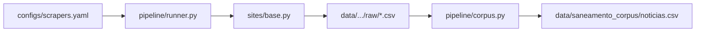

# Documentação técnica — Financial Sentiment Lab

Referência para entender **o que foi implementado**, **como os módulos se conectam** e **quais fórmulas são usadas**. Para comandos rápidos, veja [README.md](../README.md). Para o histórico experimental run a run, veja [trajetoria.md](trajetoria.md). Índice geral: [docs/README.md](README.md).

---

## 1. Visão geral da pesquisa

A hipótese operacional é que o sentimento agregado em notícias financeiras, transformado em um índice temporal persistente (ITI), pode ser comparado a retornos futuros de ações. O pipeline separa três preocupações:

| Fase | Módulo | Pergunta |
| --- | --- | --- |
| Coleta | `modules/scrapers` | De onde vêm as notícias? |
| Inferência + ITI | `modules/experiment` | Qual o impacto informacional diário? |
| Validação | `modules/research` + `modules/market` | O ITI se associa a retornos melhor que baselines? |



---

## 1.5 Conceitos em linguagem acessível

Esta seção antecipa a leitura técnica dos módulos e fórmulas. Os detalhes de implementação estão nas seções seguintes; o histórico de runs está em [trajetoria.md](trajetoria.md).

### O que estamos testando

O projeto constrói um **Índice Temporal Informacional (ITI)** a partir do sentimento de notícias financeiras e verifica se esse índice se associa ao **retorno futuro** de uma ação melhor do que alternativas simples feitas com as mesmas notícias (baselines B0–B3). A pergunta não é “o ITI prevê se a ação sobe ou desce como aposta”, e sim se existe **correlação** estatística entre o índice em um período e o movimento do preço nas semanas seguintes.

### De onde vêm os dados



| Origem | O que é | Exemplo no repo |
| --- | --- | --- |
| Nosso scraper / datasets | Notícias brutas e corpus classificado | `data/saneamento_corpus/` |
| Nossos modelos | Sentimento por notícia (FinBERT) | `outputs/{run_id}/models/.../predictions.csv` |
| Nosso experimento | ITI diário, agregados, baselines B0–B2 | `outputs/{run_id}/indices/.../iti_daily.csv` |
| Nosso research | Baseline B3 (impacto sem memória) | derivado em `validation/baselines.py` |
| Internet (yfinance) | Preços e retornos da ação | `data/market/prices.csv` |

Os baselines **não** usam preço de mercado — são competidores internos derivados das notícias. O preço da ação entra como **variável alvo** na validação.

### ITI líquido e ITI risco

- **`iti_liquido`** — índice de sentimento líquido acumulado (impactos positivos e negativos combinados via `impacto_dia`). É o predictor principal nas campanhas.
- **`iti_risco`** — índice do lado negativo/risco (`risco_dia`). Usado em análises complementares; para `iti_risco`, o alvo pode ser o valor absoluto do retorno.

Não há coluna “ITI bruto” no pipeline. O conceito mais próximo de impacto sem memória é o **B3** (`b3_daily_impact_no_memory`): o `impacto_dia` da semana, sem suavização EWMA.

### Parâmetro α (alpha)

No ITI, **α** controla a **memória** do EWMA (*Exponentially Weighted Moving Average*), não o “alpha” de retorno acima do mercado em finanças:

\[
\text{ITI}_t = \alpha_{\text{eff}} \cdot \text{ITI}_{t-1} + (1 - \alpha_{\text{eff}}) \cdot \text{impacto\_dia}_t
\]

- **α alto** (ex.: 0,95) — o índice muda devagar, “lembra” muito do passado.
- **α baixo** (ex.: 0,70) — o índice reage mais rápido a notícias novas.

Na campanha Sabesp 2026, α = 0,70 (run R1) foi o melhor resultado. Ver [trajetoria.md](trajetoria.md#marco-1--campanha-sabesp-2026-r0r9).

### Baselines B0–B3

Alternativas simples para responder: “será que contar notícias ou tirar média de sentimento já explica o retorno futuro tão bem quanto o ITI?”

| Baseline | Coluna | Significado |
| --- | --- | --- |
| **B0** | `b0_news_count` | Quantidade de notícias no período |
| **B1** | `b1_mean_sentiment` | Média do sentimento contínuo \(d\) |
| **B2** | `b2_confidence_weighted_sentiment` | Média ponderada por confiança do modelo |
| **B3** | `b3_daily_impact_no_memory` | Impacto do dia sem memória EWMA |

B0–B2 são gerados no experimento (`indexing/baselines.py`). B3 é derivado no research (`validation/baselines.py`). B0–B2 são avaliados apenas em dias/semanas com notícia (`baseline_news_only` em `configs/research.yaml`).

### Frequência diária e agregação semanal

O ITI é calculado em **série diária** (incluindo decay nos dias sem notícia). Na validação semanal da campanha Sabesp, o painel usa um valor por semana:

- **`iti_liquido_last`** (padrão) — estado EWMA no último dia útil da semana (sexta, W-FRI).
- **`iti_liquido_mean`** (testado na run R8) — média dos valores diários da semana.

O retorno de mercado é agregado na mesma frequência: soma dos log-returns diários da semana, alinhada ao `period_end` do ITI.

### Validação incremental e as 24 comparações

Para cada run da campanha Sabesp, o research executa comparações **cabeça a cabeça** entre o ITI e cada baseline. Com 4 baselines, 2 métricas de conclusão (Pearson, Spearman) e 3 horizontes semanais (1, 2, 4), obtemos **24 comparações** por run.

- **Vitória** — a correlação do ITI com o retorno futuro é maior que a do baseline na mesma métrica e horizonte (\(\Delta > 0\)).
- **Win rate** — proporção de vitórias entre as 24 comparações.
- **Significativa** — a diferença é estatisticamente confiável (bootstrap em bloco: intervalo de confiança que não cruza zero ou p < 0,05).

Na janela nov/2023–abr/2024 há cerca de **24 semanas** com ITI, baselines e preço alinhados (`overlap_days` no manifest). Amostra pequena: poucas vitórias significativas mesmo na melhor run (R1: 2/24).

**Caveat de busca múltipla:** as 24 comparações compartilham o mesmo painel semanal e horizontes sobrepostos — não são 24 testes independentes. Com α=0,05, espera-se ~1 falso positivo por acaso; 2 vitórias significativas (ambas h=4 vs. B3, Pearson e Spearman) **não** confirmam robustez isolada. Tabela extraída: `outputs/campaigns/sabesp_marco2/significant_wins_r1_event.md`.

### Limitações

- Evento único (privatização Sabesp) — difícil generalizar.
- Correlação não implica causalidade.
- Qualidade do sentimento depende do FinBERT; rótulos manuais ainda em validação.

### Tipos de rótulo (Trilhas B e C)

O projeto usa **três definições de “sentimento verdadeiro”** em contextos distintos. Não misturá-las no mesmo experimento de ITI.

| Tipo | Fonte | Onde entra no lab | Onde **não** entra |
| --- | --- | --- | --- |
| **Humano** | Anotador (100 notícias PT; PhraseBank EN) | Métricas de classificação (`classification_metrics`, `manual_labels`) | Cálculo do ITI na campanha Sabesp |
| **LLM** | NOSIBLE (ensemble de modelos) | Eval opcional do `finbert_en` | ITI, research, corpus Sabesp |
| **Mercado** | FinMarBa (retorno D+1 vs quantil histórico) | Diagnóstico de concordância (`scripts/campaigns/finmarba_diag.sh`) | ITI Sabesp, `true_label` no research B3 |

Na **campanha Sabesp** (Trilha A), o sentimento por notícia vem do **FinBERT** (`finbert_ptbr`); o preço `SBSP3.SA` é **alvo** no research, nunca rótulo de treino do ITI.

Comandos Trilha B: `./scripts/campaigns/sabesp_2026.sh manual-sample`, `./scripts/campaigns/sabesp_2026.sh manual-compare` (predictions: Marco 1 R0 ou fallback `sabesp_marco2_r0_baseline`), `./scripts/campaigns/classifier_eval_en.sh`. Trilha C: `./scripts/campaigns/fnspid_pilot.sh`, `./scripts/campaigns/finmarba_diag.sh`.

---

## 2. Entrypoints e scripts



| Script | Função |
| --- | --- |
| `scripts/setup_env.sh` | Cria `venv/`, instala deps; `--fetch-assets` baixa modelos, datasets e mercado |
| `scripts/audit_project.sh` | Estrutura, YAML, pytest, dry-run |
| `scripts/run_experiment.sh` | Chama `python -m modules.experiment` |
| `scripts/run_research.sh` | Chama `python -m modules.research validate` |
| `scripts/run_dashboard.sh` | Dashboard Streamlit de exploração da pesquisa |
| `modules/scrapers/scripts/scrape.sh` | Wrapper de coleta |
| `modules/scrapers/scripts/build_corpus.sh` | Mescla `raw/` → corpus |
| `modules/market/scripts/fetch.sh` | Wrapper de preços |
| `modules/models/scripts/fetch.sh` | Download isolado de modelos |
| `modules/datasets/scripts/fetch.sh` | Download isolado de datasets |

### Scripts de campanha (descartáveis)

Ver [`scripts/campaigns/README.md`](../scripts/campaigns/README.md) e [`configs/campaigns/README.md`](../configs/campaigns/README.md).

| Script | Função |
| --- | --- |
| `scripts/campaigns/sabesp_2026.sh` | Campanha Sabesp R0–R9 (Marco 1) |
| `scripts/campaigns/sabesp_marco2.sh` | Marco 2 — janela expandida (`replay-event`, `analyze-periods`) |
| `scripts/campaigns/classifier_eval_en.sh` | Trilha B — PhraseBank/NOSIBLE |
| `scripts/campaigns/fnspid_pilot.sh` | Marco 4 — piloto FNSPID |
| `scripts/campaigns/finmarba_diag.sh` | Marco 5 — FinMarBa |

---

## 3. Módulos

### 3.1 `modules/models` — modelos de sentimento

**Responsabilidade:** carregar checkpoints FinBERT, normalizar rótulos e produzir probabilidades por notícia.



| Arquivo | Papel |
| --- | --- |
| `config/loader.py` | Lê e valida `configs/models.yaml` |
| `assets.py` | Download HuggingFace → `model_store/` |
| `registry.py` | Instancia adaptador por chave YAML |
| `sentiment.py` | Mapeamento de rótulos e `continuous_sentiment` |
| `base.py` | Contrato base dos adaptadores |
| `adapters/bert/finbert_hf.py` | Motor compartilhado BERT |
| `adapters/bert/finbert_ptbr.py` | Alias FinBERT-PT-BR |
| `adapters/bert/bertweet_pt_sentiment.py` | Controle PT (pysentimiento/BERTweet) |
| `adapters/bert/bertimbau_sentiment.py` | Controle PT (BERTimbau geral, 3 classes) |
| `adapters/bert/*.py` | Um adaptador por checkpoint |

**Sentimento contínuo** (por notícia):

\[
d = P(\text{POSITIVE}) - P(\text{NEGATIVE})
\]

Implementado conforme `labels.continuous_sentiment.formula` em cada modelo (`prob_positive - prob_negative`).

**Validação de rótulos.** Em `configs/models.yaml`, `validate_label_mapping: true` confere se os rótulos do checkpoint batem com o mapeamento declarado no YAML. Adaptadores antigos usavam `validate_configured_labels`; o código aceita os dois nomes por compatibilidade.

**Controles PT (`enabled: false`).** `bertweet_pt_sentiment` ([pysentimiento/bertweet-pt-sentiment](https://huggingface.co/pysentimiento/bertweet-pt-sentiment)) e `bertimbau_sentiment` ([lipaoMai/bert-sentiment-model-portuguese](https://huggingface.co/lipaoMai/bert-sentiment-model-portuguese), base BERTimbau) não entram na matriz default. Fetch e dry-run: ver [§3.3.1](#331-higiene-do-pipeline-estado-atual).

---

### 3.2 `modules/datasets` — datasets de notícias

**Responsabilidade:** ler CSVs locais ou HuggingFace, padronizar colunas e aplicar limites (`max_rows`).

| Arquivo | Papel |
| --- | --- |
| `config/loader.py` | Lê `configs/datasets.yaml` |
| `loader.py` | Leitura, validação e normalização de linhas |
| `assets.py` | Fetch de datasets declarados com `source` |
| `__main__.py` | CLI `fetch`, `check`, `validate` |

Colunas canônicas internas: `news_id`, `text`, `date`, `company`, `sector`, `ticker`, etc., mapeadas via `columns` no YAML.

**Inspeção em preflight.** `inspect_columns()` lê apenas a primeira linha de arquivos JSONL e HuggingFace (`nrows=1`), evitando carregar o corpus inteiro só para obter nomes de colunas.

---

### 3.3 `modules/experiment` — inferência e ITI

**Responsabilidade:** orquestrar combinações modelo×dataset, inferir sentimento, agregar e calcular ITI + baselines B0–B2.



| Arquivo | Papel |
| --- | --- |
| `pipeline/runner.py` | Loop combinações, preflight, inferência, ITI |
| `config/loader.py` | Resolve `experiment.yaml` + models + datasets |
| `config/assets.py` | Orquestra fetch de modelos, datasets e mercado |
| `stages/aggregation.py` | Agregações company/sector/market day |
| `stages/metrics.py` | Métricas supervisionadas e performance |
| `indexing/temporal_index.py` | **Cálculo do ITI** |
| `indexing/dimensions.py` | Dimensões m, r, e, h, q, u |
| `indexing/baselines.py` | Baselines B0–B2 (contagem, média, média ponderada) |
| `io/results.py` | Grava CSVs e `summary.json` |

Baselines **B0–B2** são calculados no experimento a partir das previsões (`build_baselines_daily` em `indexing/baselines.py`). O baseline **B3** (impacto diário sem memória EWMA) é derivado no research (`validation/baselines.py`, coluna `b3_daily_impact_no_memory`).

**Preflight.** Invariantes (YAML válido, pelo menos uma combinação modelo×dataset, colunas mínimas ao inspecionar/carregar) são sempre aplicadas. Em `preflight_checks`, só restam flags reais: `enabled` (desliga o I/O caro de `run_preflight`), `validate_model_files`, `validate_dataset_files` e `validate_output_directory`.

**Ciclo de vida do runner.** `ExperimentRunner.run()` instala handlers de SIGINT/SIGTERM dentro do bloco `try` principal (incluindo `results.prepare()` e coleta de metadados), de modo que o `finally` sempre restaura os handlers mesmo se a preparação falhar cedo. A finalização de resultados em caso de erro usa `try/except` para não mascarar a exceção original.

**Memória e performance.** `LoadedDataset.texts` usa cache interno (`_texts_cache`) — a lista de strings é criada uma vez por dataset carregado. `CombinationPerformanceMonitor` (`stages/metrics.py`) respeita `performance_metrics.enabled`: quando `false`, `start()`, `stop()` e `phase()` são no-op (sem sincronização CUDA desnecessária). `execution.unload_model_after_combination` libera o modelo ao **trocar de `model_key`** ou ao terminar a run — não a cada dataset do mesmo modelo (o runner passa `next_model_key` para decidir).

Dívida conhecida: ver [§3.3.1 Higiene do pipeline](#331-higiene-do-pipeline-estado-atual).

#### 3.3.1 Higiene do pipeline (estado atual)

Auditoria das correções de robustez e memória no runner. Itens já resolvidos têm testes dedicados.

| Item | Status | Onde |
| --- | --- | --- |
| `preflight_checks` enxuto (só flags reais) | Resolvido | `configs/experiment.yaml`, `loader._validate_resolved_configuration`, `runner.run_preflight` |
| JSONL `nrows=1` em `inspect_columns` | Resolvido | `modules/datasets/loader.py` |
| `performance_metrics.enabled` como no-op | Resolvido | `stages/metrics.py` `CombinationPerformanceMonitor` |
| `prepare()` dentro do `try/finally` de sinais | Resolvido | `pipeline/runner.py` |
| Unload de modelo só ao trocar `model_key` | Resolvido | `runner._release_model_after_combination` |
| Cache de `LoadedDataset.texts` | Resolvido | `modules/datasets/loader.py` |
| Reduzir cópias de DataFrame/previsões | Resolvido | `prediction_normalization`, `aggregation`, `runner` (sem cópia redundante de `texts`/previsões) |
| `save_failure_artifacts` (ex-`save_partial_results`) | Resolvido | `execution` no YAML e runner |
| `OutputSchemaBuilder` só `ModelPrediction` | Resolvido | `io/output_schema.py`, `io/prediction_normalization.py` |
| Docstrings legadas | Resolvido | módulos `modules/experiment` |

**Limitação conhecida:** o dataset inteiro ainda é carregado em memória por combinação; inferência já é por lotes no adaptador (`batch_size` em `models.yaml`). Streaming end-to-end fica para fase futura.

#### Relatório de deep research vs. repositório

A seção 6 do relatório externo ainda cita `pipeline/dataset_loader.py` e `pipeline/runner.py`. O lab está em `modules/`. Checklist para **não reabrir** o mesmo backlog:

| Item do relatório | Estado no repo |
| --- | --- |
| JSONL `inspect_columns` com `nrows=1` | Feito (`modules/datasets/loader.py`) |
| `performance_metrics.enabled` | Feito (`CombinationPerformanceMonitor`) |
| `try/finally` na inicialização do runner | Feito (`prepare()` dentro do `try`) |
| Não chamar `loaded_dataset.texts` duas vezes | Feito (cache `_texts_cache`) |
| `save_partial_results` → `save_failure_artifacts` | Feito (YAMLs + alias legado) |
| Modelos EN (`ProsusAI/finbert`, `yiyanghkust/finbert-tone`) | Já em `configs/models.yaml` (`finbert_en` enabled; `finbert_tone_en` disabled) |
| Controles PT genéricos (BERTweet-PT, BERTimbau 3-class) | `bertweet_pt_sentiment` e `bertimbau_sentiment`, ambos `enabled: false` |

Esses dois controles **não** são modelos financeiros: servem para comparar PT genérico vs. FinBERT-PT na próxima bateria ITI. Baixar checkpoints sem ligar a matriz:

```bash
python -m modules.models fetch --model bertweet_pt_sentiment --model bertimbau_sentiment
./scripts/run_experiment.sh --skip-setup --dry-run --model bertweet_pt_sentiment --dataset noticias_exemplo_ptbr
./scripts/run_experiment.sh --skip-setup --dry-run --model bertimbau_sentiment --dataset noticias_exemplo_ptbr
```

---

### 3.4 `modules/market` — preços e retornos

**Responsabilidade:** materializar preços diários (yfinance) e calcular retornos para o research.



| Arquivo | Papel |
| --- | --- |
| `assets.py` | Download ticker a ticker; normaliza MultiIndex yfinance |
| `loader.py` | Sanitiza CSV, calcula retornos |
| `config/loader.py` | Tickers, datas, colunas |

**Retornos** (por ticker, ordenado por data):

\[
r^{\log}_t = \ln\left(\frac{P_t}{P_{t-1}}\right), \quad r^{\simple}_t = \frac{P_t - P_{t-1}}{P_{t-1}}
\]

(`sklearn`/pandas: `pct_change` e log-ratio.)

---

### 3.5 `modules/research` — validação científica

**Responsabilidade:** alinhar ITI + baselines + preços B3, calcular métricas incrementais e gerar relatórios.



| Arquivo | Papel |
| --- | --- |
| `pipeline/runner.py` | `check_research_inputs`, `run_research` |
| `io/align.py` | Merge ITI × mercado × retornos futuros |
| `io/experiment.py` | Descobre combinações em `outputs/{run_id}/` |
| `validation/incremental.py` | ITI vs baselines por horizonte |
| `validation/market.py` | Correlações série × retorno |
| `validation/metrics.py` | Pearson, Spearman, R², MSE |
| `validation/inference.py` | Bootstrap em bloco, IC, p-value |
| `validation/baselines.py` | Deriva B3 = `impacto_dia` no painel |

**Saídas** em `outputs/{run_id}/research/{model}/{dataset}/`:

- `aligned_panel.csv` — painel date×empresa×ticker
- `incremental.csv` — métricas por predictor/horizonte
- `incremental_deltas.csv` — delta ITI − baseline
- `market_metrics.csv` — correlações brutas
- `research_summary.json` — conclusão e metadados

---

### 3.6 `modules/scrapers` — coleta multiportal

**Responsabilidade:** buscar artigos em portais configurados, enriquecer entidade B3 e mesclar corpus.



| Arquivo | Papel |
| --- | --- |
| `pipeline/runner.py` | Orquestra sites habilitados |
| `sites/base.py` | Scraper configurável (RSS, API WordPress, HTML) |
| `core/search.py` | Estratégias de busca |
| `schema/entities.py` | Match Sabesp, Copasa, Sanepar, etc. |
| `pipeline/corpus.py` | Dedupe e filtro de registros genéricos (`SETOR`) |

---

## 4. Fórmulas do ITI

Com os conceitos da [§1.5](#15-conceitos-em-linguagem-acessível) em mente, esta seção formaliza o cálculo implementado no código.

Implementação: `modules/experiment/indexing/temporal_index.py`  
Dimensões: `modules/experiment/indexing/dimensions.py`  
Parâmetros: `configs/experiment.yaml` → `temporal_index`

### 4.1 Variáveis por notícia

| Símbolo | Nome | Descrição |
| --- | --- | --- |
| \(d\) | sentimento contínuo | \(P_{pos} - P_{neg}\) |
| \(c\) | confiança | max(probabilidades) ou coluna `confidence` |
| \(m\) | magnitude | dimensão de escala do evento |
| \(r\) | relevância | peso de relevância editorial |
| \(e\) | event_weight | peso por tipo de evento (heurística) |
| \(u\) | novelty | novidade vs títulos já vistos |
| \(h\) | horizon | horizonte temporal inferido do texto |
| \(q\) | risk | peso de risco (eventos negativos) |

Dimensões resolvem-se na ordem `dataset_columns` → `prediction_metadata` → `heuristics` → `defaults`.

### 4.2 Impacto por notícia

**Impacto líquido:**

\[
I_n = d \cdot m \cdot r \cdot c \cdot e \cdot u
\]

**Impacto de risco** (só lado negativo do sentimento):

\[
R_n = \max(0,\,-d) \cdot m \cdot r \cdot c \cdot q
\]

**Peso da notícia:**

\[
w_n = c \cdot r \cdot u
\]

### 4.3 Agregação diária (empresa)

Para cada `(empresa, setor, data)`:

\[
\text{impacto\_dia} = \frac{\sum I_n w_n}{\sum w_n}
\quad\text{(ou média de } I_n \text{ se } \sum w_n = 0\text{)}
\]

\[
\text{risco\_dia} = \frac{\sum R_n w_n}{\sum w_n}
\quad\text{(ou média de } R_n \text{ se } \sum w_n = 0\text{)}
\]

### 4.4 Memória EWMA — `iti_liquido` e `iti_risco`

Parâmetro base \(\alpha\) (default `0.85`). Com notícias no dia, usa \(\alpha_{\text{eff}}\):

\[
\alpha_{\text{eff}} = \text{clip}\left(\alpha^{1/h},\ 0.01,\ 0.999\right)
\]

**Dia com notícia:**

\[
\text{iti\_liquido}_t = \alpha_{\text{eff}} \cdot \text{iti\_liquido}_{t-1} + (1-\alpha_{\text{eff}}) \cdot \text{impacto\_dia}_t
\]

\[
\text{iti\_risco}_t = \alpha_{\text{eff}} \cdot \text{iti\_risco}_{t-1} + (1-\alpha_{\text{eff}}) \cdot \text{risco\_dia}_t
\]

**Dia sem notícia** (decay):

\[
\text{iti\_liquido}_t = \alpha \cdot \text{iti\_liquido}_{t-1}, \quad \text{iti\_risco}_t = \alpha \cdot \text{iti\_risco}_{t-1}
\]

A série é preenchida em calendário contínuo entre a primeira e a última data com notícia da empresa.

### 4.5 Agregação setor e mercado

Médias diárias de `impacto_dia`, `risco_dia`, `iti_liquido`, `iti_risco` entre empresas do nível.

### 4.6 Baselines (validação)

| Baseline | Coluna | Fórmula |
| --- | --- | --- |
| B0 | `b0_news_count` | contagem de notícias no dia |
| B1 | `b1_mean_sentiment` | média de \(d\) no dia |
| B2 | `b2_confidence_weighted_sentiment` | \(\sum(d \cdot c) / \sum c\) |
| B3 | `b3_daily_impact_no_memory` | `impacto_dia` (sem EWMA) |

B0–B2 são gerados no experimento; B3 é derivado no research. B0–B2 são avaliados **apenas em dias com notícia** (`baseline_news_only` em `configs/research.yaml`).

### 4.7 Ablações da equação

A equação completa usa todas as dimensões em \(I_n\), \(R_n\) e \(w_n\). Para testar hipóteses isoladas (campanha Sabesp R3–R6), o YAML de experimento aceita:

| Mecanismo | Efeito | Exemplo na campanha |
| --- | --- | --- |
| `disabled_dimensions` | Zera dimensões na fórmula (ex.: `novelty`, `event_weight`) | R3 sem `u`, R4 sem `e`, R5 sem `r` |
| `equation_mode: simplified_dc` | `I_n = d \cdot c`, `w_n = c` (sem m, r, e, u) | R6 |

O modo simplificado e as dimensões desabilitadas alteram apenas o cálculo de impacto por notícia; a memória EWMA (§4.4) permanece igual.

---

## 5. Validação research — métricas e retornos

Config padrão: `configs/research.yaml`. Campanha Sabesp semanal: `configs/campaigns/sabesp_2026/research_weekly.yaml`.

### 5.0 Modos diário e semanal

**Correções que habilitam o modo semanal.** A rodada broad (Marco 0) misturava frequências: o ITI semanal era gerado mas o research lia só `iti_daily.csv` com baselines diários. A auditoria metodológica (detalhe narrativo em [trajetoria.md § Auditoria](trajetoria.md#auditoria-metodológica--por-que-o-marco-1-existiu)) mapeou seis lacunas; as correções no código incluem `index_frequency: weekly`, alinhamento em `io/weekly_align.py`, `resample_baselines_weekly`, `companies_filter`, dataset strict por evento e horizontes em semanas.

O módulo research suporta dois modos de alinhamento, selecionados por `index_frequency` no YAML de research:

| Modo | Config | `index_frequency` | Horizontes | Coluna ITI | Alinhamento |
| --- | --- | --- | --- | --- | --- |
| **Diário** (padrão) | `configs/research.yaml` | `daily` (implícito) | 1, 5, 21 **dias** | `iti_liquido` diário | `io/align.py` |
| **Semanal** (campanha Sabesp) | `configs/campaigns/sabesp_2026/research_weekly.yaml` | `weekly` | 1, 2, 4 **semanas** | `iti_liquido_last` | `io/weekly_align.py` |

No modo semanal:

- ITI e baselines são agregados para W-FRI (sexta-feira).
- Retornos de mercado são a soma dos log-returns diários da semana.
- Retornos futuros somam as semanas seguintes (horizonte em semanas).
- Filtro `companies_filter: [Sabesp]` restringe o painel à empresa do evento.

As **24 comparações** por run no modo semanal vêm de 4 baselines × 2 métricas de conclusão (Pearson, Spearman) × 3 horizontes. Resultados e interpretação: [trajetoria.md](trajetoria.md).

### 5.1 Retorno alvo

Modo default `return_mode: cumulative`. Para horizonte \(h\), retorno futuro a partir do dia \(t\):

- **log_return:** soma dos log-retornos em \([t+1, t+h]\)
- **simple_return:** \(\prod_{i=1}^{h}(1+r_i) - 1\)

Colunas geradas: `future_log_return_1`, `future_log_return_5`, `future_log_return_21`.

### 5.2 Métricas predictor × retorno

| Métrica | Uso | Observação |
| --- | --- | --- |
| Pearson | correlação linear | p paramétrico + bootstrap |
| Spearman | correlação de ranks | idem |
| R² | `sklearn.r2_score(y, x)` | omitido se \(n < 30\) |
| MSE | erro quadrático médio | predictor vs retorno |

Para `iti_risco`, o alvo é \(|\text{retorno}|\) (`abs_return_predictors`).

### 5.3 Delta incremental ITI vs baseline

Para cada horizonte e baseline:

\[
\Delta = \text{metric}_{ITI} - \text{metric}_{baseline}
\]

(MSE usa \(\Delta = \text{MSE}_{baseline} - \text{MSE}_{ITI}\) — redução de erro favorece ITI.)

**Bootstrap em bloco** (`block_size=5`, `n_bootstrap=500`): reamostra índices contíguos, recalcula \(\Delta\), estima IC 95% e p-value. A conclusão CLI usa **apenas Pearson e Spearman** (`conclusion_metrics`).

---

## 6. Configurações principais

### ITI (`configs/experiment.yaml`)

```yaml
temporal_index:
  alpha: 0.85
  initial_value: 0.0
  horizon:
    mode: ewma_alpha
  baselines:
    enabled: true
  resample:
    frequencies: [weekly, monthly, quarterly]
  uncertainty:
    enabled: true
    min_models: 2
```

### Preflight (`configs/experiment.yaml`)

```yaml
preflight_checks:
  enabled: true
  validate_model_files: true
  validate_dataset_files: true
  validate_output_directory: true
```

Invariantes (schema YAML, matriz não vazia, colunas mínimas) não são desligáveis. `enabled: false` só pula o I/O de `run_preflight`.

### Research (`configs/research.yaml`)

```yaml
validation:
  horizons: [1, 5, 21]
  baselines: [b0, b1, b2, b3]
  conclusion_metrics: [pearson, spearman]
  baseline_news_only: [b0, b1, b2]
  min_samples_for_r2: 30
  return_mode: cumulative
```

### Research semanal Sabesp (`configs/campaigns/sabesp_2026/research_weekly.yaml`)

Usado pela campanha `sabesp_2026` (runs R0–R9). Diferenças principais em relação ao research diário:

```yaml
defaults:
  horizons: [1, 2, 4]              # semanas, não dias
  index_frequency: weekly
  iti_weekly_column: iti_liquido_last   # R8 testou iti_liquido_mean
  companies_filter: [Sabesp]
  return_column: log_return
  return_mode: cumulative

validation:
  inference:
    block_size: 2                  # ajustado para série semanal curta
    n_bootstrap: 500
```

**Mapeamento entidade → ticker** (também em `configs/market.yaml` e `mapping.company_to_ticker`):

| Empresa | Ticker B3 |
| --- | --- |
| Sabesp | `SBSP3.SA` |
| Copasa | `CSMG3.SA` |
| Sanepar | `SAPR4.SA` |

**Corpus strict.** `build_strict_corpus()` gera `noticias_strict.csv` (ou variantes por evento) reaplicando `match_entity(titulo + noticia)` nos registros de `raw/`, sem gerar PENDENTE — preserva o corpus broad em `noticias.csv`.

**Cobertura Sabesp (filtro mai/2022–abr/2024).** Após `scrape-2023` + `corpus`, `data/saneamento_corpus/noticias_strict_sabesp.csv` tem **1.254** artigos (256 em 2022; **199** em jan–abr/2023; resto mai/2023–abr/2024). Sem duplicatas de URL. A lacuna jan–abr/2023 foi preenchida sem replay ITI — ver [trajetoria.md](trajetoria.md#atualização-de-corpus-31082026-sem-replay-iti). Estadão e Folha ficam desligados (marketing / paywall).

### Core vs campaigns (`configs/`)

| Camada | Caminho | Papel |
| --- | --- | --- |
| **Core** | `configs/experiment.yaml`, `models.yaml`, `datasets.yaml`, `market.yaml`, `research.yaml` | Pipeline genérico reutilizável |
| **Campaigns** | `configs/campaigns/` | Sabesp, pilotos FNSPID/FinMarBa — **apagável** após consolidar a tese |

Datasets de campanha ficam em `configs/campaigns/datasets.yaml` e são mesclados automaticamente pelo loader quando a pasta existe.

### Datasets por trilha

| Chave | Trilha | Onde | Uso |
| --- | --- | --- | --- |
| `noticias_exemplo_ptbr`, `news_example_en`, `saneamento_corpus` | core | `configs/datasets.yaml` | Validação e scraper |
| `saneamento_sabesp_strict_event`, `saneamento_sabesp_strict_expanded` | A | overlay campaigns | ITI Sabesp |
| `financial_phrasebank_en`, `nosible_financial_sentiment_en` | B | overlay campaigns | Eval `finbert_en` |
| `fnspid_pilot` | C | overlay campaigns | Piloto ITI US (`configs/campaigns/fnspid_pilot/market.yaml`) |
| `finmarba_headlines_en` | C | overlay campaigns | Diagnóstico classificador |

Fetch de dataset `enabled: false`: `python -m modules.datasets fetch --dataset CHAVE` ou via experimento com `--dataset`.

### Avaliação de rótulos (`modules/evaluation`)

| Módulo | Função |
| --- | --- |
| `manual_labels.py` | Amostra estratificada PT + compare (acurácia, kappa) |
| `classifier_eval.py` | Acurácia/kappa em `predictions.csv` com `true_label` |
| `period_breakdown.py` | Correlação ITI×retorno por subperíodo (2022 / 2023Q1 / evento) |

---

## 7. Apêndice — execução no Santos Dumont (desenvolvimento)

O cluster SDumont é um **ambiente de teste HPC** para rodar o experimento com GPU; não faz parte do desenho científico em si. O job Slurm executa apenas `./scripts/run_experiment.sh --skip-setup` (sem scraper nem research no nó).

### 7.1 Fluxo resumido

```text
[PC]  git push
[SDumont]  git pull / reset --hard origin/main
[SDumont]  module load cuda + anaconda
[SDumont]  ./scripts/setup_env.sh --fetch-assets
[SDumont]  pip install torch (index cu124)   # driver CUDA 12.6
[SDumont]  ./scripts/audit_project.sh --sdumont
[SDumont]  sbatch jobs/sdumont/run_experiment.srm
[PC]  scp outputs/ e logs/
```

### 7.2 Caminhos típicos

| Variável | Exemplo |
| --- | --- |
| `$HOME` | `/prj/ufsj/hpc4agents-br/<usuario>` |
| `$SCRATCH` | `/scratch/ufsj/hpc4agents-br/<usuario>` |
| Projeto | `$SCRATCH/financial-sentiment-lab` |

### 7.3 Setup no cluster

```bash
cd "$SCRATCH/financial-sentiment-lab"
module purge
module load cuda/12.6_sequana
module load anaconda3/2024.02_sequana

./scripts/setup_env.sh --fetch-assets

# PyTorch compatível com CUDA 12.6 (obrigatório após setup)
source venv/bin/activate
pip uninstall -y torch
pip install torch --index-url https://download.pytorch.org/whl/cu124
python -c "import torch; print(torch.__version__, torch.cuda.is_available())"
```

### 7.4 Validar e submeter

```bash
./scripts/audit_project.sh --sdumont
sbatch jobs/sdumont/run_experiment.srm

squeue -u $USER
tail -f job_financial_<JOBID>.out
```

Job: `jobs/sdumont/run_experiment.srm` — partição GPU dev, ~20 min, 1 GPU.

### 7.5 Sincronizar código

Fluxo recomendado: editar no PC → `git push` → no cluster `git fetch && git reset --hard origin/main`. Não fazer `git push` a partir do SDumont.

### 7.6 Baixar resultados (PC)

No PowerShell (VPN conectada), ajuste `RUN` e `JOB`:

```powershell
$SSH = "-o MACs=hmac-sha2-256 -o Ciphers=aes256-ctr -o IPQoS=none -o Compression=no"
$BASE = "<usuario>@login.sdumont.lncc.br:/scratch/ufsj/hpc4agents-br/<usuario>/financial-sentiment-lab"
$RUN = "financial_sentiment_AAAAMMDD_HHMMSS"
$JOB = "12345678"

scp -r $SSH "${BASE}/outputs/${RUN}" .
scp $SSH "${BASE}/logs/${RUN}.log" .
scp $SSH "${BASE}/job_financial_${JOB}.out" .
```

### 7.7 Problemas comuns

| Sintoma | Solução |
| --- | --- |
| `Failed building wheel for pyarrow` | `rm -rf venv && ./scripts/setup_env.sh --recreate --fetch-assets` (requer pyarrow ≥ 22 para Python 3.14) |
| `bad interpreter` no venv | `rm -rf venv` + setup + PyTorch cu124 |
| CUDA driver too old | Reinstalar torch com index `cu124` |
| Audit CUDA falha no login | Normal no login node; GPU vale no job |
| Quota SCRATCH | Limpar `outputs/` e `job_financial_*.out` antigos |

### 7.8 Research e scraper no HPC

Por padrão o job SDumont **não** roda scraper, fetch de mercado nem `modules.research`. Para validação científica completa, execute localmente (ou estenda o job):

```bash
python -m modules.market fetch
python -m modules.research validate --run-id <run_id>
```

---

## 8. Dashboard (Streamlit)

Interface multipage para explorar corpus, runs, modelos, experimentos e research sem abrir CSVs manualmente.

```bash
./scripts/run_dashboard.sh
# ou: ./scripts/run_dashboard.sh --port 8502
```

### Módulos

| Página | Conteúdo |
| --- | --- |
| Visão Geral | KPIs, corpus, campanha Sabesp, atalhos |
| Datasets e Scraper | Filtros, cobertura, heatmap, tabela de notícias |
| Modelos | Previsões, distribuição de classes, sentimento por empresa |
| Runs | Detalhe da execução, config ITI, diff vs baseline |
| Comparação | Multi-run: parâmetros, win rate, sentimento |
| Experimentos | Campanha R0–R9, alpha vs win rate, ablações — ver também [trajetoria.md](trajetoria.md) |
| Research | ITI vs mercado, incremental, drill-down por empresa |

Dados lidos de `outputs/` e `data/` via `modules/dashboard/services/`. Insights automáticos em `modules/dashboard/insights/`.

---

## 9. Testes

```bash
pytest -m "not network"
./scripts/audit_project.sh
```

Fixtures em `tests/fixtures/` cobrem mercado, research e experimento dry-run.

**Testes de higiene do pipeline** (comportamento do runner e preflight):

| Arquivo | O que valida |
| --- | --- |
| `tests/test_preflight.py` | Flags de `preflight_checks`, bypass com `enabled: false`, inspeção JSONL com `nrows=1` |
| `tests/test_performance_monitor.py` | `CombinationPerformanceMonitor` como no-op quando `performance_metrics.enabled: false` |
| `tests/test_runner_lifecycle.py` | Restauração de signal handlers em falha cedo; unload de modelo só ao trocar `model_key`; cache de `texts`; unload entre datasets do mesmo modelo |

Outros testes relevantes: `test_research_weekly_align.py` (alinhamento semanal), `test_temporal_index.py` (EWMA), `test_experiment_baselines.py` (B0–B2).

Para rodar só a higiene do pipeline:

```bash
pytest tests/test_preflight.py tests/test_performance_monitor.py tests/test_runner_lifecycle.py -q
```
