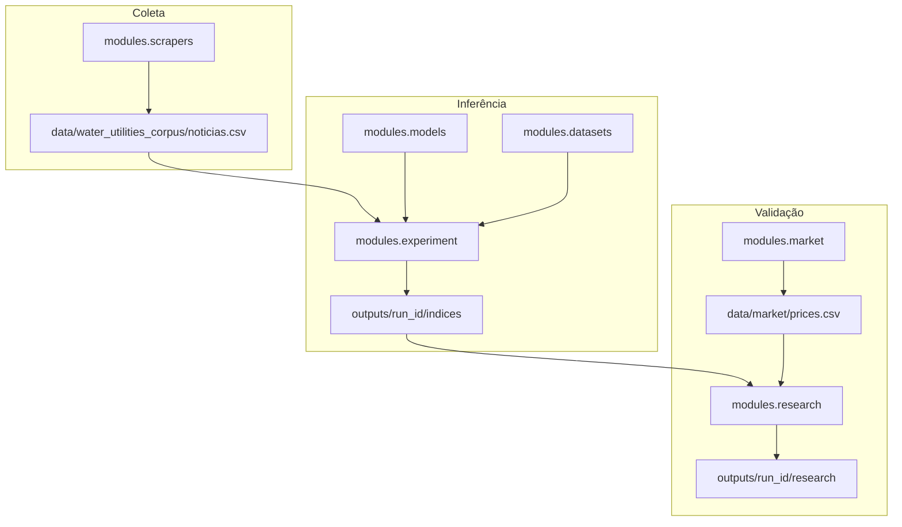
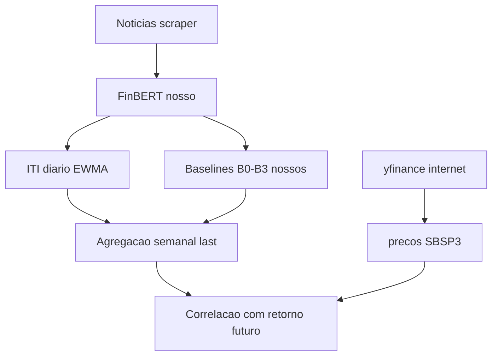

# Documentação técnica — visão e conceitos

## 1. Visão geral da pesquisa

A hipótese operacional é que o sentimento agregado em notícias financeiras, transformado em um índice temporal persistente (ITI), pode ser comparado a retornos futuros de ações. O pipeline separa três preocupações:

| Fase | Módulo | Pergunta |
| --- | --- | --- |
| Coleta | `modules/scrapers` | De onde vêm as notícias? |
| Inferência + ITI | `modules/experiment` | Qual o impacto informacional diário? |
| Validação | `modules/research` + `modules/market` | O ITI se associa a retornos melhor que baselines? |

---

## 1.5 Conceitos em linguagem acessível

Esta seção antecipa a leitura técnica dos módulos e fórmulas. Os detalhes de implementação estão nas seções seguintes; o histórico de runs está em [research_trail](../research_trail/README.md).

### O que estamos testando

O projeto constrói um **Índice Temporal Informacional (ITI)** a partir do sentimento de notícias financeiras e verifica se esse índice se associa ao **retorno futuro** de uma ação melhor do que alternativas simples feitas com as mesmas notícias (baselines B0–B3). A pergunta não é “o ITI prevê se a ação sobe ou desce como aposta”, e sim se existe **correlação** estatística entre o índice em um período e o movimento do preço nas semanas seguintes.

### De onde vêm os dados

| Origem | O que é | Exemplo no repo |
| --- | --- | --- |
| Nosso scraper / datasets | Notícias brutas e corpus classificado | `data/water_utilities_corpus/` |
| Nossos modelos | Sentimento por notícia (FinBERT) | `outputs/{run_id}/models/.../predictions.csv` |
| Nosso experimento | ITI diário, agregados, baselines B0–B2 | `outputs/{run_id}/indices/.../iti_daily.csv` |
| Nosso research | Baseline B3 (impacto sem memória) | derivado em `validation/baselines.py` |
| Internet (yfinance) | Preços e retornos da ação | `data/market/prices.csv` |

Os baselines **não** usam preço de mercado — são competidores internos derivados das notícias. O preço da ação entra como **variável alvo** na validação.

### ITI líquido e ITI risco

- **`iti_liquido`** — índice de sentimento líquido acumulado (impactos positivos e negativos combinados via `impacto_dia`). É o predictor principal nas campanhas.
- **`iti_risco`** — índice do lado negativo/risco (`risco_dia`). Usado em análises complementares; para `iti_risco`, o alvo pode ser o valor absoluto do retorno.

Não há coluna “ITI bruto” no pipeline. O conceito mais próximo de impacto sem memória é o **B3** (`b3_daily_impact_no_memory`): o `impacto_dia` da semana, sem suavização EWMA.

### Parâmetro α (alpha)

No ITI, **α** controla a **memória** do EWMA (*Exponentially Weighted Moving Average*), não o “alpha” de retorno acima do mercado em finanças:

\[
\text{ITI}_t = \alpha_{\text{eff}} \cdot \text{ITI}_{t-1} + (1 - \alpha_{\text{eff}}) \cdot \text{impacto\_dia}_t
\]

- **α alto** (ex.: 0,95) — o índice muda devagar, “lembra” muito do passado.
- **α baixo** (ex.: 0,70) — o índice reage mais rápido a notícias novas.

Na campanha Sabesp 2026, α = 0,70 (run R1) foi o melhor resultado. Ver [trajetoria Parte 4](../research_trail/part-04-results.md#42-resultado-principal-janela-evento).

### Baselines B0–B3

Alternativas simples para responder: “será que contar notícias ou tirar média de sentimento já explica o retorno futuro tão bem quanto o ITI?”

| Baseline | Coluna | Significado |
| --- | --- | --- |
| **B0** | `b0_news_count` | Quantidade de notícias no período |
| **B1** | `b1_mean_sentiment` | Média do sentimento contínuo \(d\) |
| **B2** | `b2_confidence_weighted_sentiment` | Média ponderada por confiança do modelo |
| **B3** | `b3_daily_impact_no_memory` | Impacto do dia sem memória EWMA |

B0–B2 são gerados no experimento (`indexing/baselines.py`). B3 é derivado no research (`validation/baselines.py`). B0–B2 são avaliados apenas em dias/semanas com notícia (`baseline_news_only` em `configs/research.yaml`).

### Frequência diária e agregação semanal

O ITI é calculado em **série diária** (incluindo decay nos dias sem notícia). Na validação semanal da campanha Sabesp, o painel usa um valor por semana:

- **`iti_liquido_last`** (padrão) — estado EWMA no último dia útil da semana (sexta, W-FRI).
- **`iti_liquido_mean`** (testado na run R8) — média dos valores diários da semana.

O retorno de mercado é agregado na mesma frequência: soma dos log-returns diários da semana, alinhada ao `period_end` do ITI.

### Validação incremental e as 24 comparações

Para cada run da campanha Sabesp, o research executa comparações **cabeça a cabeça** entre o ITI e cada baseline. Com 4 baselines, 2 métricas de conclusão (Pearson, Spearman) e 3 horizontes semanais (1, 2, 4), obtemos **24 comparações** por run.

- **Vitória** — a correlação do ITI com o retorno futuro é maior que a do baseline na mesma métrica e horizonte (\(\Delta > 0\)).
- **Win rate** — proporção de vitórias entre as 24 comparações.
- **Significativa** — a diferença é estatisticamente confiável (bootstrap em bloco: intervalo de confiança que não cruza zero ou p < 0,05).

Na janela nov/2023–abr/2024 há cerca de **24 semanas** com ITI, baselines e preço alinhados (`overlap_days` no manifest). Amostra pequena: poucas vitórias significativas mesmo na melhor run (R1: 2/24).

**Caveat de busca múltipla:** as 24 comparações compartilham o mesmo painel semanal e horizontes sobrepostos — não são 24 testes independentes. Com α=0,05, espera-se ~1 falso positivo por acaso; 2 vitórias significativas (ambas h=4 vs. B3, Pearson e Spearman) **não** confirmam robustez isolada. Tabela extraída: `outputs/campaigns/sabesp_marco2/significant_wins_r1_event.md`.

### Limitações

- Evento único (privatização Sabesp) — difícil generalizar.
- Correlação não implica causalidade.
- **Gate do classificador:** na amostra manual (n=100), FinBERT-PT-BR atingiu 48% de acurácia e κ=0,163 — abaixo do gate (70% / κ≥0,40). Qualquer associação ITI×mercado é **condicional** à validade do sentimento; detalhes numéricos em [research_trail §4.4](../research_trail/part-04-results.md#44-qualidade-do-classificador).
- Rótulos manuais ainda limitados (n=100).

### Tipos de rótulo (Trilhas B e C)

O projeto usa **três definições de “sentimento verdadeiro”** em contextos distintos. Não misturá-las no mesmo experimento de ITI.

| Tipo | Fonte | Onde entra no lab | Onde **não** entra |
| --- | --- | --- | --- |
| **Humano** | Anotador (100 notícias PT; PhraseBank EN) | Métricas de classificação (`classification_metrics`, `manual_labels`) | Cálculo do ITI na campanha Sabesp |
| **LLM** | NOSIBLE (ensemble de modelos) | Eval opcional do `finbert_en` | ITI, research, corpus Sabesp |
| **Mercado** | FinMarBa (retorno D+1 vs quantil histórico) | Diagnóstico de concordância (`scripts/campaigns/finmarba_diag.sh`) | ITI Sabesp, `true_label` no research B3 |

Na **campanha Sabesp** (Trilha A), o sentimento por notícia vem do **FinBERT** (`finbert_ptbr`); o preço `SBSP3.SA` é **alvo** no research, nunca rótulo de treino do ITI.

Comandos Trilha B: `./scripts/campaigns/sabesp_2026.sh manual-sample`, `./scripts/campaigns/sabesp_2026.sh manual-compare` (predictions: Marco 1 R0 ou fallback `sabesp_marco2_r0_baseline`), `./scripts/campaigns/classifier_eval_en.sh`. Trilha C: `./scripts/campaigns/fnspid_pilot.sh`, `./scripts/campaigns/finmarba_diag.sh`.

### Glossário cruzado (docs)

| Termo | Documentação técnica | Trajetória experimental |
| --- | --- | --- |
| ITI / α / EWMA | [04_formulas_iti.md](04_formulas_iti.md) | [part-01-iti.md](../research_trail/part-01-iti.md) |
| B0–B3, 24 duelos, win rate | [12_regras_de_negocio.md](12_regras_de_negocio.md) | [part-02-protocol.md](../research_trail/part-02-protocol.md) |
| Fases F0–F6 | [11_fluxo_ponta_a_ponta.md](11_fluxo_ponta_a_ponta.md) | [part-03-phases.md](../research_trail/part-03-phases.md) |
| κ / gate classificador | [12_regras_de_negocio.md](12_regras_de_negocio.md) §12.6 | [part-04-results.md](../research_trail/part-04-results.md) |

Fluxo operacional único: [11_fluxo_ponta_a_ponta.md](11_fluxo_ponta_a_ponta.md) (diagrama alinhado ao §1 acima).

---
