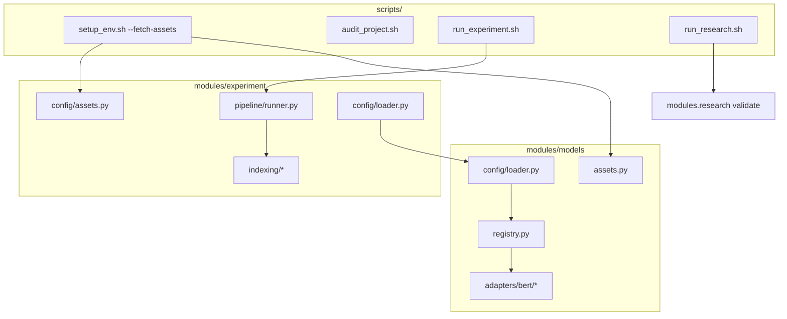

# 02 Entrypoints Scripts

## 2. Entrypoints e scripts

| Script | Função |
| --- | --- |
| `scripts/setup_env.sh` | Cria `venv/`, instala deps; `--fetch-assets` baixa modelos, datasets e mercado |
| `scripts/audit_project.sh` | Estrutura, YAML, pytest, dry-run |
| `scripts/run_experiment.sh` | Chama `python -m modules.experiment`; `--campaign sabesp_2026 --campaign-run r0_baseline` resolve config/run/model/dataset |
| `scripts/migrate_data_paths.sh` | Migra `data/saneamento_corpus/` → `data/water_utilities_corpus/` (idempotente) |
| `scripts/run_research.sh` | Chama `python -m modules.research validate` |
| `scripts/run_dashboard.sh` | Dashboard Streamlit de exploração da pesquisa |
| `modules/scrapers/scripts/scrape.sh` | Wrapper de coleta |
| `modules/scrapers/scripts/build_corpus.sh` | Mescla `raw/` → corpus |
| `modules/market/scripts/fetch.sh` | Wrapper de preços |
| `modules/models/scripts/fetch.sh` | Download isolado de modelos |
| `modules/datasets/scripts/fetch.sh` | Download isolado de datasets |

### Scripts de campanha (descartáveis)

Ver [`scripts/campaigns/README.md`](../../scripts/campaigns/README.md) e [`configs/campaigns/README.md`](../../configs/campaigns/README.md).

| Script | Função |
| --- | --- |
| `scripts/campaigns/sabesp_2026.sh` | Campanha Sabesp R0–R9 (Marco 1) |
| `scripts/campaigns/sabesp_marco2.sh` | Marco 2 — janela expandida (`replay-event`, `analyze-periods`) |
| `scripts/campaigns/classifier_eval_en.sh` | Trilha B — PhraseBank/NOSIBLE |
| `scripts/campaigns/fnspid_pilot.sh` | Marco 4 — piloto FNSPID |
| `scripts/campaigns/finmarba_diag.sh` | Marco 5 — FinMarBa |
| `scripts/campaigns/classifier_eval_pt.sh` | κ bateria PT (FinBERT vs controles) |

### CLIs `python -m modules.*`

| Módulo | Comandos úteis |
| --- | --- |
| `modules.experiment` | `--dry-run`, `--model`, `--dataset`, `run_id` |
| `modules.research` | `validate`, `check` |
| `modules.models` | `check`, `fetch --model KEY` |
| `modules.datasets` | `check`, `validate`, `fetch` |
| `modules.market` | `check`, fetch via script |
| `modules.scrapers` | subcomandos em `cli/main.py` |
| `modules.evaluation` | campanhas manuais / relatórios |

Detalhe de flags: `--help` em cada módulo; campanhas encapsulam sequências em `scripts/campaigns/`.

### Variáveis de ambiente

| Variável | Efeito |
| --- | --- |
| `SCRAPERS_LIVE=1` | Habilita `pytest` de scrapers com rede/Playwright |
| `TRANSFORMERS_OFFLINE=1` / `HF_HUB_OFFLINE=1` | Inferência offline (padrão em `run_service.sh`) |
| `PYTHONPATH` | Raiz do repo (scripts já exportam) |
| Secrets (API juiz) | `.env` — nunca commitar |

Fluxo completo: [11_fluxo_ponta_a_ponta.md](11_fluxo_ponta_a_ponta.md).

---
