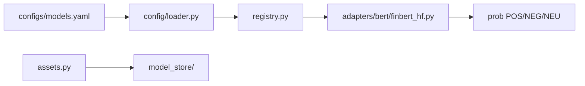
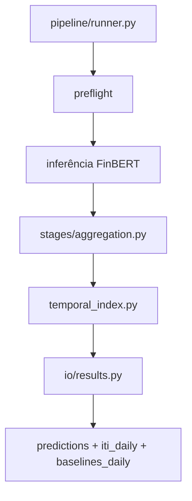
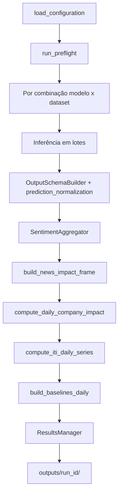
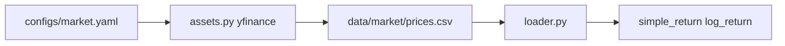
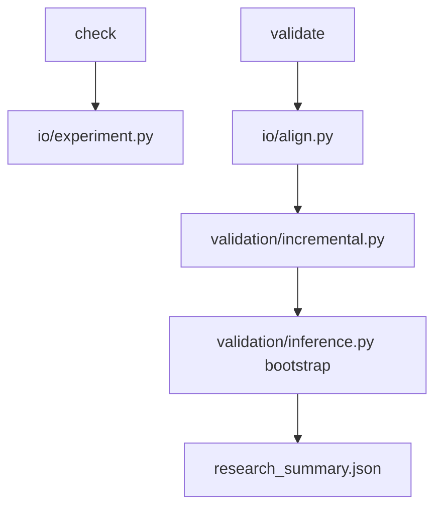
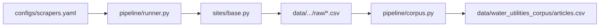

# 03 Modulos

## 3. Módulos

### 3.1 `modules/models` — modelos de sentimento

**Responsabilidade:** carregar checkpoints FinBERT, normalizar rótulos e produzir probabilidades por notícia.



| Arquivo | Papel |
| --- | --- |
| `config/loader.py` | Lê e valida `configs/models.yaml` |
| `assets.py` | Download HuggingFace → `model_store/` |
| `registry.py` | Instancia adaptador por chave YAML |
| `sentiment.py` | Mapeamento de rótulos e `continuous_sentiment` |
| `base.py` | Contrato base dos adaptadores |
| `adapters/bert/finbert_hf.py` | Motor compartilhado BERT |
| `adapters/bert/finbert_ptbr.py` | Alias FinBERT-PT-BR |
| `adapters/bert/bertweet_pt_sentiment.py` | Controle PT (pysentimiento/BERTweet) |
| `adapters/bert/bertimbau_sentiment.py` | Controle PT (BERTimbau geral, 3 classes) |
| `adapters/bert/*.py` | Um adaptador por checkpoint |

**Sentimento contínuo** (por notícia):

\[
d = P(\text{POSITIVE}) - P(\text{NEGATIVE})
\]

Implementado conforme `labels.continuous_sentiment.formula` em cada modelo (`prob_positive - prob_negative`).

**Validação de rótulos.** Em `configs/models.yaml`, `validate_label_mapping: true` confere se os rótulos do checkpoint batem com o mapeamento declarado no YAML. Adaptadores antigos usavam `validate_configured_labels`; o código aceita os dois nomes por compatibilidade.

**Controles PT (`enabled: false`).** `bertweet_pt_sentiment` ([pysentimiento/bertweet-pt-sentiment](https://huggingface.co/pysentimiento/bertweet-pt-sentiment)) e `bertimbau_sentiment` ([lipaoMai/bert-sentiment-model-portuguese](https://huggingface.co/lipaoMai/bert-sentiment-model-portuguese), base BERTimbau) não entram na matriz default. Fetch e dry-run: ver [§3.3.1](#331-higiene-do-pipeline-estado-atual).

---

### 3.2 `modules/datasets` — datasets de notícias

**Responsabilidade:** ler CSVs locais ou HuggingFace, padronizar colunas e aplicar limites (`max_rows`).

| Arquivo | Papel |
| --- | --- |
| `config/loader.py` | Lê `configs/datasets.yaml` |
| `loader.py` | Leitura, validação e normalização de linhas |
| `assets.py` | Fetch de datasets declarados com `source` |
| `__main__.py` | CLI `fetch`, `check`, `validate` |

Colunas canônicas internas: `news_id`, `text`, `date`, `company`, `sector`, `ticker`, etc., mapeadas via `columns` no YAML.

**Inspeção em preflight.** `inspect_columns()` lê apenas a primeira linha de arquivos JSONL e HuggingFace (`nrows=1`), evitando carregar o corpus inteiro só para obter nomes de colunas.

---

### 3.3 `modules/experiment` — inferência e ITI

**Responsabilidade:** orquestrar combinações modelo×dataset, inferir sentimento, agregar e calcular ITI + baselines B0–B2.



| Arquivo | Papel |
| --- | --- |
| `pipeline/runner.py` | Orquestração da run (combinações, ITI, resultados) |
| `pipeline/preflight.py` | Checks antes da inferência (`PreflightReport`) |
| `pipeline/combination_executor.py` | Uma combinação modelo×dataset (inferência + métricas + ITI) |
| `pipeline/runner_support.py` | Progresso e liberação de memória CUDA |
| `config/loader.py` | Resolve `experiment.yaml` + models + datasets |
| `config/assets.py` | Orquestra fetch de modelos, datasets e mercado |
| `stages/aggregation.py` | Agregações company/sector/market day |
| `stages/metrics.py` | Métricas supervisionadas e performance |
| `indexing/temporal_index.py` | **Cálculo do ITI** |
| `indexing/dimensions.py` | Dimensões m, r, e, h, q, u |
| `indexing/baselines.py` | Baselines B0–B2 (contagem, média, média ponderada) |
| `io/results.py` | Grava CSVs e `summary.json` |

Baselines **B0–B2** são calculados no experimento a partir das previsões (`build_baselines_daily` em `indexing/baselines.py`). O baseline **B3** (impacto diário sem memória EWMA) é derivado no research (`validation/baselines.py`, coluna `b3_daily_impact_no_memory`).

**Preflight.** Invariantes (YAML válido, pelo menos uma combinação modelo×dataset, colunas mínimas ao inspecionar/carregar) são sempre aplicadas. Em `preflight_checks`, só restam flags reais: `enabled` (desliga o I/O caro de `run_preflight`), `validate_model_files`, `validate_dataset_files` e `validate_output_directory`.

**Ciclo de vida do runner.** `ExperimentRunner.run()` instala handlers de SIGINT/SIGTERM dentro do bloco `try` principal (incluindo `results.prepare()` e coleta de metadados), de modo que o `finally` sempre restaura os handlers mesmo se a preparação falhar cedo. A finalização de resultados em caso de erro usa `try/except` para não mascarar a exceção original.

**Memória e performance.** `LoadedDataset.texts` usa cache interno (`_texts_cache`) — a lista de strings é criada uma vez por dataset carregado. `CombinationPerformanceMonitor` (`stages/metrics.py`) respeita `performance_metrics.enabled`: quando `false`, `start()`, `stop()` e `phase()` são no-op (sem sincronização CUDA desnecessária). `execution.unload_model_after_combination` libera o modelo ao **trocar de `model_key`** ou ao terminar a run — não a cada dataset do mesmo modelo (o runner passa `next_model_key` para decidir).

Dívida conhecida: ver [§3.3.1 Higiene do pipeline](#331-higiene-do-pipeline-estado-atual).

#### 3.3.1 Higiene do pipeline (estado atual)

Auditoria das correções de robustez e memória no runner. Itens já resolvidos têm testes dedicados.

| Item | Status | Onde |
| --- | --- | --- |
| `preflight_checks` enxuto (só flags reais) | Resolvido | `configs/experiment.yaml`, `loader._validate_resolved_configuration`, `runner.run_preflight` |
| JSONL `nrows=1` em `inspect_columns` | Resolvido | `modules/datasets/loader.py` |
| `performance_metrics.enabled` como no-op | Resolvido | `stages/metrics.py` `CombinationPerformanceMonitor` |
| `prepare()` dentro do `try/finally` de sinais | Resolvido | `pipeline/runner.py` |
| Unload de modelo só ao trocar `model_key` | Resolvido | `runner._release_model_after_combination` |
| Cache de `LoadedDataset.texts` | Resolvido | `modules/datasets/loader.py` |
| Reduzir cópias de DataFrame/previsões | Resolvido | `prediction_normalization`, `aggregation`, `runner` (sem cópia redundante de `texts`/previsões) |
| `save_failure_artifacts` (ex-`save_partial_results`) | Resolvido | `execution` no YAML e runner |
| `OutputSchemaBuilder` só `ModelPrediction` | Resolvido | `io/output_schema.py`, `io/prediction_normalization.py` |
| Docstrings legadas | Resolvido | módulos `modules/experiment` |
| Preflight em módulo dedicado | Resolvido | `pipeline/preflight.py` |
| Execução de combinação extraída | Resolvido | `pipeline/combination_executor.py` |

**Limitação conhecida:** o dataset inteiro ainda é carregado em memória por combinação; inferência já é por lotes no adaptador (`batch_size` em `models.yaml`). Streaming end-to-end fica para fase futura.

Controles PT genéricos (`bertweet_pt_sentiment`, `bertimbau_sentiment`) estão em `configs/models.yaml` com `enabled: false` — fetch opcional para bateria de κ:

```bash
python -m modules.models fetch --model bertweet_pt_sentiment --model bertimbau_sentiment
```

#### 3.3.2 Fluxo do runner (`pipeline/runner.py`)



Ordem de execução por combinação:

1. **Preflight** — valida YAML, arquivos de modelo/dataset, diretório de saída.
2. **Carregar corpus** — `DatasetLoader` → `LoadedDataset` (cache de `texts`).
3. **Inferência** — adaptador BERT em lotes (`batch_size`); probabilidades POS/NEG/NEU.
4. **Padronização** — `OutputSchemaBuilder` + `normalize_model_predictions` → schema fixo (`io/output_schema.py`).
5. **Agregação de sentimento** — `SentimentAggregator` → `aggregates.csv` (níveis `company_day`, `sector_day`, `market_day`).
6. **Impacto por notícia** — `build_news_impact_frame`: resolve dimensões (§4.1.1) e calcula \(I_n\), \(R_n\), \(w_n\).
7. **Agregação diária** — `compute_daily_company_impact` → `impacto_dia`, `risco_dia`, `news_count`.
8. **EWMA** — `compute_iti_daily_series` → `iti_daily.csv` (+ resample semanal/mensal se habilitado).
9. **Baselines B0–B2** — `build_baselines_daily` → `baselines_daily.csv`.
10. **Persistência** — `ResultsManager`: `predictions.csv`, `summary.json`, `resolved_config.yaml`, métricas de classificação se houver `true_label`.

Se `uncertainty.enabled` e ≥2 modelos na run, `merge_uncertainty_across_models` gera `iti_uncertainty_daily.csv` (variância de \(d\) entre modelos).

Ver [Apêndice A](#apêndice-a--contrato-outputs) para colunas de cada arquivo.

---

### 3.4 `modules/market` — preços e retornos

**Responsabilidade:** materializar preços diários (yfinance) e calcular retornos para o research.



| Arquivo | Papel |
| --- | --- |
| `assets.py` | Download ticker a ticker; normaliza MultiIndex yfinance |
| `loader.py` | Sanitiza CSV, calcula retornos |
| `config/loader.py` | Tickers, datas, colunas |

**Retornos** (por ticker, ordenado por data):

\[
r^{\log}_t = \ln\left(\frac{P_t}{P_{t-1}}\right), \quad r^{\simple}_t = \frac{P_t - P_{t-1}}{P_{t-1}}
\]

(`sklearn`/pandas: `pct_change` e log-ratio.)

---

### 3.5 `modules/research` — validação científica

**Responsabilidade:** alinhar ITI + baselines + preços B3, calcular métricas incrementais e gerar relatórios.



| Arquivo | Papel |
| --- | --- |
| `pipeline/runner.py` | `check_research_inputs`, `run_research` |
| `io/align.py` | Merge ITI × mercado × retornos futuros (modo diário) |
| `io/weekly_align.py` | Alinhamento semanal W-FRI (modo campanha Sabesp) |
| `io/experiment.py` | Descobre combinações em `outputs/{run_id}/` |
| `validation/incremental.py` | ITI vs baselines por horizonte |
| `validation/market.py` | Correlações série × retorno |
| `validation/metrics.py` | Pearson, Spearman, R², MSE |
| `validation/inference.py` | Bootstrap em bloco, IC, p-value |
| `validation/baselines.py` | Deriva B3 = `impacto_dia` no painel |

**Saídas** em `outputs/{run_id}/research/{model}/{dataset}/`:

- `aligned_panel.csv` — painel date×empresa×ticker
- `incremental.csv` — métricas por predictor/horizonte
- `incremental_deltas.csv` — delta ITI − baseline
- `market_metrics.csv` — correlações brutas
- `research_summary.json` — conclusão e metadados

---

### 3.6 `modules/scrapers` — coleta multiportal

**Responsabilidade:** buscar artigos em portais configurados, enriquecer entidade B3 e mesclar corpus.



| Arquivo | Papel |
| --- | --- |
| `pipeline/runner.py` | Orquestra sites habilitados |
| `pipeline/state.py` | Estado incremental / checkpoints de coleta |
| `sites/base.py` | Scraper configurável (RSS, API WordPress, HTML) |
| `core/search.py` | Estratégias de busca |
| `schema/entities.py` | Match entidades (`configs/entities.yaml`) |
| `schema/csv.py` | Normalização CSV bruto |
| `cli/build_strict.py` | Corpus strict por entidade |
| `cli/filter_corpus.py` | Filtros ad hoc |

**Operação:** `python -m modules.scrapers`, scripts em `modules/scrapers/scripts/`. Entidades e tickers: [06_configuracoes.md](06_configuracoes.md).

**Testes:** `test_scrapers_*.py` — live com `SCRAPERS_LIVE=1` ([09_testes.md](09_testes.md)). Offline: config, schema, entities, corpus.

**Pós-coleta:** datasets apontam para `data/water_utilities_corpus/` — não importar scrapers em `experiment` ou `research`.

---

### 3.7 `modules/evaluation` — métricas auxiliares

Scripts de análise **fora** do pipeline ITI→research principal. Não alteram `iti_daily.csv`; produzem relatórios em `outputs/campaigns/`.

**Layout:** `configs/evaluation.yaml`; pacotes `evaluation/core/` (métricas e rótulos manuais), `evaluation/campaigns/` (relatórios Sabesp e pilotos), `evaluation/judges/` (contrato LLM). CLI unificada: `python -m modules.evaluation`.

| Módulo | Função | Script / campanha |
| --- | --- | --- |
| `manual_labels.py` | Amostra estratificada PT + comparação humano vs modelo | `sabesp_2026.sh manual-sample`, `manual-compare` |
| `classifier_eval.py` | Acurácia/κ em `predictions.csv` com `true_label` (EN) | `classifier_eval_en.sh` |
| `classifier_eval_pt.py` | Bateria FinBERT vs BERTweet/BERTimbau (n=100) | `classifier_eval_pt.sh` |
| `classifier_error_analysis.py` | Tipologia `focal_sabesp` / `roundup_agenda` | `error_analysis.md` |
| `significant_wins_report.py` | Tabela das vitórias significativas (2/24) | Marco 2 — `significant_wins_r1_event.md` |
| `period_breakdown.py` | Correlação ITI×retorno por subperíodo | `period_breakdown_gap2023.md` |
| `gap2023_summary.py` | Comparação expandido vs evento | `gap2023_comparison.md` |
| `event_corpus_filter.py` | Remove roundups/agendas do corpus evento | F4 — `sabesp_event_r1_filtered` |
| `judges/base.py`, `llm_stub.py` | Contrato LLM-as-judge | Piloto qualificação — [tracking](../tracking/annotation_protocol_v2.md) §7 |

Fluxo típico: `manual_labels` → join corpus → `classifier_eval_pt` / κ gate. Saídas em `outputs/campaigns/`. Regras: [12_regras_de_negocio.md](12_regras_de_negocio.md) §12.6.

---

### 3.8 Campanhas (`modules/experiment/campaign`)

Orquestra runs R0–R9 da Sabesp sem editar o core do experimento.

| Arquivo | Papel |
| --- | --- |
| `init_manifest.py` | Cria `outputs/campaigns/sabesp_2026/manifest.json` com hipóteses R0–R9 |
| `generate_configs.py` | Gera YAMLs em `configs/campaigns/sabesp_2026/experiments/` |
| `update_manifest.py` | Atualiza `metrics_summary` e `delta_vs_baseline` após research |
| `manifest.py` | `CampaignRunRecord`, load/save do manifest |
| `comparative_analysis.py` | Tabela comparativa para dashboard (página Experimentos) |

**Relação configs ↔ outputs:**

- Configs: `configs/campaigns/sabesp_2026/` (experiment + `research_weekly.yaml`)
- Manifest e relatórios: `outputs/campaigns/sabesp_2026/`, `outputs/campaigns/sabesp_marco2/`
- Runs individuais: `outputs/sabesp_r0_baseline/`, …, `outputs/sabesp_r9_ensemble/`

O dashboard lê o manifest via `modules/dashboard/services/campaigns.py`.

---

### 3.9 `modules/dashboard` — exploração (Streamlit)

**Responsabilidade:** visualizar `outputs/`, manifests e textos de ajuda — **sem** recalcular ITI ou rodar inferência.

| Área | Caminho | Notas |
| --- | --- | --- |
| App | `app.py` | Entry Streamlit |
| Páginas | `pages/*.py` | URLs em PT (`research_trail`, corpus, experimentos) |
| Conteúdo UI | `content/pt_br.py`, `chart_help.py` | Strings pesquisador |
| Serviços | `services/campaigns.py`, loaders de CSV | Somente leitura |
| Config | `config.py` | Paths para `outputs/` |

Comando: `./scripts/run_dashboard.sh`. Inventário de gráficos: [chart_inventory.md](chart_inventory.md), [08_dashboard_streamlit.md](08_dashboard_streamlit.md). Testes: `tests/test_dashboard_*.py`.

---

### 3.10 Funções críticas (mapa rápido)

| Etapa | Função / classe | Arquivo |
| --- | --- | --- |
| Config experiment | `load_configuration()` | `experiment/config/loader.py` |
| Preflight | `run_preflight()` | `experiment/pipeline/preflight.py` |
| Combinação | `execute_combination()` | `experiment/pipeline/combination_executor.py` |
| Schema saída | `OutputSchemaBuilder.build()` | `experiment/io/output_schema.py` |
| ITI diário | `compute_iti_daily_series()` | `experiment/indexing/temporal_index.py` |
| Research semanal | `align_weekly_combination()` | `research/io/weekly_align.py` |
| Incremental | deltas ITI vs baseline | `research/validation/incremental.py` |
| Merge datasets campanha | `_merge_campaign_datasets_overlay()` | `datasets/config/loader.py` |

---
