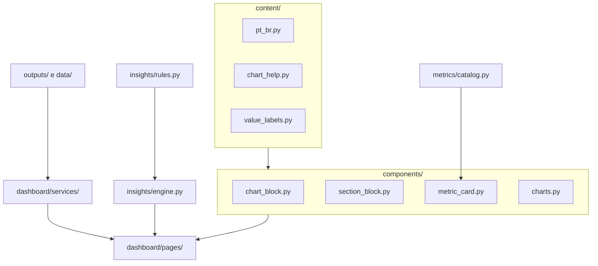

# 08 Dashboard Streamlit

## 8. Dashboard (Streamlit)

Interface multipage para explorar corpus, runs, modelos, experimentos e research sem abrir CSVs manualmente. **Não recalcula** ITI nem research — só lê `outputs/` e `data/` (detalhe: [03_modulos §3.9](03_modulos.md)). Campanhas: [02_entrypoints_scripts](02_entrypoints_scripts.md).

```bash
./scripts/run_dashboard.sh
# ou: ./scripts/run_dashboard.sh --port 8502
```

### Arquitetura



| Camada | Papel |
| --- | --- |
| `content/chart_help.py` | Textos "O que isto mostra?" por gráfico (`CHART_HELP`) |
| `content/pt_br.py` | Rótulos de abas, navegação e callouts exploratórios |
| `content/value_labels.py` | Nomes amigáveis B0–B3, horizontes, runs |
| `components/chart_block.py` | Título + expander + gráfico com `chart_context` |
| `components/section_block.py` | Seções com intro e ajuda opcional |
| `components/metric_card.py` | KPI com catálogo, bands e `metric_row` |
| `services/catalog.py` | Runs, `run_display_name`, badges de status |
| `services/classifier.py` | Bateria `classifier_eval_pt` (κ, acurácia, matriz) |
| `services/research.py` | `research_summary`, `aligned_panel`, win rate |
| `services/compare.py` | `compare_runs`, `delta_win_rate`, diffs de parâmetros |
| `services/campaigns.py` | Manifest R0–R9, tabela comparativa |
| `services/corpus.py` | Estatísticas do corpus scraper |
| `services/runs.py` | `diff_configs`, `param_diffs_to_dataframe` (Arrow-safe) |
| `insights/engine.py` | Bullets contextuais (κ, exploratório, win rate) |

Inventário completo de gráficos: [documentation/chart_inventory.md](chart_inventory.md).

Tabelas de diff de parâmetros ITI (`run_a`/`run_b`) passam por `param_diffs_to_dataframe()` antes do `st.dataframe` — evita erro PyArrow quando α (float) e `horizon_mode` (string) coexistem na mesma coluna.

### Páginas

Módulos em `modules/dashboard/pages/` (inglês); URLs Streamlit em português em `app.py`.

| Módulo | `url_path` | Título na UI |
| --- | --- | --- |
| `overview.py` | `visao-geral` | Visão Geral |
| `datasets_scraper.py` | `datasets` | Datasets e Scraper |
| `models_page.py` | `modelos` | Modelos |
| `runs.py` | `runs` | Runs |
| `run_comparison.py` | `comparacao` | Comparação |
| `experiments_page.py` | `experimentos` | Experimentos |
| `research.py` | `research` | Research |
| `research_trail.py` | `trilha` | Trilha da pesquisa |

| Página | Abas / conteúdo |
| --- | --- |
| Visão Geral | KPIs (win rate, κ, corpus), pipeline, corpus, campanha |
| Datasets e Scraper | Panorama · Cobertura temporal · Amostra |
| Modelos | Panorama · Distribuição · Qualidade do classificador (κ) |
| Runs | Resumo · Configuração ITI · Série ITI |
| Comparação | Win rate, diff ITI, sentimento multi-run |
| Experimentos | Campanha · Alpha · Ablações |
| Research | Panorama · ITI vs mercado · Incremental · Séries · Métricas brutas |
| Trilha da pesquisa | F0–F6, links à documentação, lista de runs |

---
