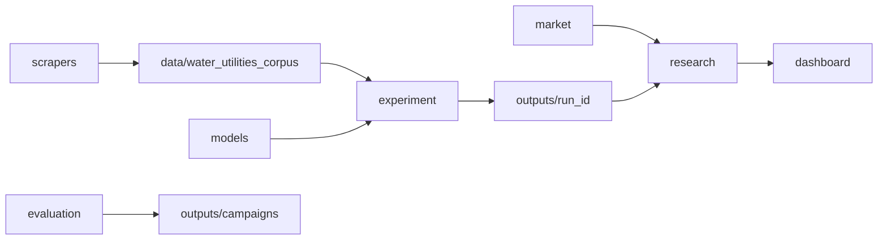

# 11 Fluxo ponta a ponta

Um único percurso do dado bruto ao relatório de research. Detalhe por módulo: [03_modulos.md](03_modulos.md).



## Etapa 0 — Ambiente

```bash
./scripts/setup_env.sh --fetch-assets   # primeira vez
./scripts/audit_project.sh              # gate
```

Artefatos: `venv/`, `model_store/`, `data/market/prices.csv` (se enabled).

## Etapa 1 — Coleta (opcional se corpus já existe)

| Ação | Comando | Saída |
| --- | --- | --- |
| Coleta portais | `python -m modules.scrapers` ou `modules/scrapers/scripts/scrape.sh` | `data/.../raw/*.csv` |
| Montar corpus | `modules/scrapers/scripts/build_corpus.sh` | `data/water_utilities_corpus/noticias.csv` |

Config: `configs/scrapers.yaml`, entidades `configs/entities.yaml`. Testes live: `SCRAPERS_LIVE=1 pytest tests/test_scrapers_live.py`.

Falhas comuns: rede bloqueada; Playwright não instalado.

## Etapa 2 — Declarar corpus (datasets)

Corpus referenciado em `configs/datasets.yaml`. Overlay de campanha: `configs/campaigns/datasets.yaml` (merge sem sobrescrever chaves core).

```bash
python -m modules.datasets check
python -m modules.datasets validate --dataset water_utilities_corpus
```

Saída interna: `LoadedDataset` com colunas canônicas (`news_id`, `text`, `date`, …).

## Etapa 3 — Experimento (inferência + ITI)

```bash
# Dry-run (sem gravar outputs/)
./scripts/run_service.sh --dry-run --model finbert_ptbr --dataset noticias_exemplo_ptbr

# Run real
./scripts/run_experiment.sh --run-id minha_run --model finbert_ptbr --dataset noticias_exemplo_ptbr
```

Campanha Sabesp:

```bash
./scripts/campaigns/sabesp_2026.sh r1_event   # exemplo; ver script
```

Pipeline interno (por combinação): preflight → inferência → `output_schema` → agregação → ITI → baselines B0–B2 → `ResultsManager`.

Saídas: [appendix_output_contract.md](appendix_output_contract.md) — `outputs/{run_id}/models/.../predictions.csv`, `indices/.../iti_daily.csv`, `summary.json`.

Logs: `logs/`; auditoria: `logs/audit/`.

## Etapa 4 — Mercado

```bash
modules/market/scripts/fetch.sh
python -m modules.market check
```

Artefato: `data/market/prices.csv` com `log_return` / `simple_return`.

## Etapa 5 — Research

```bash
./scripts/run_research.sh --run-id minha_run --model finbert_ptbr --dataset noticias_exemplo_ptbr
```

Campanha semanal: research lê `configs/campaigns/sabesp_2026/research_weekly.yaml` (via script de campanha).

Saídas: `outputs/{run_id}/research/.../aligned_panel.csv`, `incremental_deltas.csv`, `research_summary.json`.

## Etapa 6 — Avaliação offline (paralela ao ITI→research)

```bash
./scripts/campaigns/classifier_eval_pt.sh
python -m modules.evaluation  # subcomandos conforme campanha
```

Não altera `iti_daily.csv`. Relatórios em `outputs/campaigns/`.

## Etapa 7 — Dashboard

```bash
./scripts/run_dashboard.sh
```

Somente leitura de `outputs/` e manifests — ver [08_dashboard_streamlit.md](08_dashboard_streamlit.md).

## Pontos de falha e onde olhar

| Sintoma | Verificar |
| --- | --- |
| Preflight falha | `configs/*.yaml`, `model_store/`, colunas dataset |
| Combinação skipped (idioma) | `compatibility` em experiment loader |
| Research sem overlap | `weekly_align`, ticker em `market.yaml`, `companies_filter` |
| κ / manual labels | `configs/evaluation.yaml`, paths em tracking |

Regras de negócio: [12_regras_de_negocio.md](12_regras_de_negocio.md).
