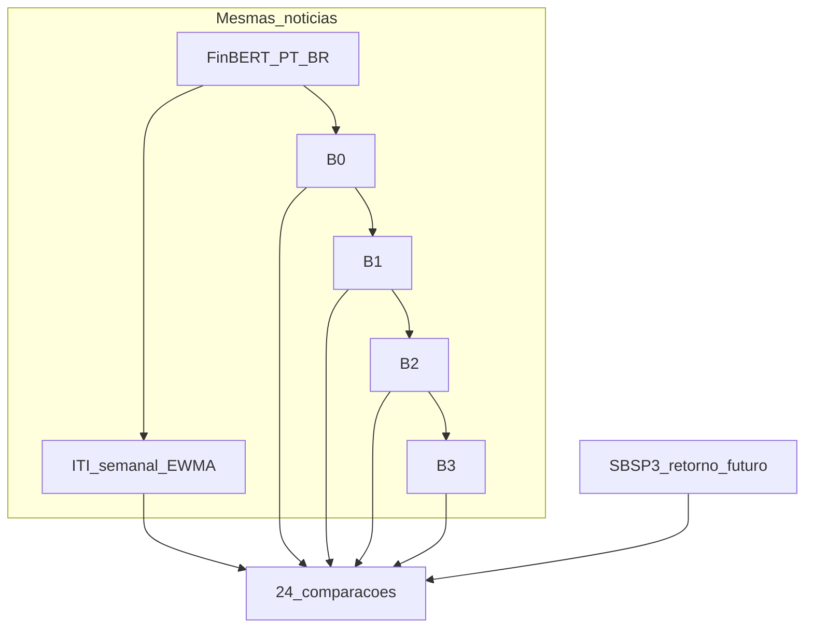

# Parte 2 — Protocolo e critérios de progresso

**Comparação:** ITI vs B0–B3; Pearson + Spearman; retornos futuros 1, 2 e 4 **semanas** → **24 comparações** (4×2×3). ITI semanal = `iti_liquido_last` (último dia útil da semana); retorno = soma dos log-retornos diários na janela futura alinhada.

## Seis camadas de validade

1. **Execução** — pipeline coleta, classifica, agrega, alinha.
2. **Comparação** — mesma frequência e painel para predictor e alvo.
3. **Valor incremental** — ITI vence baselines cabeça a cabeça.
4. **Robustez** — padrão sobrevive a lacunas e filtros textuais.
5. **Credibilidade do predictor** — gate de concordância humana (≥70% ou κ≥0,40).
6. **Interpretação** — resultados positivos, nulos e contraditórios reportados; **busca múltipla** (2/24 sig.) como regra de leitura, não explicação posterior.

## Tabela protocolo (Trilha A)

| Item | Valor |
|------|-------|
| Empresa | Sabesp (`SBSP3.SA`) |
| Corpus strict | `data/water_utilities_corpus/articles_strict_sabesp.csv` |
| Classificador | `finbert_ptbr` |
| ITI | EWMA α configurável; `iti_liquido_last` |
| Baselines | B0–B3 (somente notícias) |
| Validação | Pearson + Spearman; h ∈ {1,2,4} semanas |
| Significância | Bootstrap `block_size=2`, `n_bootstrap=500` |
| Research YAML | `configs/campaigns/sabesp_2026/research_weekly.yaml` |

## Implementação no código (camada 2–3)

| Camada | Onde no repo |
| --- | --- |
| 1 Execução | `experiment` runner, `scrapers`, `datasets` |
| 2 Comparação | `research/io/weekly_align.py`, `index_frequency: weekly` |
| 3 Incremental | `research/validation/incremental.py`, `incremental_deltas.csv` |
| 4 Robustez | campanhas Marco 2, `evaluation/gap2023_summary.py` |
| 5 Credibilidade | `evaluation/classifier_eval_pt.py`, [annotation_protocol_v2](../tracking/annotation_protocol_v2.md) |
| 6 Interpretação | manifest + Parte 4; regra busca múltipla em [01_visao §1.5](../documentation/01_visao_e_conceitos.md) |

Matriz 24 duelos (referência):

| Horizonte (sem) | Baseline | Métricas |
| --- | --- | --- |
| 1, 2, 4 | B0, B1, B2, B3 | Pearson, Spearman |

Regras formais: [12_regras_de_negocio.md](../documentation/12_regras_de_negocio.md) §12.4.

Bibliografia âncora: [references/README.md](../references/README.md) (mapa artigo → fase → doc).

---

**Próximo:** [Parte 3 — Fases](part-03-phases.md)
