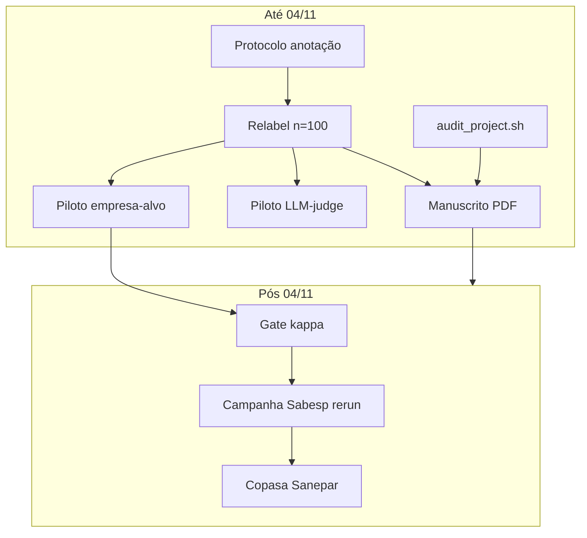
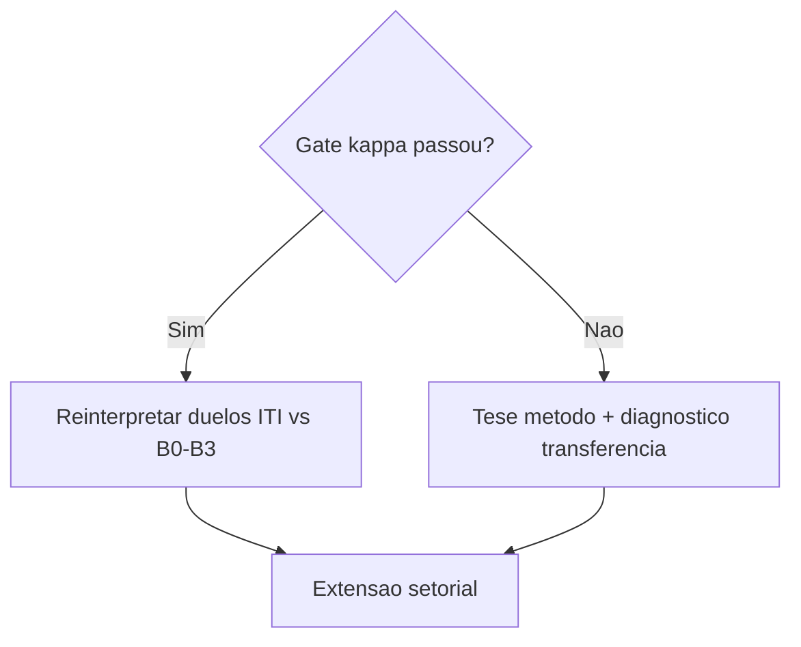

# Plano mestre — Qualificação PPGCC/UFSJ (28 dias)

**Prazo de envio:** 04/11/2026  
**Janela operacional:** 07/10/2026 a 04/11/2026 (28 dias)  
**Última atualização do plano:** 07/10/2026  

Este é o **guia operacional** (detalhe técnico) até a entrega do manuscrito de qualificação — diretrizes do orientador (§1.6), DoD, scripts e pilares A–G. **[qualification_schedule.md](qualification_schedule.md)** é o **acompanhamento semanal com o orientador** (registro por semana, checkboxes e entregas; sem tutorial nem operação interna). **Progresso:** atualizar primeiro o schedule, depois espelhar marcos relevantes no Status rápido abaixo. Cruza escrita, revisão bibliográfica, código, testes, **LLM-judge (piloto)** e uso do **Santos Dumont (SDumont)**.

Documentação técnica interna (pilares A–G, guia para desenvolvimento): ver `docs/documentation/` e capítulos 10–13 em `docs/README.md` — não faz parte do cronograma enviado ao orientador.

---

## Status rápido (atualizar semanalmente)

| Item | Status | Notas |
|------|--------|-------|
| PDF `ufsj-abntex2.pdf` compilável | ☐ | |
| Caps. 1–2 + apêndice (PDF quali parcial) | ☐ | caps. 3–5 quando `\qualificacaoparcialfalse` |
| Protocolo de anotação (amostra formal) | ☐ | |
| Relabel ≥ 80% (n=100) | ☐ | |
| Piloto mensuração empresa-alvo | ☐ | |
| PQs explícitas em `01_introducao.tex` | ☐ | |
| Contato / IAA Rafael (subconjunto ~30) | ☐ | |
| Piloto LLM-judge (CSV + prompt documentado) | ☐ | |
| PDF enviado ao orientador (sem. 1 / 2 / 3) | ☐ | sem. 1: caps. 1–2 + apêndice protocolo — ver [schedule § Semana 1](qualification_schedule.md#semana-1-07-a-13out) |
| Catálogo juízes LLM + CLI piloto | ☑ | `docs/references/notas/llm_judge.md`, DR-011, `python -m modules.evaluation llm-judge-pilot` |
| CSV amostra formal criado | ☐ | `scripts/bootstrap_manual_labels.py` + revisão humana 25–35 |
| `audit_project.sh` verde | ☐ | |
| Job SDumont (ou adiado documentado) | ☐ | |
| `run_id` pós-piloto registrado | ☐ | |

**Runs da semana:** _(preencher)_  
**Bloqueios:** _(preencher)_  

---

## 1. Objetivo e escopo

### 1.1 O que entregamos em 04/11/2026

Entrega acordada: **manuscrito atual** (capítulos 1–6, **sem** capítulo de resultados fechados) + **PDF abnTeX** compilável.

- Estrutura LaTeX: [`../Dissertacao_PPGCC/ufsj-abntex2.tex`](../Dissertacao_PPGCC/ufsj-abntex2.tex) — inclui caps. 1–6 e bibliografia; **não** inclui capítulo de “resultados definitivos”.
- Tom científico: andamentos **honestos** (gate κ não atingido; R0/R1 como exercício de protocolo), alinhado a [`05_andamentos.tex`](../Dissertacao_PPGCC/05_andamentos.tex) e [`../research_trail/README.md`](../research_trail/README.md) Parte 4.

### 1.2 Dentro do escopo (28 dias)

| Entrega | Critério |
|---------|----------|
| Manuscrito coerente | QPs, método, números = [`../research_trail/README.md`](../research_trail/README.md) Parte 4 |
| Protocolo de anotação | Escrito; amostra para **validar pipeline**, não para fechar gate na qualificação |
| Relabel da amostra manual | ≥ 80% das 100 notícias **ou** amostra estratificada documentada |
| Piloto LLM-judge | 10–20 notícias, prompt `prompt_v1_quali` em [annotation_protocol.md](annotation_protocol.md) §7 |
| Piloto código empresa-alvo | 1–2 estratégias **sem fine-tune**, se relabel avançar até ~18/10 (opcional vs LLM) |
| Qualidade de repositório | `./scripts/audit_project.sh` passando |
| SDumont | Inferência em GPU **ou** adiamento explícito com motivo neste arquivo |

### 1.3 Fora do escopo (não prometer na qualificação)

- H1 confirmada ou vitória do ITI como conclusão principal.
- Gate κ ≥ 0,40 / acurácia ~70% **fechado** (meta pós-qualificação).
- Copasa/Sanepar na avaliação principal.
- Fine-tune / LoRA.
- H2 (volatilidade/volume), Granger, controles IBOV.
- Dashboard como evidência científica.

### 1.4 Documentos de referência (não duplicar; sincronizar)

| Documento | Função |
|-----------|--------|
| [`qualification_schedule.md`](qualification_schedule.md) | **Acompanhamento semanal** — registro, checkboxes e entrega (reunião com orientador) |
| [`../Dissertacao_PPGCC/`](../Dissertacao_PPGCC/) | Narrativa acadêmica (caps. 1–6) para qualificação |
| [`../research_trail/README.md`](../research_trail/README.md) | Números oficiais, runs, limitações |
| [`../documentation/README.md`](../documentation/README.md) | Comandos, módulos, fórmulas ITI |
| [`docs/references/README.md`](references/README.md) | Bibliografia e notas |
| [`annotation_protocol.md`](annotation_protocol.md) | Anotação, IAA, LLM-judge |
| [`../Dissertacao_PPGCC/README.md`](../Dissertacao_PPGCC/README.md) | Compilação LaTeX |

### 1.5 Fluxo de dependências



### 1.6 Diretrizes do orientador (06/10/2026)

Feedback consolidado (Michel Leles) — prioridade até 04/11:

| # | Diretriz | Onde registrar |
|---|----------|----------------|
| 1 | **Setup experimental** correto e **avenida de pesquisa** clara | `01_introducao.tex`–`04_metodologia.tex`; marcos nas [Semanas 1–4](qualification_schedule.md#1-cronograma-por-semanas-0710-a-04112026) do schedule |
| 2 | Revisão bibliográfica, **lacuna**, **perguntas de pesquisa**, objetivos, hipótese | `01_introducao.tex`, `02_revisao.tex` |
| 3 | **Desenho experimental** para avaliar a hipótese (sem prometer resultado) | `04_metodologia.tex` |
| 4 | **Resultados iniciais** — andamento honesto, não conclusão de mercado | `05_andamentos.tex` |
| 5 | Texto do colegiado → **formato dissertação** (PDF caps. 1–6) | `latexmk` sem. 3–4 |
| 6 | Anotação manual: crítica possível (não especialista); usar amostra para **validar pipeline** | [annotation_protocol.md](annotation_protocol.md) §0 |
| 7 | Mitigar: **Rafael** (IAA) + **LLM-judge** (piloto documentado) | [Semana 1](qualification_schedule.md#semana-1-07-a-13out)–[Semana 2](qualification_schedule.md#semana-2-14-a-20out) no schedule |

**Opcional semana 1 (LaTeX):** subseção `Questões de pesquisa` em `01_introducao.tex` (QP1–QP3, espelhar trajetoria Parte 0); parágrafo limitação anotador em `04_metodologia.tex` ou `05_andamentos.tex`.

---

## 2. Definition of Done (04/11/2026)

Marque **sim** em todos antes do envio:

- [ ] **PDF** gerado: `cd ../Dissertacao_PPGCC && latexmk -pdf ufsj-abntex2.tex` — sem erro fatal (avisos de underfull hbox aceitáveis).
- [ ] **Capítulos 1–6** revisados; tabela κ e win rate em `05_andamentos.tex` = trajetoria §4.2–4.4.
- [ ] **Resumo/abstract** (`00_pretextual.tex`) coerente com limitações do gate.
- [ ] **Protocolo de anotação** em [`annotation_protocol.md`](annotation_protocol.md) ou apêndice em `99_apendices.tex`.
- [ ] **Revisão da amostra:** `data/water_utilities_corpus/manual_labels_100.csv` com ≥ 80 linhas revisadas segundo o protocolo (exploratório arquivado em `manual_labels_100_exploratorio.csv`).
- [ ] **`./scripts/audit_project.sh`** executado com sucesso após últimas mudanças de código (se houver).
- [ ] **SDumont:** job concluído **ou** seção “Adiamento SDumont” preenchida no [Status rápido](#status-rápido-atualizar-semanalmente) com data e motivo.
- [ ] **Fase 2** lida e aceita como roteiro pós-qualificação (Seção 11).
- [ ] **Orientador:** envio do PDF + versão do commit (opcional tag `qualificacao-2026-11-04`).

---

## 3. Ritmo de trabalho e registro

### 3.1 Sugestão diária (ajuste à sua rotina)

| Bloco | Atividade típica |
|-------|------------------|
| Manhã (2–3 h) | Escrita LaTeX ou leitura bibliográfica |
| Tarde (2–3 h) | Anotação, código piloto, pytest/audit |
| Fim do dia (15 min) | Atualizar [Status rápido](#status-rápido-atualizar-semanalmente); anotar `run_id` |

### 3.2 Onde registrar evidência

| Tipo | Local |
|------|--------|
| Runs experimento/research | `outputs/<run_id>/` |
| Diagnóstico classificador | `outputs/campaigns/classifier_eval_pt/` |
| Logs auditoria | `logs/audit/` |
| Notas qualitativas de erro | `outputs/campaigns/.../error_analysis.md` ou notas em `docs/` |
| Números citados na tese | Fonte: trajetoria Parte 4 — **não** inventar |

### 3.3 Ritual semanal (30 min, preferência segunda-feira)

1. Marcar checkboxes do cronograma (Seção 9).
2. Atualizar tabela [Status rápido](#status-rápido-atualizar-semanalmente).
3. Listar `run_id`s e commits da semana.
4. Decidir: SDumont nesta semana ou adiar (Seção 8).

---

## 4. Trilha A — Escrita da dissertação

Compilação:

```bash
cd ../Dissertacao_PPGCC
latexmk -pdf ufsj-abntex2.tex
# PDF: ../Dissertacao_PPGCC/ufsj-abntex2.pdf
```

Checklist LaTeX (antes do envio):

- [ ] `latexmk` sem erro fatal.
- [ ] Todas as `\cite{}` resolvem no `.bbl`.
- [ ] Figuras/tabelas referenciadas existem ou foram removidas.
- [ ] Folha de aprovação: membros da banca (“A definir”) — confirmar com orientador se preencher nomes antes de 04/11.

### 4.1 Por capítulo — tarefas e fonte

| Capítulo | Arquivo | O que fazer até 04/11 | Fonte de verdade |
|----------|---------|------------------------|------------------|
| 1 Introdução | `01_introducao.tex` | Alinhar QP1–QP3 e objetivos; hipótese em aberto | `01_introducao.tex`, trajetoria Parte 0 |
| 2 Revisão | `02_revisao.tex` | Tabela síntese lacuna (linhas: mídia, índices, NLP, BR, saneamento) | `02_revisao.tex`, trajetoria §0.2 |
| 3 Proposta | `03_proposta.tex` | Revisão de estilo; manter “o que não replicamos” | Já forte |
| 4 Metodologia | `04_metodologia.tex` | Gate 70% / κ≥0,40; 24 duelos; preço só como alvo | `04_metodologia.tex`, [documentation](../documentation/README.md) |
| 5 Andamentos | `05_andamentos.tex` | **Sincronizar números** (tabela abaixo) | trajetoria Parte 4 |
| 6 Próximos passos | `06_proximos_passos.tex` | Ponte para Fase 2 (Seção 11); datas relativas nov–dez/2026 | Este plano §11 |
| Pretextual | `00_pretextual.tex` | Revisão final 30–31/10; resumo = sem conclusão de desempenho | — |
| Apêndices | `99_apendices.tex` | **Recomendado:** protocolo resumido | `annotation_protocol.md` |

### 4.2 Números obrigatórios em `05_andamentos.tex` (trajetoria Parte 4)

| Métrica / resultado | Valor | Leitura na qualificação |
|---------------------|-------|-------------------------|
| Acurácia FinBERT vs manual (n=100) | 48% | Abaixo do gate |
| Cohen κ | 0,163 | Gate falhou |
| F1 macro | 0,42 | — |
| κ focal Sabesp (subconjunto) | ~0,217 | Ainda abaixo do gate |
| Roundups na amostra manual | ~26% | Motiva empresa-alvo |
| R1 win rate (janela evento) | 41,7% | **Exploratório**, não H1 |
| Vitórias significativas (evento) | 2 (h=4 vs B3) | Compatível com busca múltipla |
| Expandido gap2023 R1 win rate | 33,3% | Limitação / não generaliza |

**Cuidado:** não escrever que o ITI “comprovou” associação com retorno. Usar: *exercício de protocolo reprodutível; interpretação substantiva condicionada ao gate.*

### 4.3 Calendário de escrita (sobreposto ao cronograma geral)

| Período | Foco LaTeX |
|---------|------------|
| 12–13/10 | Cap. 2 + cap. 5 (números) |
| 25–27/10 | Caps. 1, 3, 4, 6 + biblio |
| 28–29/10 | Apêndice protocolo (opcional) |
| 30/10–01/11 | Leitura integral, resumo, folha de rosto |
| 02/11 | **Freeze de conteúdo** (só correções mínimas) |
| 04/11 | Envio formal |

---

## 5. Trilha B — Revisão bibliográfica incremental

Base já indexada: [`docs/references/README.md`](references/README.md). Antes de citar num capítulo, ler a nota em `docs/references/notas/`.

### 5.1 Referências âncora (manter — já no manuscrito)

Santos et al. (2023), Yoshinaga & Castro Junior (2012), Duarte et al. (2020), Tetlock (2007), Loughran & McDonald (2011), Baker et al. (2016), Shapiro et al. (2022), Marquezan & Assunção (2025), Gattai & Souza (2025), UTFPR (2024), Neuenschwander et al. (2014), Souza et al. (2020) BERTimbau, Araci (2020).

### 5.2 Inclusões recomendadas até a qualificação

| Tema | Referência sugerida | Ação | Onde citar |
|------|---------------------|------|------------|
| Concordância κ | Cohen, J. (1960). *Educational and Psychological Measurement* | Criar `notas/cohen1960.md`; entrada em `bibliografia.bib` | `04_metodologia.tex` (gate); `05_andamentos.tex` |
| Acordo anotação / IAA | Artstein, R. & Poesio, M. (2008). *Language Resources and Evaluation* | Criar `notas/artstein2008.md`; bib | Protocolo formal; cap. 4 se IAA parcial |
| Sentimento por aspecto/entidade | Buscar 1 artigo ABSA em finanças ou “target-specific sentiment” (ex.: trabalhos em aspect-based financial sentiment) | Nota `notas/absa_finance.md`; bib | `02_revisao.tex` lacuna; justificar piloto empresa-alvo |
| Transferência de domínio | Reusar Santos 2023 + parágrafo em Souza 2020 | Nota já existente | `05_andamentos.tex` — κ no saneamento |

**Leitura mínima (qualificação):** Cohen (κ); Artstein (limites IAA); 1 artigo ABSA/entity-target (30–60 min + nota de meia página).

### 5.3 Tabela Decisão → Citação → Texto

| Decisão metodológica | Citação | Arquivo `.tex` |
|----------------------|---------|----------------|
| Gate κ e acurácia antes de mercado | Cohen 1960; Santos 2023 | `04_metodologia.tex` |
| Baselines simples obrigatórios | Loughran & McDonald 2011 | `03_proposta.tex`, `04_metodologia.tex` |
| Horizontes 1/2/4 semanas | Duarte 2020; Marquezan 2025 | `04_metodologia.tex` |
| Não afirmar causalidade | UTFPR 2024 | `03_proposta.tex`, `05_andamentos.tex` |
| Evento Sabesp (contexto, não desenho) | Gattai & Souza 2025 | `01_introducao.tex`, `02_revisao.tex` |
| Coleta como problema científico | Neuenschwander 2014 | `04_metodologia.tex` |
| Anotação multiempresa / ambiguidade | Artstein & Poesio 2008 + piloto ABSA | Apêndice protocolo |

### 5.4 Bases anotadas externas (trilha opcional)

Se encontrar corpus anotado (PT financeiro ou sentimento):

| Critério | Exigência |
|----------|-----------|
| Idioma | PT preferencial |
| Classes | Compatíveis com POSITIVE/NEGATIVE/NEUTRAL ou mapeamento explícito |
| Domínio | Documentar distância ao saneamento |
| Licença | Uso acadêmico permitido |
| Uso na qualificação | **Controle ou diagnóstico** — não substituir gold Sabesp sem nota metodológica |

Fluxo: catalogar em `docs/notas_corpus_externo.md` → não misturar labels no mesmo CSV do gold sem coluna `origem`.

### 5.5 IAA com segundo anotador (trilha opcional)

Enquanto anotação for **solo**, o manuscrito deve declarar limitação. Se orientador ou colega anotar **30–50** itens:

1. Subconjunto estratificado (focal + roundup).
2. κ entre anotadores (Cohen) **separado** do κ modelo×humano.
3. Parágrafo em `05_andamentos.tex` ou apêndice.

---

## 6. Trilha C — Código, dados e experimentos

### 6.1 Protocolo de anotação (amostra formal)

**Protocolo canônico:** [`annotation_protocol.md`](annotation_protocol.md)

**Exploratório arquivado:** [`data/water_utilities_corpus/manual_labels_100_exploratorio.csv`](../../data/water_utilities_corpus/manual_labels_100_exploratorio.csv) — schema simples (`rotulo_manual`); métricas 48%/κ na [trilha §4.4.2](../research_trail/part-04-results.md#442-métricas-na-rodada-exploratória-finbert--anotação-solo).

**Amostra formal (canônica):** [`data/water_utilities_corpus/manual_labels_100.csv`](../../data/water_utilities_corpus/manual_labels_100.csv) — schema:

| Coluna | Tipo | Regra |
|--------|------|--------|
| `news_id` | string | Chave estável |
| `empresa_alvo` | string | Ex.: `Sabesp` — sempre explícito |
| `tipologia` | enum | `focal_sabesp` \| `roundup_agenda` \| `mencao_tangencial` |
| `impacto_alvo` | label | POSITIVE \| NEGATIVE \| NEUTRAL — **o que importa para o ITI** |
| `sentimento_global` | label | Opcional — tom da matéria inteira |
| `ambiguo` | bool | true se humano hesitar; revisar em lote 2 |
| `rotulo_finbert` | label | Congelar ou atualizar após piloto |
| `notas` | texto | Casos limite, multiempresa |
| `anotador` | string | Seu nome; `anotador_2` se IAA |
| `versao_protocolo` | string | Ex.: `2026-10-08` |

**Regras multiempresa (resumo):**

- Roundup: julgar **impacto para `empresa_alvo`**, não o tom geral do mercado.
- Menção tangencial sem evento para a empresa: preferir NEUTRAL ou excluir do strict (documentar).
- Alinhar com [`modules/scrapers/schema/entities.py`](../../modules/scrapers/schema/entities.py) e filtros em [`modules/evaluation/event_corpus_filter.py`](../../modules/evaluation/event_corpus_filter.py).

### 6.2 Relabel — lotes

| Lote | Meta | Período plano |
|------|------|----------------|
| Lote 1 | 30–40 notícias | 09–11/10 |
| Lote 2 | +30–40 | 14–16/10 |
| Lote 3 | Restante até ≥80% | 17–20/10 |

Após cada lote, opcional:

```bash
# Regenerar eval join manual + corpus (quando a amostra formal estiver estável)
python -m modules.evaluation.classifier_eval_pt prepare
python -m modules.evaluation.classifier_eval_pt run
```

Paths padrão em `classifier_eval_pt.py`: `MANUAL_PATH`, `CORPUS_PATH` = `noticias_strict_sabesp.csv`, gate `GATE_ACCURACY = 0.70`, `GATE_KAPPA = 0.40`.

### 6.3 Piloto mensuração empresa-alvo (sem fine-tune)

**Objetivo:** comparar estratégias de **entrada** ao FinBERT antes de reprocessar o corpus inteiro.

| ID | Estratégia | Descrição | Onde implementar (sugestão) |
|----|------------|-----------|------------------------------|
| A | `full_text` | Baseline atual — texto integral | Já existe |
| B | `entity_prefix` | Prefixo: `Empresa-alvo: {empresa}. Texto: {texto}` | Pré-processamento em runner ou `sentiment.py` |
| C | `entity_snippet` | Parágrafo/trecho com match em `match_entity()` | Reutilizar lógica de entidades |

**Critérios de escolha:** acurácia, F1 macro, κ vs `impacto_alvo`; análise qualitativa em erros roundup (`classifier_error_analysis.py`).

**Não fazer neste ciclo:** fine-tune, ensemble R9 como “solução” do κ.

### 6.4 Piloto LLM-judge (semana 2)

Documentação canônica: [annotation_protocol.md](annotation_protocol.md) §7 · nota: [llm_judge.md](../references/notas/llm_judge.md).

| Etapa | Ação |
|-------|------|
| Seleção | 10–20 `news_id` (`ambiguo` ou `roundup_agenda`) |
| Execução | Prompt `prompt_v1_quali` via API ou chat local; **sem** chaves no git |
| Saída | `outputs/campaigns/llm_judge_pilot/llm_judge_pilot.csv` |
| Análise | % acordo humano × LLM × FinBERT; discordâncias para nota qualitativa |
| Código | `modules/evaluation/llm_judge_pilot.py` — **opcional** pós-qualificação; semana 2 basta CSV manual |

**Não integrar** ao gate κ na qualificação; citar no texto como triangulação exploratória.

### 6.5 Campanha pós-piloto (se estratégia fixa até ~22/10)

Configs:

- Experimento: [`configs/campaigns/sabesp_2026/experiments/r1_alpha070.yaml`](../../configs/campaigns/sabesp_2026/experiments/r1_alpha070.yaml)
- Research: [`configs/campaigns/sabesp_2026/research_weekly.yaml`](../../configs/campaigns/sabesp_2026/research_weekly.yaml)

Local (após inferência):

```bash
./scripts/run_experiment.sh --run-id quali_piloto_YYYYMMDD --model finbert_ptbr --dataset saneamento_sabesp_strict_event
./scripts/run_research.sh --run-id quali_piloto_YYYYMMDD --model finbert_ptbr --dataset saneamento_sabesp_strict_event
python -m modules.research check --run-id quali_piloto_YYYYMMDD
```

Registrar `run_id` no [Status rápido](#status-rápido-atualizar-semanalmente) e, se citar na tese, só com linguagem exploratória.

**ITI condicional automático** (só se gate passar — improvável na qualificação):

```bash
python -m modules.evaluation.classifier_eval_pt iti-if-gate
```

---

## 7. Trilha D — Testes e auditoria

### 7.1 Comando diário / antes de commit

```bash
./scripts/audit_project.sh
```

Com modelos locais e inferência curta:

```bash
./scripts/audit_project.sh --smoke
```

No SDumont (validação CUDA no nó):

```bash
./scripts/audit_project.sh --sdumont
```

### 7.2 Suíte pytest

```bash
python -m pytest tests/ -q
python -m pytest tests/ --collect-only -q   # contagem de testes
```

**Cobertura forte hoje (~141 testes):** ITI, research, scrapers, configs, `test_evaluation_labels.py`, dashboard.

### 7.3 Testes a adicionar após piloto empresa-alvo

| Prioridade | Arquivo sugerido | O que testar |
|------------|-----------------|--------------|
| Alta | `tests/test_evaluation_labels.py` (expandir) | Fixtures roundup; `passes_gate()`; estratégia B/C |
| Alta | `tests/test_measurement_strategy.py` (novo) | Prefixo/snippet não vazio; empresa injetada |
| Média | `tests/test_event_corpus_filter.py` (novo) | Filtro evento/roundup |
| Média | `tests/test_significant_wins_report.py` (novo) | Markdown caveat busca múltipla |
| Baixa | `gap2023_summary`, `classifier_error_analysis` | Só se módulos forem alterados |

Meta: **+15 a 20** testes focados em mensuração, não expansão genérica.

### 7.4 Módulos `evaluation` sem teste dedicado hoje

- `modules/evaluation/significant_wins_report.py`
- `modules/evaluation/classifier_error_analysis.py`
- `modules/evaluation/gap2023_summary.py`

Prioridade: pós-04/11 ou quando tocados para rerun de campanha.

---

## 7.5 Documentação no repositório (`docs/`)

Marcos por pilar (não duplicar a research_trail). Índice: [docs/README.md](../README.md). Progresso semanal com orientador: [qualification_schedule.md](qualification_schedule.md).

| Pilar | Artefatos principais | Gate de leitura (agente/dev) |
| --- | --- | --- |
| A | `10_arquitetura`, `13_guia_leitura_dev_e_agente`, `decision-register` | Antes de editar `modules/` |
| B | `03` §3.2/3.6, `06`, `11` (coleta) | Antes de scrapers/datasets |
| C | `04`, `12`, `appendix_output_contract` | Antes de ITI/experiment |
| D | `05`, `12` §duelos, part-02/04 | Antes de `research/` |
| E | `03` §3.7, `annotation_protocol` §7, `evaluation.yaml` | Antes de κ/LLM-judge |
| F | `02`, `07`, `08_dashboard_streamlit`, `09_testes` | Campanhas/dashboard |
| G | `references/README` mapa, glossário em `01` | Revisão final de links |

Pós-qualificação: [post_qualification_roadmap.md](post_qualification_roadmap.md).

---

## 8. Santos Dumont (SDumont) — playbook

Job Slurm: [`jobs/sdumont/run_experiment.srm`](../../jobs/sdumont/run_experiment.srm)

### 8.1 Quando usar GPU

| Usar SDumont | Não usar SDumont |
|--------------|------------------|
| Inferência FinBERT em corpus evento/expandido completo | Anotação humana |
| Reprocessar após **estratégia empresa-alvo fixa** | Enquanto o protocolo formal ainda muda |
| Múltiplas combinações modelo×dataset enabled | Research leve (pode rodar local após baixar `outputs/`) |

**Janela sugerida neste plano:** 22–28/10/2026, **se** decisão de estratégia até 21/10.

### 8.2 Pré-requisitos no scratch

Variáveis do job (ajustar se seu grupo HPC mudou):

```bash
SCRATCH_BASE="${SCRATCH:-/scratch/ufsj/hpc4agents-br/gabriel.santos3}"
WORKING_DIR="${SCRATCH_BASE}/financial-sentiment-lab"
```

Checklist **antes** do primeiro `sbatch`:

- [ ] Repositório clonado ou `rsync` WSL → scratch (excluir `venv` gigante se recriar no cluster).
- [ ] No scratch: `./scripts/setup_env.sh --fetch-assets`
- [ ] `model_store/` populado; corpus `data/water_utilities_corpus/` presente.
- [ ] `venv` ativável no nó GPU (Anaconda + venv conforme job).
- [ ] Partição `sequana_gpu_dev` e tempo `00:20:00` suficientes para o run — aumentar `--time` se necessário.

### 8.3 Sincronização WSL ↔ scratch

Exemplo (ajuste usuário/host):

```bash
rsync -avz --delete \
  --exclude 'venv/' --exclude '.git/' --exclude 'outputs/' \
  ~/GitHub/Financial-Sentiment-Lab/ \
  "${SCRATCH_BASE}/financial-sentiment-lab/"
```

Após o job, trazer resultados:

```bash
rsync -avz \
  "${SCRATCH_BASE}/financial-sentiment-lab/outputs/QUALI_RUN_ID/" \
  ~/GitHub/Financial-Sentiment-Lab/outputs/QUALI_RUN_ID/
rsync -avz \
  "${SCRATCH_BASE}/financial-sentiment-lab/logs/" \
  ~/GitHub/Financial-Sentiment-Lab/logs/
```

### 8.4 Submeter job

No diretório do projeto no scratch:

```bash
cd "${WORKING_DIR}"
sbatch jobs/sdumont/run_experiment.srm
squeue -u "$USER"
# Logs: job_financial_<JOBID>.out / .err no WORKING_DIR
```

O script executa:

```bash
srun ./scripts/run_experiment.sh --environment sdumont --skip-setup
```

Para **run_id** fixo na qualificação, editar temporariamente o `.srm` ou passar flags suportadas pelo `run_experiment.sh` (ver `scripts/run_experiment.sh --help`).

### 8.5 Pós-job

- [ ] Verificar `outputs/<run_id>/indices/.../iti_daily.csv`
- [ ] Research local: `./scripts/run_research.sh --run-id <run_id> ...`
- [ ] Atualizar [`../research_trail/README.md`](../research_trail/README.md) só se números entrarem oficialmente na Parte 4 (com orientador)
- [ ] Preencher [Status rápido](#status-rápido-atualizar-semanalmente)

### 8.6 Adiamento documentado (template)

Se não rodar SDumont até 04/11, copiar no Status rápido:

> SDumont adiado em __/__/2026. Motivo: _(estratégia de mensuração não fixada / fila GPU / prioridade escrita)_. Nova janela: Fase 2 semana de __/__.

---

## 9. Cronograma único — 28 dias (07/10 a 04/11/2026)

**Marcos:** 02/11 = freeze de conteúdo · **04/11 = envio**

### 9.1 Visão por semana

| Semana | Datas | Foco | Entregável forte |
|--------|-------|------|------------------|
| 1 | 07–13/10 | Intro + revisão + **PQs**; protocolo; contato Rafael | 25–35 linhas revisadas na amostra; PDF parcial ao orientador |
| 2 | 14–20/10 | Metodologia + **setup experimental** | ~80 relabel; **LLM-judge 10–20**; IAA Rafael ~30 se ok |
| 3 | 21–27/10 | SDumont (opcional) + revisão LaTeX | PDF intermediário |
| 4 | 28/10–04/11 | Apêndice + leitura + audit + envio | PDF final |

### 9.2 Dia a dia

| Dia | Data | Trilha A (escrita) | Trilha B (biblio) | Trilha C (lab) | Trilha D (testes) |
|-----|------|--------------------|-------------------|----------------|-------------------|
| 1 | Ter 07/10 | Ler estrutura caps.; alinhar com orientador (feedback 06/10) | — | Kickoff; protocolo formal | `audit_project.sh` baseline |
| 2 | Qua 08/10 | Esboço **PQs** em `01_introducao.tex` | Cohen 1960 — nota curta | Planilha `manual_labels_100.csv`; e-mail Rafael | pytest -q |
| 3 | Qui 09/10 | — | — | Relabel lote 1 (15–20) | — |
| 4 | Sex 10/10 | — | Artstein 2008 — esboço | Relabel lote 1 (15–20) | — |
| 5 | Sáb 11/10 | — | 1 artigo ABSA — nota | Fechar lote 1 | `classifier_eval_pt prepare` se amostra estável |
| 6 | Dom 12/10 | Cap. 2 lacuna + tabela | — | — | — |
| 7 | Seg 13/10 | Cap. 5 números sync trajetoria | Revisar citações cap. 2 | Ritual semanal | audit |
| 8 | Ter 14/10 | — | — | Relabel lote 2 início | — |
| 9 | Qua 15/10 | — | — | Relabel lote 2 | — |
| 10 | Qui 16/10 | — | — | Relabel + notas erro qualitativo | — |
| 11 | Sex 17/10 | Metodologia (esboço) | — | **LLM-judge piloto** (10–20 ids) OU piloto `entity_prefix` | registrar CSV LLM |
| 12 | Sáb 18/10 | Setup experimental no texto | Artstein / llm_judge nota | IAA Rafael (se confirmado) | pytest |
| 13 | Dom 19/10 | Parágrafo piloto em cap. 5 | — | Comparar κ/F1 A vs B vs C | expandir `test_evaluation_labels` |
| 14 | Seg 20/10 | Ritual semanal | — | Fechar relabel ≥80% | audit |
| 15 | Ter 21/10 | **Marco:** decisão estratégia ou “protocolo only” | — | Congelar estratégia para inferência | — |
| 16 | Qua 22/10 | Cap. 1 QPs | — | rsync → scratch; preparar SDumont | — |
| 17 | Qui 23/10 | Cap. 4 gate | — | `sbatch` ou run local evento | — |
| 18 | Sex 24/10 | Cap. 6 Fase 2 | — | Baixar outputs; research local | audit --smoke se possível |
| 19 | Sáb 25/10 | Cap. 3 revisão | Biblio `.bib` novas entradas | — | pytest |
| 20 | Dom 26/10 | Cap. 6 | — | — | — |
| 21 | Seg 27/10 | `latexmk` integração | — | Ritual semanal | audit |
| 22 | Ter 28/10 | Apêndice protocolo | — | — | — |
| 23 | Qua 29/10 | PDF intermediário → orientador | — | — | — |
| 24 | Qui 30/10 | `00_pretextual` resumo | — | — | — |
| 25 | Sex 31/10 | Leitura integral | — | — | — |
| 26 | Sáb 01/11 | Folha rosto / aprovação | — | — | — |
| 27 | Dom 02/11 | **FREEZE** | — | Sync trajetoria se necessário | audit final |
| — | Seg 03/11 | Buffer correções | — | — | — |
| 28 | **Ter 04/11** | **ENVIO PDF** | — | Registrar SDumont status | — |

### 9.3 Contingências no cronograma

| Se atrasar… | Cortar primeiro | Não cortar |
|-------------|-----------------|------------|
| Relabel | Piloto C; SDumont | Protocolo formal escrito; cap. 5 honesto |
| Escrita | Apêndice longo | PDF compilável caps. 1–6 |
| SDumont | Rerun completo | Documentar adiamento + manter números trajetoria atuais |
| Piloto código | Segunda estratégia | `audit_project.sh` verde |

---

## 10. Riscos e mitigação

| Risco | Sinal | Mitigação |
|-------|-------|-----------|
| Anotação solo lenta | <50% relabel até 16/10 | Reduzir meta para 80% estratificado; IAA pós-04/11 |
| Crítica “anotador não é especialista” | Banca questiona gold | Limitação no texto + Rafael (IAA) + LLM-judge; ênfase em **validar pipeline** |
| Tentação de “vender” R1 41,7% | Texto com “vitória do ITI” | Revisar cap. 5 com checklist §4.2 |
| Fila SDumont | Job pendente >48h | Run local overnight CPU ou adiar com template §8.6 |
| LaTeX quebrado | `latexmk` erro bib | Compilar cedo (27/10); checar `referencias.bib` symlink |
| Escopo Copasa | Pedido externo | Remeter a Fase 2 §11 |
| Base externa incompatível | Labels irreconciliáveis | Só catalogar; não misturar no gold |

---

## 11. Fase 2 — Pós-04/11 (consolidação da pesquisa)

Mapeamento da consolidação experimental pós-qualificação (8 semanas) — esta seção + [`../research_trail/README.md`](../research_trail/README.md) Parte 6.

### 11.1 Calendário sugerido (a partir de 05/11/2026)

| Semana | Período aprox. | Etapa | Atividades |
|--------|----------------|-----------------|------------|
| P2-1 | 05–11/11 | Etapa 1 | Revisão diretrizes; dupla anotação se houver par; gold consolidado |
| P2-2 | 12–18/11 | Etapa 2 | Protocolo multiempresa formal; flags no corpus |
| P2-3 | 19–25/11 | Etapa 3 | Classificação empresa-alvo definitiva; comparar métricas |
| P2-4 | 26/11–02/12 | Etapa 3 cont. | SDumont rerun corpus; error analysis |
| P2-5 | 03–09/12 | Etapa 4 | Reconstruir ITI + B0–B3; 24 duelos |
| P2-6 | 10–16/12 | Etapa 4 | Sensibilidade α; estabilidade janelas |
| P2-7 | 17–23/12 | Etapa 5 prep | Tabelas para capítulo resultados (se gate permitir) |
| P2-8+ | 2027 | Extensão | Copasa/Sanepar; H2; controles mercado |

### 11.2 Marco de decisão científica



- **Gate passa:** associação mercado pode ser discutida com ressalvas; ainda sem causalidade.
- **Gate não passa:** contribuição = pipeline + lacuna multiempresa + evidência negativa de transferência — válido academicamente.

### 11.3 Entregáveis pós-qualificação (além do PDF atual)

- Capítulo ou seção **Resultados** (nova versão dissertação).
- Atualização Parte 4 em `docs/research_trail/part-04-results.md` com novos `run_id`.
- Opcional: artigo workshop (RACEf/SBC IA Financeira) com escopo estreito.

---

## 12. Template — Protocolo de anotação (extrato)

Ver [`annotation_protocol.md`](annotation_protocol.md) §7 para o prompt LLM-judge.

### 12.1 Definições de classe (`impacto_alvo`)

| Classe | Critério |
|--------|----------|
| POSITIVE | Evento favorável à empresa-alvo (resultado, contrato, regulação benéfica) |
| NEGATIVE | Prejuízo, multa, atraso, risco explícito à empresa-alvo |
| NEUTRAL | Menção sem valência clara, ou agenda setorial sem efeito direto |

### 12.2 Tipologia

| Valor | Quando usar |
|-------|-------------|
| `focal_sabesp` | Sabesp é protagonista do fato |
| `roundup_agenda` | Várias empresas/setor; julgar só impacto_alvo |
| `mencao_tangencial` | Sabesp citada de passagem |

### 12.3 Fluxo do anotador

1. Ler título + texto no corpus strict.
2. Preencher `empresa_alvo` = Sabesp (Trilha A).
3. Classificar `tipologia`.
4. Atribuir `impacto_alvo` (não confundir com manchete sensacionalista).
5. Se dúvida: `ambiguo=true` + `notas`.
6. Não alterar `news_id`.

---

## 13. Checklist SDumont (imprimível)

- [ ] Estratégia de mensuração congelada (data: ______)
- [ ] `run_id` escolhido: `________________`
- [ ] rsync código + data + model_store para scratch
- [ ] `setup_env.sh --fetch-assets` no scratch OK
- [ ] `sbatch jobs/sdumont/run_experiment.srm`
- [ ] Job completou (ver `.out`)
- [ ] rsync `outputs/` e `logs/` de volta
- [ ] `run_research.sh` local
- [ ] Status rápido atualizado

---

## 14. Como caminhamos juntos (agente + você)

1. **Início de sessão:** indicar dia do cronograma (Seção 9.2) e trilha prioritária.
2. **Pedidos ao agente:** implementar estratégia B/C, testes, ou revisão de `.tex` — sempre escopo Financial-Sentiment-Lab.
3. **Fim de sessão:** marcar checkboxes neste arquivo; listar arquivos alterados.
4. **Antes de 02/11:** nenhuma mudança estrutural no manuscrito sem necessidade.

---

## 15. Histórico de revisões do plano

| Data | Versão | Notas |
|------|--------|-------|
| 06/10/2026 | 1.0 | Criação do plano mestre qualificação |
