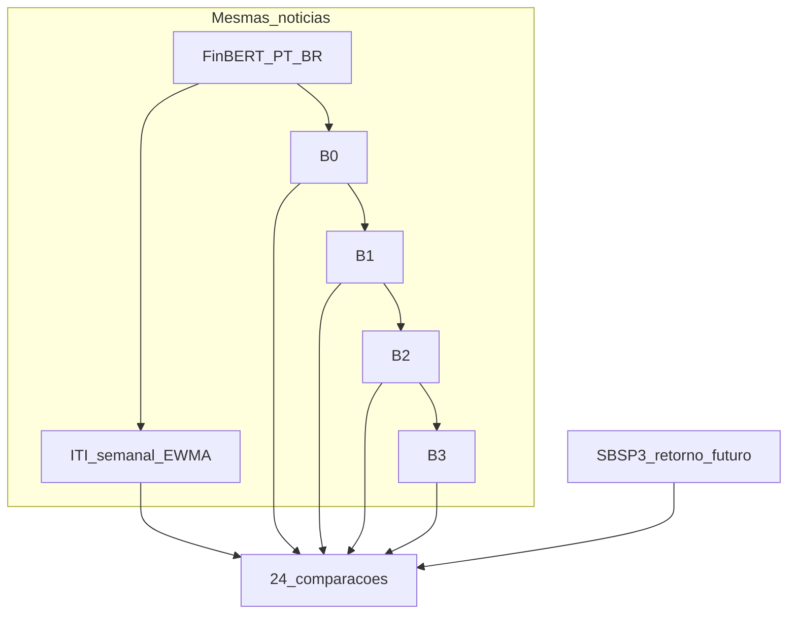

# Trajetória experimental — Financial Sentiment Lab

**Documento único da pesquisa (Trilha A, Sabesp).** Narrativa metodológica ancorada em literatura: por que cada decisão foi tomada, o que comparamos, o que respondemos e o que permanece em aberto. Números oficiais na **Parte 4**; fórmulas e módulos em [documentacao.md](documentacao.md); referências em [referencias/](referencias/). Direcionamento original de 20/08: [Apêndice C](#apêndice-c--direcionamento-da-pesquisa-2008).

---

## Como ler este documento

| Parte | Conteúdo |
|-------|----------|
| **0** | Problema, hipóteses H1–H3, subobjetivos SO1–SO10, referências de base |
| **1** | O que é o ITI, origem metodológica, definições sem ambiguidade |
| **2** | Protocolo (24 duelos), 6 camadas de validade, tabela técnica |
| **3** | Fases F0–F6 — processo, decisões, transições |
| **4** | **Resultados consolidados** Trilha A (números oficiais) |
| **5** | O que foi e não foi tratado |
| **6** | Próximo ciclo — perguntas que podem mudar a conclusão |
| **Apêndices** | Runs R2–R9, glossário, direcionamento, artefatos, bibliografia |

---

# Parte 0 — Enquadramento da pesquisa

## Em uma frase

Construir e validar empiricamente um **Índice Temporal Informacional (ITI)** a partir de notícias corporativas de empresas brasileiras de saneamento de capital aberto, testando se esse índice traz informação incremental sobre retornos futuros além de medidas simples (contagem de notícias e sentimento médio).

## Problema de pesquisa

Notícias financeiras em português carregam informação que o mercado pode precificar (Tetlock, 2007), mas medir isso de forma reprodutível exige: corpus ligado à empresa certa; classificador de domínio (Santos et al., 2023); agregação temporal coerente; comparação honesta com alternativas simples (Loughran & McDonald, 2011). No **saneamento**, o Marco Legal e a privatização da Sabesp geram choques informacionais intensos (Gattai & Souza, 2025 — estudo de evento em EQTL3) — contexto favorável para testar H1, pouco explorado com NLP em PT.

A literatura brasileira motiva o teste, mas não garante resultado: Duarte et al. (2020) comparam horizontes diário, semanal e mensal em 64 ativos; Yoshinaga & Castro Junior (2012) encontram relação entre índice de sentimento e retornos que pode ser **negativa** (reversão), não direcional.

## 0.1 Ancoragem teórica

O lab testa **associação incremental exploratória** entre texto agregado e retorno futuro — não eficiência informacional plena nem estratégia de trading. As teorias abaixo orientam hipóteses e limites de interpretação:

| Teoria | Referência | O que sustenta no lab | O que **não** afirmamos |
|--------|------------|----------------------|-------------------------|
| Mídia informa preços | Tetlock (2007) | H1 — texto carrega informação testável | Direção positiva garantida |
| Finanças comportamentais / sentimento | Yoshinaga (2012); Baker-Wurgler via Yoshinaga | Índice × retorno; reversão possível | ITI replica índice PCA de mercado |
| EMH forma semiforte | Gattai & Souza (2025) FOCO | Choque institucional relevante (privatização) | Nosso desenho **não** é event study CAR |
| NLP domínio financeiro | Araci (2019); Santos (2023) | FinBERT-PT-BR + score \(d\) | Acurácia do artigo = corpus saneamento |
| Correlação defasada BR | Marquezan & Assunção (2025); Duarte (2020) | Horizontes 1/2/4 sem.; lags variam | Causalidade Granger |

*Posicionamento:* medimos se um índice com memória (ITI) correlaciona melhor que baselines simples no mesmo painel; qualquer leitura de “mercado eficiente” ou “sentimento move preço” permanece condicional ao classificador e ao caráter exploratório dos resultados.

## Objetivo geral

Construir e validar empiricamente um ITI baseado em notícias corporativas para empresas de saneamento de capital aberto (Sabesp, Copasa, Sanepar no desenho inicial; **Trilha A** focou Sabesp/SBSP3).

## Perguntas e hipóteses

### Pergunta principal (QP1) → H1

Em que medida um ITI derivado de notícias corporativas representa choques informacionais em empresas de saneamento de capital aberto e apresenta associação com retorno, volatilidade e volume **além** de medidas simples de sentimento e frequência? *(Volatilidade/volume: no desenho original do direcionamento; não fechados na Trilha A.)*

**H1:** o ITI em uma semana associa-se ao retorno acumulado nas semanas seguintes **mais fortemente** que B0–B3 sobre as mesmas notícias — não é previsão mecânica de alta/baixa.

Qualquer associação ITI×retorno permanece **hipótese a testar**, não conclusão prévia: o mérito do classificador (FinBERT-PT-BR) limita o canal notícia→índice — ver gate κ em [§4.4](#44-qualidade-do-classificador).

### Perguntas secundárias

| ID | Pergunta | Hipótese | Status Trilha A |
|----|----------|----------|-----------------|
| QP2 | Notícias negativas associam-se mais a volatilidade/retorno? | **H2** (assimetria) | Não testada formalmente |
| QP3 | EWMA melhora validade vs impacto sem memória? | **H3** | Parcial — R1 vs B3, 2 sig. em h=4 |
| QP4 | Discordância entre modelos informa volatilidade? | Extensão | Não executada |

### Pergunta empírica central

**ITI/B3 acrescentam informação sobre retorno futuro além de B0, B1 e B2?** — medida pelo win rate em 24 duelos por run.

## Subobjetivos operacionais

| Subobjetivo | Pergunta operacional | Saída esperada | Status |
|-------------|---------------------|----------------|--------|
| SO1 — coleta | Scraper produz notícias deduplicadas e alinháveis? | Corpus tabular (título, data, link, empresa, texto) | Executado; qualidade residual documentada |
| SO2 — classificação | FinBERT PT produz sinal utilizável em saneamento? | Probabilidades e score \(d\) | Executado; **gate falhou** |
| SO3 — índice | Agregação e memória sem misturar frequências? | ITI diário/semanal, líquido e risco | Executado |
| SO4 — comparação | ITI vence B0–B3? | 24 duelos/run | Executado |
| SO5 — mercado | Sinal associa-se a retorno em frequência compatível? | Painel semanal Pearson/Spearman | Executado, exploratório |
| SO6 — ablação | Desempenho depende de α e componentes? | R0–R9 | Executado ([Apêndice A](#apêndice-a--runs-r2r9-condensadas)) |
| SO7 — robustez | Resultado sobrevive expansão e lacuna 2023? | Evento vs expandido | Executado — **não generaliza** |
| SO8 — validade modelo | FinBERT concorda com humanos? | Acurácia, F1, κ (n=100) | Executado — κ=0,163 |
| SO9 — transparência | Evidência, decisão e lacuna distinguíveis? | Este documento | Executado |
| SO10 — literatura | Decisões ancoradas em refs BR | `referencias/` | Executado |

## 0.2 Matriz de ancoragem bibliográfica

Cada referência abaixo liga decisão metodológica a justificativa e à avaliação no contexto Sabesp.

| Referência | Decisão que sustenta | Justificativa | Avaliação |
|------------|---------------------|---------------|-----------|
| Santos (2023) | Classificador `finbert_ptbr` | Domínio PT + índice de sentimento | Justifica escolha; **não** garante κ no saneamento |
| Araci (2019) | Cadeia FinBERT | Pré-treino domínio EN → adaptação PT | Justifica família de modelos |
| Loughran (2011) | B0–B3 internos | Baselines simples antes de índice complexo | Parcial — usamos FinBERT, não léxico |
| Yoshinaga (2012) | Não fixar direção; precedente BR | Relação pode ser negativa (reversão) | Justifica cautela em H1 |
| Duarte (2020) | Múltiplos horizontes | Persistência da informação varia | Justifica protocolo semanal 1/2/4 |
| Marquezan & Assunção (2025) | Lags + tipo de notícia | Correlação cruzada BR com LLM | Justifica horizontes; método diferente (emoções LLM) |
| Gattai & Souza (2025) | Janela evento | Choque Sabesp/privatização | **Parcial** — EQTL3, não SBSP3; não é NLP |
| Tetlock (2007) | Validação texto×mercado | Mídia não é ruído puro | Inspiracional (métrica diferente) |

## Referências bibliográficas de base (direcionamento 20/08)

| Referência | Contribuição |
|------------|--------------|
| Baker, Bloom & Davis — EPU | Texto → índice → validação externa |
| Caldara & Iacoviello — GPR | Índice de risco jornalístico |
| Shapiro et al. — Fed News Sentiment | Sentimento diário com decaimento (analogia EWMA) |
| Araci — FinBERT; Santos et al. — FinBERT-PT-BR | NLP financeiro |
| FNSPID, FUNNEL | Escala notícia–preço; mapeamento notícia→empresa |
| Estudos de evento | Choques informacionais |
| Marco Legal do Saneamento; índices UTIL/ISE B3 | Contexto setorial BR |

## Mapa fase → pergunta → artefato

| Fase | Pergunta | Artefato |
|------|----------|----------|
| F0 | Pipeline roda? | `outputs/saneamento_pt_20260824/` |
| F1 | Protocolo interpretável? | `configs/campaigns/sabesp_2026/` |
| F2 | ITI vence baselines no evento? | `sabesp_r1_alpha070` |
| F3 | Sinal generaliza? | `sabesp_gap2023_*`, `period_breakdown_gap2023.md` |
| F4 | Roundups explicam teto? | `sabesp_event_r1_filtered` |
| F5 | Classificador confiável? | `manual_label_report.md`, `classifier_eval_pt/` |
| F6 | O que concluir? | **Parte 4** abaixo |

---

# Parte 1 — ITI: origem metodológica

O ITI **não é um índice publicado nem homônimo importado**. É construção operacional em [temporal_index.py](../modules/experiment/indexing/temporal_index.py) para saneamento: sentimento por notícia → impacto informacional → agregação diária → memória EWMA.

| Elemento | Base bibliográfica | Transferido | Adaptado (Sabesp) |
|----------|-------------------|-------------|-------------------|
| Texto → mercado | Tetlock (2007) | Mídia carrega informação | Multiportal PT, NLP |
| Índice textual temporal | Baker et al. (2016) EPU | Agregação + validação | Microíndice empresa |
| Sentimento PT | Santos et al. (2023) | FinBERT-PT-BR, \(d=P(pos)-P(neg)\) | Corpus saneamento |
| Precedente índice BR | Yoshinaga (2012) | Índice sentimento × retorno | ITI não usa PCA agregado |
| Horizontes múltiplos | Duarte et al. (2020) | Lags diário/semanal/mensal | 1/2/4 semanas |
| Persistência | Shapiro et al. (2022) | Decaimento temporal | α por ablação (R0 vs R1) |
| Controles simples | Loughran & McDonald (2011) | Medidas textuais simples | B0–B3 internos |
| Evento | Gattai & Souza (2025) | Reação a privatização | Alvo SBSP3, não EQTL3 |

**Mensagem:** se ITI não supera B0–B3 no mesmo painel, memória e dimensões extras não demonstram valor incremental. Yoshinaga mostra alternativa (PCA); ITI preserva interpretação operacional empresa×dia.

## 1.1 Definições sem ambiguidade

- **Score por notícia:** \(d = P(\text{pos}) - P(\text{neg})\). Neutro permanece nas probabilidades.
- **Impacto diário:** combinação de scores e dimensões (`m,r,e,c,u,q,h`) — ver [documentacao.md §4](documentacao.md#4-fórmulas-do-iti).
- **ITI líquido:** estado EWMA do impacto líquido — predictor principal (`iti_liquido_last` na validação semanal).
- **ITI risco:** componente negativo/risco — complementar, não usado no resultado principal.
- **B0:** contagem de notícias; **B1:** média de \(d\); **B2:** média ponderada por confiança; **B3:** impacto diário **sem** memória.
- **α:** memória EWMA — **não** é alpha de excesso de retorno. α alto = mais passado; α baixo = mais reativo.
- **Vitória:** ITI correlaciona melhor que baseline (mesmo horizonte e métrica).
- **Significância:** bootstrap em bloco apoia a diferença — **não** implica causalidade.

## 1.2 Por que FinBERT e não léxico/LSTM

- **Araci → Santos:** Araci (2019) estabelece FinBERT em inglês com vocabulário de domínio; Santos et al. (2023) estendem a português com Gradual Unfreezing e validam índice de sentimento — cadeia que justifica `finbert_ptbr` como classificador principal.
- **Loughran & McDonald (2011):** dicionários genéricos falham em finanças (polissemia de “liability”, “risk” etc.) — evitamos léxico fixo; B0–B3 derivam do **mesmo** classificador para comparação justa.
- **LSTM (Araújo et al., 2021):** precedente BR em Twitter com redes recorrentes — **não adotado**: corpus multiportal de notícias + estado da arte BERT (Santos supera baselines no artigo de origem).

## 1.3 Tensões na literatura (o que esperar)

A literatura BR não converge em direção única. Yoshinaga & Castro Junior (2012) encontram relação **negativa** entre índice de sentimento agregado e retorno futuro (padrão de reversão). Marquezan & Assunção (2025), com emoções via LLM e correlação cruzada, reportam lags heterogêneos — sentimento pode **anteceder** preço em alguns ativos e defasagens. **Leitura para Trilha A:** direção e magnitude são empíricas; subperíodos mistos na janela expandido ([§4.3](#43-robustez-janela-expandida)) são compatíveis com ambos os quadros, não prova de inconsistência metodológica.

---

# Parte 2 — Protocolo e critérios de progresso

**Comparação:** ITI vs B0–B3; Pearson + Spearman; retornos futuros 1, 2 e 4 **semanas** → **24 comparações** (4×2×3). ITI semanal = `iti_liquido_last` (último dia útil da semana); retorno = soma dos log-retornos diários na janela futura alinhada.

## Seis camadas de validade

1. **Execução** — pipeline coleta, classifica, agrega, alinha.
2. **Comparação** — mesma frequência e painel para predictor e alvo.
3. **Valor incremental** — ITI vence baselines cabeça a cabeça.
4. **Robustez** — padrão sobrevive a lacunas e filtros textuais.
5. **Credibilidade do predictor** — gate de concordância humana (≥70% ou κ≥0,40).
6. **Interpretação** — resultados positivos, nulos e contraditórios reportados; **busca múltipla** (2/24 sig.) como regra de leitura, não explicação posterior.

## Tabela protocolo (Trilha A)

| Item | Valor |
|------|-------|
| Empresa | Sabesp (`SBSP3.SA`) |
| Corpus strict | `data/saneamento_corpus/noticias_strict_sabesp.csv` |
| Classificador | `finbert_ptbr` |
| ITI | EWMA α configurável; `iti_liquido_last` |
| Baselines | B0–B3 (somente notícias) |
| Validação | Pearson + Spearman; h ∈ {1,2,4} semanas |
| Significância | Bootstrap `block_size=2`, `n_bootstrap=500` |
| Research YAML | `configs/campaigns/sabesp_2026/research_weekly.yaml` |

---

# Parte 3 — Trajetória por fases

## F0 — Marco amplo: provar que o pipeline roda

### Pergunta
É possível executar scraping → CSV → inferência → índices → research antes de validade estatística?

### Base bibliográfica
Neuenschwander et al. (2014): extração de sinal de fluxos web é difícil no BR. Duarte et al. (2020): horizontes múltiplos são necessários. UTFPR (2024): causalidade pode ser fraca — expectativa realista. Araci (2019) → Santos (2023): cadeia FinBERT domínio EN→PT.

### Literatura → resultado

Neuenschwander (2014) e UTFPR (2024) sustentam que extrair sinal de texto web no BR é difícil e a associação com preços pode ser fraca; Duarte (2020) sustenta testar múltiplos horizontes. **Nosso resultado confirma** que o pipeline executa (SO1), mas **nega** comparação válida com mercado (0% win, frequências incompatíveis).

### Entradas e decisões

| Item | Valor |
|------|-------|
| Run | `saneamento_pt_20260824` |
| Corpus | `saneamento_corpus` multi-empresa (Sabesp, Copasa, Sanepar) |
| Research | Frequência **diária** (ITI semanal gerado mas não usado na validação) |
| Modelos | `finbert_ptbr`, `pt_br_financial_sentiment_analysis` |

FinBERT-PT-BR escolhido por domínio financeiro PT (Santos et al., 2023) — modelos especializados superam genéricos para jargão econômico; validação externa via preços é prática recomendada na literatura de sentimento.

### Resultados

| Modelo | Win rate | Significativas |
|--------|----------|----------------|
| `finbert_ptbr` | 0% (0/24) | 0 |
| `pt_br_financial_sentiment_analysis` | 12,5% (3/24) | 0 |

### Obtidas / não obtidas / direcionamento

- **Obtido:** SO1 — pipeline executável.
- **Não obtido:** H1; comparação inválida (frequências misturadas).
- **Direcionamento:** auditoria F1.

**Artefatos:** `outputs/saneamento_pt_20260824/`

---

## F1 — Auditoria e protocolo comparável

### Pergunta
Quais erros impedem comparação defensável ITI × mercado?

### Base bibliográfica
Duarte et al. (2020): lags variam no tempo. Yoshinaga (2012): associação pode ser reversão — não fixar direção a priori. Tetlock (2007): alinhamento temporal correto.

### Literatura → resultado

Duarte (2020) sustenta múltiplas janelas; Yoshinaga (2012) sustenta não fixar direção; Tetlock (2007) sustenta alinhamento temporal correto; Loughran (2011) sustenta baselines simples pré-definidos. **Nosso resultado confirma** o protocolo semanal comparável; **ainda não confirma** H1.

### Decisões

| Decisão | Alternativa rejeitada | Fundamento |
|---------|----------------------|------------|
| Sabesp focal (Trilha A) | Multi-empresa no resultado | Evento institucional específico |
| Frequência semanal | ITI semanal vs alvo diário | Incompatibilidade eliminada |
| B0–B3 ex ante | Baselines pós-hoc | Loughran: controles simples pré-definidos |
| Pearson + Spearman | Só Pearson | Associação linear e monotônica |
| Horizontes 1/2/4 sem | Lag único | Duarte: múltiplas janelas |
| Gate pré-evento ≥40% win | Expansão automática | Só expandir com sinal mínimo |

### Obtidas / direcionamento

- **Obtido:** campanha `sabesp_2026`, protocolo semanal, 24 duelos.
- **Não obtido:** evidência de H1 (ainda).
- **Direcionamento:** F2 primeira execução interpretável.

**Artefatos:** `configs/campaigns/sabesp_2026/`, `noticias_strict_sabesp.csv`

---

## F2 — Campanha Sabesp evento (R0 / R1)

### Pergunta
Na janela da privatização, EWMA (α=0,70) acrescenta informação além de B0–B3? (H3)

### Base bibliográfica
Gattai & Souza (2025): anúncio privatização → retornos anormais EQTL3 (não prova canal notícia→SBSP3). Santos (2023): FinBERT + índice. Yoshinaga (2012): “vencer” ≠ retorno positivo futuro.

### Literatura → resultado

Gattai & Souza (2025) sustentam relevância institucional do evento (EQTL3, não SBSP3); Santos (2023) sustenta FinBERT+índice em PT; Yoshinaga (2012) sustenta cautela com direção. **Nosso resultado confirma parcialmente** H3 (2 sig. vs B3, h=4) e melhor α=0,70; **não confirma** H1 forte nem causalidade — leitura exploratória.

**Distinção metodológica FOCO:** Gattai & Souza (2025) aplicam EMH semiforte com **CAR** em EQTL3 no anúncio da privatização; nós medimos **correlação semanal** ITI×retorno futuro em SBSP3 no mesmo período institucional. Os desenhos são **complementares** (contexto vs canal notícia→índice), não replicáveis um pelo outro.

### Entradas

| Item | Valor |
|------|-------|
| Dataset | `saneamento_sabesp_strict_event` |
| Período | nov/2023 – abr/2024 (~465 artigos) |
| Runs | R0 `sabesp_r0_baseline` (α=0,85); R1 `sabesp_r1_alpha070` (α=0,70) |

### Resultados

| Run | α | Win rate | Significativas |
|-----|---|----------|----------------|
| R0 | 0,85 | 20,8% (5/24) | 0 |
| **R1** | **0,70** | **41,7% (10/24)** | **2** |

**Vitórias significativas R1:** h=4 vs B3 — Pearson Δ=+0,133 (p=0,040); Spearman Δ=+0,221 (p=0,046).

**ITI vs baselines R1:**

| Baseline | 1 sem (P/S) | 2 sem (P/S) | 4 sem (P/S) |
|----------|-------------|-------------|-------------|
| B0 | ✗/✓ | ✗/✗ | ✗/✗ |
| B1 | ✗/✗ | ✗/✗ | ✗/✓ |
| B2 | ✗/✗ | ✗/✓ | ✗/✓ |
| B3 | ✓/✓ | ✓/✓ | **★/★** |

★ = significativa (bootstrap).

### Obtidas / não obtidas / direcionamento

- **Obtido:** melhor config (α=0,70, `iti_liquido_last`); gate ≥40% → autoriza F3; H3 parcial (2 sig. vs B3).
- **Não obtido:** H1 forte; causalidade; H2; ITI não domina todas as comparações.
- **Direcionamento:** F3 robustez temporal; F5 qualidade classificador.

**Artefatos:** `outputs/sabesp_r0_baseline/`, `outputs/sabesp_r1_alpha070/`

---

## F3 — Expansão temporal e lacuna 2023

### Pergunta
O sinal sobrevive mai/2022–abr/2024 com lacuna jan–abr/2023 preenchida?

### Base bibliográfica
Duarte et al. (2020): persistência da informação varia. RACEf (2022): associação sentimento–mercado mais forte em crises/eventos.

### Literatura → resultado

Duarte (2020) sustenta que persistência varia por horizonte; RACEf (2022) sustenta sensibilidade em períodos de crise/evento. **Nosso resultado confirma** reprodução do evento no sanity; **nega** robustez no expandido (33,3%, 0 sig.).

### Resultados (resumo — detalhe na Parte 4)

| Contexto | R1 win rate | Sig. |
|----------|-------------|------|
| Evento (referência) | **41,7%** | **2** |
| Marco 2 expandido (1.055 art.) | 20,8% | 0 |
| Gap 2023 (1.254 art.) | 33,3% | 0 |
| Sanity evento pós-gap | **41,7%** | **2** |

Subperíodos R1 expandido (h=1): pré-evento 2022 Pearson −0,148; interregno 2023Q1 +0,172 (n=15); evento isolado no expandido −0,030.

### Obtidas / direcionamento

- **Obtido:** mais dados ≠ melhor sinal; sanity reproduz evento.
- **Não obtido:** vitória robusta no expandido.
- **Direcionamento:** F4 filtro roundups.

**Artefatos:** `outputs/sabesp_gap2023_*`, `gap2023_comparison.md`, `period_breakdown_gap2023.md`

---

## F4 — Robustez textual e múltiplas comparações

### Pergunta
Remover roundups/agendas melhora o sinal? As 2 sig. resistem à leitura de busca múltipla?

### Base bibliográfica
Neuenschwander (2014): pré-processamento não trivial. Marquezan & Assunção (2025): sinal varia por tipo de notícia e **lag** — heterogeneidade por defasagem é precedente BR direto.

### Literatura → resultado

Neuenschwander (2014) e Marquezan & Assunção (2025) sustentam que tipo de notícia e pré-processamento afetam o sinal; ERAMIARS prevê heterogeneidade por lag — coerente com vitórias significativas **apenas** em h=4 (não em h=1 ou h=2). **Nosso resultado nega** que roundups expliquem o teto (filtro piora para 25%, 0 sig.); 2/24 sig. permanecem exploratórias.

### Resultado

| Run | Artigos | R1 win rate | Sig. |
|-----|---------|-------------|------|
| Evento base | 465 | 41,7% | 2 |
| Evento filtrado | 404 (−61 roundups) | **25,0%** | **0** |

### Obtidas / direcionamento

- Filtro **piora** ITI — teto ~41,7% não é só “lixo textual”.
- 2/24 sig. permanecem leitura exploratória cautelosa.
- **Direcionamento:** F5 validade FinBERT.

**Artefatos:** `outputs/sabesp_event_r1_filtered/`, `significant_wins_r1_event.md`

---

## F5 — Validade do classificador

### Pergunta
FinBERT concorda com humanos o suficiente (gate 70% / κ≥0,40)?

### Base bibliográfica
Santos et al. (2023): FinBERT de domínio financeiro PT; desempenho depende do corpus de aplicação.

### Literatura → resultado

Santos (2023) sustenta FinBERT de domínio, com ressalva de corpus de aplicação. **Nosso resultado nega** transferência ao saneamento (κ=0,163; nenhum modelo passa gate) — **limita interpretação substantiva** de todo resultado de mercado anterior.

### Resultado (n=100)

| Modelo | Acurácia | κ | Passa gate? |
|--------|----------|---|-------------|
| `finbert_ptbr` | 48,0% | 0,163 | não |
| `bertweet_pt_sentiment` | 68,0% | −0,014 | não |
| `bertimbau_sentiment` | 53,0% | 0,087 | não |

κ focal FinBERT: 0,217 (ainda abaixo do gate). Tipologia: 74% focal_sabesp, 26% roundup_agenda.

### Obtidas / direcionamento

- Transferência FinBERT→saneamento **não demonstrada** nesta amostra.
- ITI condicional com controles PT **não executado** (correto).
- **Direcionamento:** F6 síntese; sem fine-tune neste ciclo.

**Artefatos:** `manual_label_report.md`, `classifier_eval_pt/`

---

## F6 — Síntese processual da Trilha A

### Literatura → resultado

Literatura BR (Yoshinaga, Duarte, UTFPR) sustenta a **pergunta** e o desenho; não garante resultado positivo. **Nosso resultado confirma** prova de conceito de engenharia; **nega** validação confirmatória de H1/H3 fora do patamar exploratório do evento.

Prova de conceito de engenharia + resultado exploratório localizado no evento — **não** validação confirmatória. A interpretação substantiva de qualquer associação ITI×mercado fica **limitada** pelo gate κ do classificador ([§4.4](#44-qualidade-do-classificador)). Direção estratégica: (i) preservar evento como exploratório; (ii) não vender expandido como robustez; (iii) sem fine-tune sem ampliar anotação; (iv) separar H2/volatilidade do resultado principal; (v) literatura BR como comparação de desenho, não prova do ITI.

Números fechados: **Parte 4**.

---

# Parte 4 — Resultados consolidados Trilha A

*Números extraídos de `outputs/` — fonte de verdade para tabelas desta seção.*

## 4.1 Protocolo

Ver [Parte 2](#parte-2--protocolo-e-critérios-de-progresso). Research: `configs/campaigns/sabesp_2026/research_weekly.yaml`.

## 4.2 Resultado principal (janela evento)

> **Leitura obrigatória:** o resultado principal (41,7%, 2 sig.) é **exploratório**, não confirmatório. Interpretação substantiva do ITI como medida de choque informacional **condiciona-se** à validade do classificador — gate κ falhou (48%, κ=0,163; [§4.4](#44-qualidade-do-classificador)). Não inferir causalidade nem generalização fora da janela evento.

**Janela:** nov/2023–abr/2024 (`saneamento_sabesp_strict_event`, ~465 artigos).

| Run | run_id | Win rate R1 | Significativas |
|-----|--------|-------------|----------------|
| Marco 1 | `sabesp_r1_alpha070` | **41,7%** | **2** |
| Sanity corpus 1.254 | `sabesp_gap2023_event_r1_alpha070` | **41,7%** | **2** |
| Filtro roundups | `sabesp_event_r1_filtered` | 25,0% | 0 |

**Vitórias significativas** (`significant_wins_r1_event.md`):

| Horizonte | Baseline | Métrica | Δ | p-value |
|-----------|----------|---------|---|---------|
| 4 sem. | B3 | Pearson | +0,133 | 0,040 |
| 4 sem. | B3 | Spearman | +0,221 | 0,046 |

*Caveat:* 2/24 comparações — compatível com busca múltipla (§4.5).

## 4.3 Robustez (janela expandida)

**Janela:** mai/2022–abr/2024 (`saneamento_sabesp_strict_expanded`).

| Corpus | Artigos | R1 win rate | Δ vs Marco 2 |
|--------|---------|-------------|--------------|
| Marco 2 (sem lacuna 2023) | 1.055 | 20,8% | — |
| Gap 2023 preenchido | **1.254** | **33,3%** | +12,5 pp |

| Run gap 2023 | R0 | R1 |
|--------------|----|----|
| Expandido | 4,2% (1/24) | **33,3%** (8/24) |

**Subperíodos** (`period_breakdown_gap2023.md`):

| Bucket | Semanas | Pearson | Spearman |
|--------|---------|---------|----------|
| `pre_evento_2022` | 25 | −0,148 | −0,110 |
| `interregno_2023q1` | 15 | +0,172 | +0,304 |
| `evento_nov23_abr24` | 50 | −0,030 | +0,054 |

**Leitura:** expandido = teste de limitação (“mais dados ≠ melhor sinal”).

## 4.4 Qualidade do classificador

| Métrica FinBERT (100 manual) | Valor | Gate |
|------------------------------|-------|------|
| Acurácia | 48% | < 70% |
| Cohen's κ | 0,163 | — |
| F1 macro | 0,42 | — |

**Benchmark literatura vs. corpus local** (não re-executado — números do artigo Santos et al., 2023):

| Fonte | Acurácia / F1 | Corpus | Implicação para Trilha A |
|-------|---------------|--------|--------------------------|
| Santos et al. (2023) — artigo | ~76% / F1 0,73 | Notícias financeiras PT (treino) | Teto teórico se domínio coincidisse |
| FinBERT-PT-BR — **este lab** | 48% / F1 0,42 | Saneamento Sabesp (n=100) | Gate κ falhou — limita interpretação substantiva |
| BERTweet / BERTimbau — controles | 68% / 0,27; 53% / 0,33 | Mesma amostra | κ negativo ou baixo — problema não é só arquitetura |

| Modelo | F1 macro | κ (completa) | κ (focal) |
|--------|----------|--------------|-----------|
| `finbert_ptbr` | 0,42 | 0,163 | 0,217 |
| `bertweet_pt_sentiment` | 0,27 | −0,014 | 0,000 |
| `bertimbau_sentiment` | 0,33 | 0,087 | 0,032 |

**Tipologia de erro** (`error_analysis.md`, n=100):

| Tipologia | n | % |
|-----------|---|---|
| `focal_sabesp` | 74 | 74% |
| `roundup_agenda` | 26 | 26% |

κ sobe levemente no subconjunto focal do FinBERT (0,163 → 0,217), mas permanece abaixo do gate — contaminação de gênero jornalístico explica parte, não tudo, do desempenho fraco. Filtro de roundups no evento (**25,0%**, 0 sig.) confirma que o teto ~41,7% não é só “lixo textual”.

**Relatórios:** `outputs/campaigns/sabesp_2026/manual_label_report.md` · `outputs/campaigns/classifier_eval_pt/comparative_report.md` · `outputs/campaigns/classifier_eval_pt/error_analysis.md`

## 4.5 Limitações

- Evento único (privatização); overlap ~24 semanas (evento) a ~90 (expandido).
- Correlação ≠ causalidade; win rate = ITI vs baselines internos.
- 24 comparações não independentes; 2 sig. compatíveis com busca múltipla.
- Classificador abaixo do gate; roundups ~26% da amostra manual.
- n=100 para κ — instável em classes minoritárias.
- H2, volatilidade, volume, Granger, controles IBOV: **não executados**.

## 4.6 Conclusão operacional

1. **Exploratório e condicionado ao κ:** fechar narrativa com evento + R1 (41,7%, 2 sig.) como resultado principal exploratório.
2. Citar expandido como robustez/limitação (33,3%, 0 sig.).
3. **Não** investir em fine-tune/LoRA neste ciclo.
4. Marcos 4–5 (FNSPID / FinMarBa) opcionais.

## 4.7 Redação da tese

**Figuras sugeridas** (extrair de `outputs/`):

- Série ITI vs retorno h=1: `outputs/sabesp_gap2023_event_r1_alpha070/.../aligned_panel.csv`
- Matriz confusão: `outputs/.../rotulos_manual_pt_100/confusion_matrix.csv`
- Win rate por janela: `gap2023_comparison.md`

**Bibliografia sugerida:** ver [Apêndice E](#apêndice-e--bibliografia-comentada).

---

# Parte 5 — O que foi e não foi tratado

| Tema | Tratado | Não tratado / inconcluso |
|------|---------|--------------------------|
| Scraping | scraper→raw→CSV; identificação temporal | Recall por portal; republicações |
| Corpus | strict, expansão, lacuna 2023, filtro roundups | Deduplicação semântica; viés de portais |
| Modelo | FinBERT; BERTimbau/BERTweet controles | Fine-tune, ensemble, calibração |
| Índice | score, impacto, ITI líquido/risco, EWMA | Validação dimensão a dimensão |
| α | Ablação R0–R9 | Estimação out-of-sample; pré-registro |
| Mercado | SBSP3, retorno futuro, Pearson/Spearman | Causalidade; volume; volatilidade fechados |
| Notícias | corpus Sabesp; filtro roundups | Regra final materialidade por fonte |
| Estatística | bootstrap; cabeça a cabeça | Correção multiplicidade; poder |
| Setor | contexto privatização | Copasa/Sanepar painel setorial |
| Teoria de mercado | EMH citada via FOCO (evento EQTL3) | Desenho é correlação exploratória, não teste de eficiência |

---

# Parte 6 — Próximo ciclo

Perguntas que podem **mudar** a conclusão (não repetir fine-tune/LLM como prioridade deste ciclo):

1. **Validação humana maior** — estratificar por gênero, fonte, classe, período (n>100).
2. **Teste fora da janela** — ganho vs B3 em período futuro pré-definido (evidência out-of-sample).
3. **H2 separada** — assimetria neg/pos em retorno, volatilidade ou volume.
4. **Controles de mercado** — sinal residual após IBOV, setor, dia da semana, volatilidade.
5. **Generalização** — Copasa e Sanepar com protocolo idêntico.
6. **Parcimônia do índice** — cada dimensão melhora métrica pré-especificada ou só graus de liberdade?

**Formulação estreita atual:** pipeline funciona; ITI teve vantagem exploratória localizada sobre B3 no evento; vantagem não robusta na expansão; classificador limita interpretação substantiva.

---

# Apêndice A — Runs R2–R9 condensadas

Campanha `sabesp_2026`, dataset evento, 465 artigos.

| Run | ID | Mudança | Win rate | Δ vs R0 | Sig. |
|-----|-----|---------|----------|---------|------|
| R2 | `sabesp_r2_alpha095` | α=0,95 | 8,3% | −12,5 pp | 0 |
| R3 | `sabesp_r3_no_novelty` | sem u | 20,8% | 0 | 0 |
| R4 | `sabesp_r4_no_event` | sem e | 25,0% | +4,2 pp | 0 |
| R5 | `sabesp_r5_no_relevance` | sem r | 20,8% | 0 | 0 |
| R6 | `sabesp_r6_simplified` | d·c | 20,8% | 0 | 0 |
| R7 | `sabesp_r7_horizon_fixed` | α por h | 25,0% | +4,2 pp | 0 |
| R8 | `sabesp_r8_weekly_mean` | média semanal | 4,2% | −16,7 pp | 0 |
| R9 | `sabesp_r9_ensemble` | modelo PT alt. | 25,0% | +4,2 pp | 0 |

Só **α=0,70** (R1) produz ganho relevante. R8 confirma `iti_liquido_last`.

Configs: `configs/campaigns/sabesp_2026/experiments/r*.yaml`

---

# Apêndice B — Glossário e ordem de leitura

| Termo | Significado |
|-------|-------------|
| ITI | Índice Temporal Informacional |
| α | Memória EWMA (não alpha de mercado) |
| B0–B3 | Baselines internos — Parte 1 |
| Win rate | % vitórias em 24 duelos |
| Significativa | Bootstrap apoia diferença vs baseline |

**Ordem:** Parte 0 → 1 → 2 → 3 → **4** (números) → 5 → 6 → [documentacao.md](documentacao.md) para fórmulas.

---

# Apêndice C — Direcionamento da pesquisa (20/08)

Texto integral do direcionamento inicial da pesquisa (agosto/2025).

## Em uma frase

Construir e validar empiricamente um **Índice Temporal Informacional (ITI)** a partir de notícias corporativas de empresas brasileiras de saneamento de capital aberto (Sabesp, Copasa, Sanepar), testando se esse índice traz informação incremental sobre retornos futuros além de medidas simples (contagem de notícias e sentimento médio).

## Objetivo principal

Construir e validar empiricamente um Índice Temporal Informacional baseado em notícias corporativas para empresas brasileiras de saneamento de capital aberto.

## Pergunta de pesquisa

### Pergunta principal (H1)

Em que medida um Índice Temporal Informacional derivado de notícias corporativas é capaz de representar choques informacionais em empresas de saneamento de capital aberto e apresentar associação com retorno, volatilidade e volume negociado, além de medidas simples de sentimento e frequência de notícias?

*Notas de escopo do direcionamento:* janela de dados de 2–3 meses; definir fontes e construir base de dados; avaliar impacto do modelo em relação às ações; matriz de correlação com IBOV para medir valor incremental da notícia além do movimento macro. Unidade notícia: header, link e sentimento.

### Perguntas secundárias

| ID | Pergunta | Hipótese / extensão |
|----|----------|---------------------|
| QP2 | Notícias negativas associam-se mais a volatilidade/retorno? | **H2** — assimetria |
| QP3 | Persistência temporal (EWMA) melhora validade vs agregação sem memória? | **H3** |
| QP4 | Discordância entre modelos (`iti_risco`/incerteza) informa volatilidade? | Extensão futura |

## Metodologia

### Unidade de análise

Empresa × dia, depois agregação setorial.

**Empresas-alvo:** Sabesp (SBSP3), Copasa (CSMG3), Sanepar (SAPR4).

### Pipeline científico

scraping → classificação NLP (FinBERT-PT-BR) → score contínuo \(d = P(pos) - P(neg)\) → impacto por notícia (dimensões \(m,r,e,c,u,q,h\)) → agregação diária (`impacto_dia`, `risco_dia`) → ITI com memória EWMA (`iti_liquido`, `iti_risco`) → alinhamento com preços B3 → validação vs baselines B0–B3.

### Baselines

| Baseline | O que é |
|----------|---------|
| B0 | Número de notícias no dia |
| B1 | Sentimento médio diário |
| B2 | Sentimento ponderado por confiança |
| B3 | Impacto diário sem memória |
| ITI | Impacto com persistência EWMA |

**Pergunta empírica central:** B3/ITI acrescentam informação sobre retorno futuro além de B0, B1 e B2?

## Referências bibliográficas de base

### Índices textuais macro (metodologia)

| Referência | Contribuição |
|------------|--------------|
| Baker, Bloom & Davis — Economic Policy Uncertainty | Frequência/cobertura jornalística → índice → validação externa |
| Caldara & Iacoviello — Geopolitical Risk Index | Índice de risco a partir de jornais |
| Shapiro, Sudhof & Wilson — Daily News Sentiment Index (Fed) | Sentimento diário com decaimento temporal — próximo da lógica EWMA do ITI |

### Sentimento financeiro e NLP

| Referência | Contribuição |
|------------|--------------|
| Araci et al. — FinBERT (ProsusAI) | Vocabulário financeiro; baseline para modelos EN |
| FinBERT-PT-BR (Santos et al.) | Modelo usado no projeto para notícias em português |
| FNSPID (2024) | Integração notícia–preço em escala; infraestrutura de dados |
| FUNNEL (2025) | Mapear notícia → empresa corretamente; deduplicação |

### Mercado e validação empírica

| Referência | Contribuição |
|------------|--------------|
| Estudos de evento (event study) | Metodologia clássica para reação a choques informacionais |
| Literatura ESG + mercado | Assimetria: notícias negativas reagem mais |
| Trabalhos petróleo + sentimento | Referência comparativa (mostra o que não repetir como foco principal) |

### Contexto setorial Brasil

| Referência / fonte | Contribuição |
|--------------------|--------------|
| Marco Legal do Saneamento | Justificativa regulatória e volume de notícias |
| Índice UTIL B3 | Controle setorial amplo (energia + saneamento + gás) |
| ISE B3 | Referência de sustentabilidade, não de sentimento |

---

# Apêndice D — Índice de artefatos `outputs/`

| Artefato | Caminho |
|----------|---------|
| Comparação gap 2023 | `outputs/campaigns/sabesp_marco2/gap2023_comparison.md` |
| Subperíodos | `outputs/campaigns/sabesp_marco2/period_breakdown_gap2023.md` |
| Vitórias sig. R1 | `outputs/campaigns/sabesp_marco2/significant_wins_r1_event.md` |
| Erro classificador | `outputs/campaigns/classifier_eval_pt/error_analysis.md` |
| Runs expandidas | `outputs/sabesp_gap2023_r0_baseline/`, `sabesp_gap2023_r1_alpha070/` |
| Runs evento sanity | `outputs/sabesp_gap2023_event_r0_baseline/`, `sabesp_gap2023_event_r1_alpha070/` |
| Run filtrada | `outputs/sabesp_event_r1_filtered/` |
| Bateria κ | `outputs/campaigns/classifier_eval_pt/` |
| Scripts | `scripts/campaigns/sabesp_marco2.sh`, `classifier_eval_pt.sh` |
| Manifest Marco 1 | `outputs/campaigns/sabesp_2026/manifest.json` |

Reprodução: [configs/campaigns/sabesp_marco2/README.md](../configs/campaigns/sabesp_marco2/README.md)

---

# Apêndice E — Bibliografia comentada

| Referência | Uso | PDF local | Nota |
|------------|-----|-----------|------|
| Santos et al. (2023) | FinBERT-PT-BR, índice | [pdfs/santos2023_finbert_ptbr.pdf](referencias/pdfs/santos2023_finbert_ptbr.pdf) | [notas/santos2023.md](referencias/notas/santos2023.md) |
| Yoshinaga & Castro Junior (2012) | Índice BR × retorno | [pdfs/yoshinaga2012_bar.pdf](referencias/pdfs/yoshinaga2012_bar.pdf) | [notas/yoshinaga2012.md](referencias/notas/yoshinaga2012.md) |
| Duarte et al. (2020) | Horizontes BR | [pdfs/duarte2020_quedas_b3.pdf](referencias/pdfs/duarte2020_quedas_b3.pdf) | [notas/duarte2020.md](referencias/notas/duarte2020.md) |
| Tetlock (2007) | Mídia × mercado | [pdfs/tetlock2007_media.pdf](referencias/pdfs/tetlock2007_media.pdf) | [notas/tetlock2007.md](referencias/notas/tetlock2007.md) |
| Loughran & McDonald (2011) | Baselines | [pdfs/loughran2011_baselines.pdf](referencias/pdfs/loughran2011_baselines.pdf) | [notas/loughran2011.md](referencias/notas/loughran2011.md) |
| Gattai & Souza (2025) FOCO | Evento Sabesp | [pdfs/sabesp_evento_eqtl3_foco.pdf](referencias/pdfs/sabesp_evento_eqtl3_foco.pdf) | [notas/foco2025.md](referencias/notas/foco2025.md) |
| Araci (2020) | FinBERT EN | [pdfs/araci2020_finbert.pdf](referencias/pdfs/araci2020_finbert.pdf) | [notas/araci2020.md](referencias/notas/araci2020.md) |
| Demais | Ver [referencias/README.md](referencias/README.md) | link only | `bibliografia.bib` |

Fora de escopo Trilha A (trabalhos futuros): FNSPID, FinMarBa, PhraseBank/NOSIBLE.

---

*Última consolidação: documento único Trilha A — Financial Sentiment Lab.*
